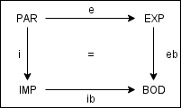
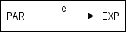
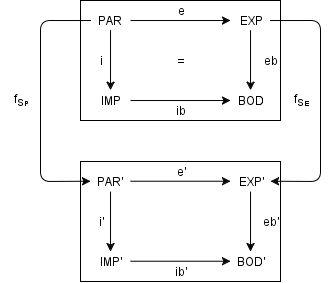

S0-02 Típusmodellek (Programozás elmélet)
=======================================
Tartalom
---------------------------------------

1. [Absztrakt adattípus](#chapter01)
2. [Adattípus specifikációja](#chapter02)
3. [Adattípus osztály](#chapter03)
4. [Paraméterátadás](#chapter04)
5. [Reprezentációs függvény](#chapter05)
6. [Öröklődés és polimorfizmus](#chapter06)
7. [Liskov féle szubsztitúciós elv](#chapter07)
8. [További források](#references)

## 1. Absztrakt adattípus 

### Típus fogalma általában

Mi a típus? Biteken tárolt információk jelentése, illetve hogyan kell értelmezni és módosítani

### Típus fogalma formálisan

$$(A, F)$$

ahol

* *A*: adattípust felépítő objektumok halmaza
* *F*: objektumokon értelmezett műveletek halmaza

### Absztrakt adattípus (ADT)

* Szolgáltatásoknak egy halmaza, ahol a szolgáltatásokat egy megvalósító adattípus nyújtja

ADT specifikációja

* Szolgáltatások leírása,a specifikáció nem írja elő a megvalósítás módját

ADT megvalósítása

* ilyen szolgáltatásokat nyújtó adattípus

ADT korai és modernebb megközelítése

* Korai megközelítésben: azonos **STRUKTÚRÁJÚ** adatok (C struct-ok)
* Modern megközelítésben: azonos **SZOLGÁLTATÁST** nyújtó adatok (C++/Java/C#)

### Szignatúra

* Programozási nyelvekben ez a deklarációnak felel meg
    + (*Gondolj a függvény típusszignatúrájára Haskell-ben*)
* $\sum$ szignatúra egy $\sum = (S, OP)$
    + $S = \{ S_0, S_1, ... , S_n \}$: szortok neveinek halmaza (fajták, alaptípusok)
    + $OP = \{ f_0, f_1, ... , f_m \}$: művelet neveinek halmaza
* A $f_i$ művelet: egy $f_i: s_{i_1} \times s_{i_2} \times \cdots s_{i_k} \rightarrow s_{i_0}$ parciális leképezés
    + ($művelet: argumentum\ szortok \rightarrow target\ szortok$)
* Argumentum szortok (miből): $s_{i_1} \times s_{i_2} \times \cdots s_{i_k}, \qquad k \geq 0$
* Target szort (mibe): $s_{i_0}$

Lényeg: a műveletek szortokból szortokba képeznek le

### Szignatúra algebra

* Ez az ami jelentést rendel a szignatúrához
* Programozási nyelvekben ez a definíciónak (implementációnak) felelne meg
* Az ADT lehetséges implementációját modellezi le
* $\sum = (S, OP)$ szignatúrához tartozó algebra: $\sum_A = (S_A, OP_A)$
    + $S_A = \{ A_{s_0}, A_{s_1}, \cdots A_{s_n} \}$: szortok, amikhez jelentés is tartoznak (*hordozó halmaz*)
    + $OP_A = \{ f_0, f_1, ... , f_m \}$: műveletek, amikhez jelentések is tartoznak (*függvények*)
    + A $f_i$ művelet: egy $f_i: A_{s_{i_1}} \times A_{s_{i_2}} \times
      \cdots A_{s_{i_k}} \rightarrow A_{s_{i_0}}$ parciális leképezés
    + $k = 0$ esetén $f_i$ az $A_{s_{i_0}}$ szort konstansa
* Szortok neveihez $\leftarrow$ hordozó halmazt rendel
* Műveletek neveihez $\leftarrow$ függvényeket rendel

## 2. Adattípus specifikácija 

* Szignatúra és szignatúra algebra: lehet, hogy van két különböző módon viselkedő szignatúra algebra!
* Hogyan adjunk szemantikát ezekhez? Specifikációval.
* Specifikáció: szerződés a felhasználó és a megvalósító között
    + Legyen a lehető legáltalánosabb, hogy ne korlátozza a megvalósítást!

### Absztrakt adattípus specifikációja

Specifikáció: $SPEC = (\sum, E)$ (alternatív jelölés: $SPEC = (S, OP, E)$)

* $\sum$: szignatúra
* *E*: műveletek szemantikáját meghatározó specifikáció

### Absztrakt adattípus specifikációk fajtái

**1. Állapot elvű specifikáció (Hoare-féle módszer)**

* Műveletek elő- és utófeltételeinek halmaza
* $\{\varphi\} P \{\psi\}$
    + $\varphi$: előfeltétel
    + *P*: program
    + $\psi$: utófeltétel

**2. Procedurális specifikáció**

* Műveletek kiszámítási szabályainak halmaza
* Függvény jelentésének, kiszámátási szabályának pszeudokód-szerű definiálása

**3. Axiomatikus specifikáció (algebrai specifikáció)**

* Eljárás jelentését meghatározó logikai állítások
* Függvények jelentését axiómákban írjuk le
* Axiomákat rendszerint predikátumokkal adjuk meg

### Szignatúra algebrák közötti homomorfizmus

(*morfizmus: leképezés*)

* Alaphalmazok (*S*) és műveletek (*OP*)
* Legyen két szignatúra algebra:
    + $\sum_A = (S_A, OP_A)$ és $\sum_B = (S_B, OP_B)$

$h: A \rightarrow B$ egy függvénycsalád

1. Minden *S*-beli *s* szortra $h_s: A_s \rightarrow B_s$
    + azaz *A* szortját $\rightarrow$ *B* megfelelő szortjára képezi le
2. $\forall f_{A_i} + \forall (A_{s_{i_1}}, A_{s_{i_2}}, ..., A_{s_{i_k}})$ esetén:
   $f_{B_i} megfelel f_{A_i}$-nek
    + úgy, hogy $h_{s_{i_0}}(f_{A_i}(A_{s_{i_1}}, A_{s_{i_2}}, ..., A_{s_{i_k}}))
      = f_{B_i}(h_{s_{i_1}}(A_{s_{i_1}}), ..., (h_{s_{i_k}}(A_{s_{i_k}}))$
    + előző laikusan: *A*-n való homomorfizmus végrehajtása (formula bal oldala) után *B* az *A* leképezéseit
      fogja tartalmazni (formula jobb oldala)

### Szignatúra algebra homomorfizmusok speciális esetei

1. Átnevezés
    + szignatúra szortjainak és műveleteinek átnevezése
2. Bővítés
    + szignatúra bővítése új szortokkal és műveletekkel
    + új szignatúra definíció a korábbi átvételével
3. Új ábrázolás
    + szignatúra átvétele, meglévő szortok helyére más szortokból képzett ábrázolások

### Szignatúra algebra izomorfizmus

* 1-1 leképezés *A* és *B* között
* Jelölés: $A \simeq B$
    + (*szürjektív: minden B-beli elemhez kapcsolódik valaki*)
    + (*injektív: minden A-beli elem különböző B-beli elemhez kapcsolódnak*)
    + (*bijektív: egyszerre szürjektív és injektív*)
* Ha egy homomorfizmus bijektív $\Longrightarrow$ akkor **izomorfizmusról** beszélünk
* Az izomorf algebrák azonosak egymással (átnevezést leszámítva)

### Adattípus szignatúra algebrai megközelítésben

* Izomorfikus $\sum$ szignatúra algebrák ekvivalencia osztálya:

$$osztály[A] = \{B \in Alg(\sum): B \simeq A\}$$

ahol

* *[A]*: ekvivalencia osztály
* $B \in Alg(\sum)$: *B* az $Alg(\sum)$ szignatúra algebra része
* $B \simeq A$: *B* izomorf *A*-val

### Monomorfikus és polimorfikus absztrakt típus

* **Monomrfikus**
    + Egyetlen adattípus tudja megvalósítani
    + Minden eleme izomorf
    + **Csak egy ekvivalencia osztály** van benne
* **Polimorfikus**
    + Több adattípus tudja megvalósítani
    + Absztrakt adattípus nem monomorfikus
    + **Több ekvivalencia osztály** is van benne

### Specifikáció homomorfizmus

Szignatúra algebra homomorfizmus kiterjesztés az $SPEC = (\sum, E)$ specifikációban lévő műveleti 
szemantikát leíró $E$ specifikációban lévő

* változókra 
* és kifejezésekre

Specifikáció változói és kifejezései leképezhetők $\rightarrow$ másik specifikáció változóira és
kifejezéseire

## 3. Adattípus osztály specifikációja 

**Specifikációk**

* *PAR*: formális paraméterek tulajdonságainak specifikációja
    + paraméteres specifikáció esetén a specifikáció részei csak akkor lesznek meghatározva
      $\Longrightarrow$ amikor formális paraméterekkel példányosítjuk a specifikációt
      (*gondolj konstruktorra*)
* *EXP*: export felület specifikációja
    + $EXP = PAR + (S_1, OP_1, E_1)$
    + rajta értelmezett műveletek szintaxisának és szemantikájának definíciója
    + kitüntetett szortú specifikáció (*kitüntetett szort: szort ami az adattípus elemeit azonosítja*):
      $EXP = (S_{EXP}, OP_{EXP}, E_{EXP})$
* *IMP*: import felület specifikációja
    + $IMP = PAR' + (S_2, OP_2, E_2)$
    + más osztályból átvett szolgáltatások tulajdonságainak leírása
* *BOD*: törzsrész specifikációja
    + $BOD = IMP + eb(EXP)$
    + típusosztály megvalósitása, adatok reprezentálásának definíciója
    + modul rejtett része, szortok, műveletek axiómái
    + kitüntetett szortú specifikáció: $BOD = (S_{BOD}, OP_{BOD}, E_{BOD})$

**Morfizmusok**

* *e*: specifikációmorfizmus *PAR*-ből *EXP*-re
    + tartalmazást jelent
* *i*: specifikációmorfizmus *PAR*-ból *IMP*-re
    + tartalmazást és átnevezést jelent
* *ib*: specifikációmorfizmus *IMP*-ből *BOD*-ra
    + tartalmazást jelent
* *eb*: kitüntetett szortú specifikációmorfizmus *EXP*-ből *BOD*-ra
    + reprezentációt, objektumok ábrázolásával együtt megvalósuló tartalmazást jelent

### Az adattípus osztályspecifikációjának részei és “szabályai”: adattípus osztály interfésze, konstrukciós része, megnyílvánulási aspektus része, megvalósítás része

**1. Interfész**

* osztálynév (*name*)
* paraméter felület (*PAR*)
* export felület (*EXP*)
* import felület (*IMP*)

**2. Konstrukciós rész**

* import felület (*IMP*)
* törzsrész (*BOD*)

**3. Megnyilvánulási aspektus rész**

* export felület (*EXP*)
* import felület (*IMP*)

**4. Megvalósítás**

* törzsrész (*BOD*)

\newpage

## 4. Paraméterátadás, annak jelentése és morfizmus diagramja 

Paraméteres specifikáció

* Specifikáció egyes részei akkor lesznek meghatározva $\Longrightarrow$ ha formális paraméterekkel
  példányosítjuk a specifikációt

* *PAR*: paraméter specifikáció, paraméterek tulajdonságai
* *e*: specifikáció morfizmus
    + paraméterek specifikációjából $\rightarrow$ export specifikációba
* *EXP*: export specifikáció
    + kitüntetett szortú specifikáció

Programozási nyelvekben: template-ek (C++) és generikus típusok (Java, C#)

## 5. Reprezentációs függvény 

Adva egy adattípus absztrakt és konkrét specifikációja:

$$d_a = (A, F, E_a); \qquad d_c = (C, G, E_c);$$
$$A = \{A_0, ..., A_n\}; \qquad C = \{C_0, ..., C_m\};$$
$$F = \{f_0 \rightarrow A_0, ..., f_i: A_j ... A_k \rightarrow A_l, ...\}; \qquad
G = \{g_0: \rightarrow C_0, ..., g_i: C_j ... C_k \rightarrow C_l, ...\};$$

Absztrakt és konkrét objektumok az egymáshoz való viszonya:

$$\varphi: C \rightarrow A$$
$$\varphi = (\varphi_0, ..., \varphi_n)$$ ahol
$$\varphi_0: C_0 \rightarrow A_0; \varphi_1: C_1 \rightarrow A_1; ...; \varphi_n: C_n \rightarrow A_n;$$

A *C* objektumhalmazt az *A* objektumhalmaz egy reprezentánsának nevezzük az adott $\varphi$ mellett

* ha minden $a \in A$ objektumnak létezik legalább egy $c \in C$ reprezentánsa
* azaz $a = \varphi(c)$.

Ennek jelentősége kettős specifikációnál: *eb* megmondja hogyan reprezentáljuk *IMP*-el $PAR + EXP$-et

\newpage

## 6. Típusöröklés 

* Az öröklődéssel létrehozott osztály objektuma
* Helyettesítheti az eredeti osztály, a szuperosztály (superclass) megfelelő objektumát
* Öröklődés során azonban a szuperosztály leképezései (publikus metódusai) újradefiniálhatók
    + de csak úgy, hogy azok szintaktikai formája ne változzon meg.

Típusöröklődés definíciója:

* Adva $C = (PAR, EXP, IMP, BOD, e, i, eb, ib)$ osztályspecifikáció
* Adva $C' = (PAR', EXP', IMP', BOD', e', i', eb', ib')$ osztályspecifikáció

Adva $f_s = (f_{S_P}, f_{S_E})$ morfizmus:

úgy, hogy

* $e' \circ f_{S_P} = f_{S_E} \circ e$
* $pt(EXP') = f_{S_E}(pt(EXP))$

Morfizmus során az operációk szintaktikai formája megőrződik

## 7. Liskov féle szubsztitúciós elv 

Más néven: szemantikai öröklődési követelmény

Ha a $T_1$ típusnak minden $o_1$ objektumához létezik a $T_2$ típusnak egy olyan $o_2$ objektuma,
amelyre igaz a következő: 

* minden olyan *P* programban amely $T_1$ típusú termként van definiálva,
* a *P* program viselkedése nem változik meg, valahányszor az $o_1$ objektumot $o_2$ objektumra cseréljük ki,

$\Longrightarrow$ akkor a $T_2$ a $T_1$ típus altípusa!

## 8. További források 

* Előadás diasor
