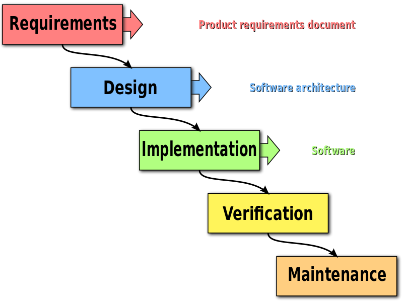
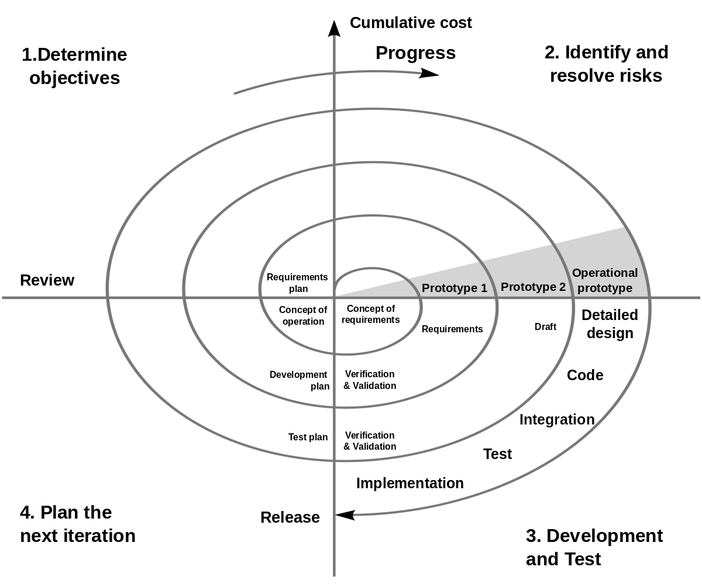
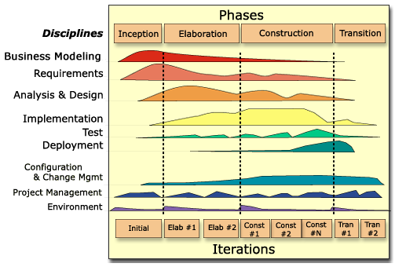
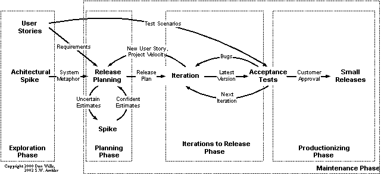

# S01-6 Szoftverfejlesztési modellek

## Tartalom
1. [Szoftverfejlesztési modellek (vízesés, spirális, evolúciós, RUP, XP, xUML)](#chapter01)
2. [Architekturális minták és hatásuk a rendszer minőségi jellemzőire](#chapter02)
3. [Tervezési minták (GoF, valamint 3 további létrehozási minta)](#chapter03)
4. [Konkurens minták](#chapter04)
5. [Antiminták, újratervezési minták](#chapter05)

---
## 1. Szoftverfejlesztési modellek (vízesés, spirális, evolúciós, RUP, XP, xUML) 
A szoftverfejlesztés hagyományos fázisai:
1. Követelmények felmérése
2. Specifikáció
3. Vázlatos/finom tervek készítése
4. Implementáció
5. Integráció
6. Verifikáció/validáció (megfelel-e a specifikációnak/ezt kérte-e a user)
7. Rendszerkövetés/karbantartás

Ezeket használják fel, vagy módosítják a következő szoftverfejlesztési modellek.

### 1.1 Vízesés modell
- Az egyes fázisok lineárisan követik egymást.
- Előre megtervezi a projekt időtartamát, ráfordításait.
- Elvárja minden fázis megfelelő dokumentálását, amely tartalmazza annak eredményeit.
- Jól strukturált dokumentált folyamatot biztosít.
- Nehézkes a megszervezése, tervezése és fájdalmas az új feature-ök bevezetése.
- Nem teszi lehetővé a követelmények megváltoztatását, nem készül fel az esetleges nehézségekre.
- Csak akkor szabad egy fázisról a következőre ugrani, ha az előző “biztosan véget ért” (reviewed & verified).
- Rövid élettartamú, előre jól specifikálható projekteknél lehet jó.

### 1.2 Boehm féle spirális modell
- A spirál minden hurka a gyártási folyamat egy fázisát jelképezi.
- Nincsenek fix hurkok, (pl.: specifikáció, vagy tervezés), azok az igényeknek megfelelően alakulnak ki.
- Minden ilyen fázisnak 4 szakasza van: (az ábrán lásd bal fentről kezdve)
    1. A célok és korlátok meghatározása
    2. Különböző megoldások elemzése, stratégiák kialakítása. Prototípus készítés
    3. Az előző pont feladatának megoldása
    4. A következő lépés megtervezése (nyilván az utolsónál ilyen nincs)
- A módszer jól dokumentálható, áttekinthető, a fázisok rugalmasak.
- Ellenben elég drága a sok kidolgozás és próbálgatás.
- A 3. pont kivételével nehezen párhuzamosítható.
- a fejlesztés ciklusokban történik, amelyben az elkészített prototípusok, valamint a továbbfejlesztésével kapcsolatos
kockázatok kiértékelésre kerülnek
- előnyei:
    - jobban alkalmazkodik a változó követelményekhez
    - a prototípusok lehetővé teszik a nehézségek előrelátását
- hátrányai:
    - költségesebb a prototípus elkészítése és a kockázatkiértékelés végett
    - továbbá a prototípusok megzavarhatják a felhasználót

### 1.3 Evolúciós modell
- Akkor jó, ha nincs pontos specifikáció
- Először a prototípust készítjük el, majd a megrendelővel folyamatosan egyeztetve jutunk el a végleges megoldásig
- Hátránya, hogy gyenge a dokumentáció, áttekinthetetlen egy idő után és nehezen módosítható.

### 1.4 RUP (Rational Unified Process)
- Az UML alkotóitól egy iteratív, inkrementális módszer.
- 4 fázisa van, mindegyik állhat több iterációból, ezeken belül munkafolyamatokból: modellezés, követelményelemzés,
tervezés, implementáció, tesztelés, telepítés, konfigurálás, változáskezelés, projektvezetés, stb
- Fázisai:
    1. Előkészítés: Architektúra, költségbecslés. (Use case és activity diagramokkal)
    2. Kidolgozás: Minimális kódolással az 1.) véglegesítése, innen már csak építeni kell.
    3. Megvalósítás: Ez a fejlesztési fázis, egészen a tesztelésig
    4. Átadás: Kb készen van, még tesztelendő, újrakiadható állapot javításokkal

### 1.5 Extreme Programming (XP)
- Lightweight fejlesztés, kis csapatokkal, határozatlan, változékony körülményekre.
- Alapelvei, hogy mindig a legegyszerűbb megoldást válasszuk, azokat csináljuk meg először, van idő próbálkozni. Ha egy
megoldás rossz, el kell dobni!
- Kis csapatokban, folyamatosan tanulva, pair-programming alkalmazásával a lehető legmagasabb minőséget biztosítva kell
dolgozni
- Fázisai:
    1. Feltárás: Az architektúra kitalálása (pár hét)
    2. Tervezés: Az első kiadás határidejének megállapítása (pár nap)
    3. Iterációk: 1-4 hetes, 2-6 hónapos kiadások, itt történik a fejlesztés nagy része.
    4. Fejlesztés, karbantartás, befejezés: Konfiguráció, bővítés, módosítás és átadás

### 1.6 Végrehajtható UML (xUML)
- Ebben az esetben csak egy platformfüggetlen modell van, csak a feladatra koncentrálunk.
- Ebből pedig kódgenerálással előáll a platformfüggő termék.
- Ezt az UML megszorításával (és kiterjesztésével) valamint az Action Specification Language-dzsel érjük el.  
- Menete:
    - Meghatározzuk a alrendszereket (use case és szekvencia diagramokkal)
    - Létrehozzuk a modellt (osztálydiagramok és állapotdiagramok)
    - Ellenőrizzük őket
    - Modellfordítást végzünk (kódgenerálás)
    - A komponensekből összeállítjuk a terméket

## 2. Architekturális minták és hatásuk a rendszer minőségi jellemzőire 
- A rendszer kívülről látható részeit mutatja meg, a belső implementációt NEM.
- Az elemek által nyújtott szolgáltatások, kommunikáció, hibakezelés, erőforrás használat tartozik ide.
- A kezdeti döntések kihatnak a következő tulajdonságokra:
    - Rendelkezésre állás
    - Megbízhatóság
    - Tejlesítmény
    - Biztonság
    - Tesztelhetőség
    - Használhatóság

**Csövek és szűrők:** Adatfolyam feldolgozása a komponensek (szűrők) között. A komponensek bemenettel és kimenettel
rendelkeznek és valamilyen transzformációt hajtanak végre az adatokon. Az adatokat pedig a csövek szállítják.
Van passzív és aktív szűrő. Az aktív szűrő tud igényelni és küldeni is. Két aktív szűrő között a kommunikációt az egyik
szűrő vagy a cső szinkronizálja. Ha a szűrők lineárisak, akkor csővezetékről beszélünk.

**Objektumelvű rendszer:** A komponensek objektumok, közöttük eljáráshívással történik a kommunikáció.
A belső reprezentációjuk rejtett. A kommunikációhoz kapcsolat kell, és ha az egyik publikus része változik, akkor
valószínűleg a használóját is módosítani kell.

**Eseményalapú rendszer:** A komponensek nem tudják, hogy más milyen eseményeket bocsát ki, mire iratkozik fel és milyen
sorrendben szolgálódik ki. Sőt, nem tudni, hogy ki-mit csinál és meddig.

**Réteg szerkezetű rendszer:** Minden réteg az alatta lévő szolgáltatásait használja, vele kommunikál. A módosítások max
1-2 réteget érintenek, tesztelés esetén lehet szimuláni a rétegeket.

**Gyűjtemény:** Komponens adattár, komponensek veszik körbe és tárolja őket. Ha végre is hajt műveleteket, akkor
táblának, ha nem, akkor adatbázisnak nevezzük. Így a komponensek függetlenek is lehetnek egymástól, jól módosítható.

**Virtuális gép, értelmező:** A bemenő adatokat értelmezi, feldolgozza, majd a feldolgozó interfészen ki is adja az
eredményt.

**Modell-Nézet-Vezérlő:** A rétegek elkülönülnek. A modell az adatokért és a rajtuk végzett műveletekért felel.
A nézet a megjelenítésért, míg a vezérlő a felhasználói utasítások kezeléséért felel. A rendszer sajnos könnyen
bonyolulttá válhat.

**Továbbiak:** szerver-kliens, modell-nézet, gyakran használt “módszerek”: állapotgép-rendszer, felügyelő (supervisor),
monád (“számítás-építő”)

## 3. Tervezési minták (GoF, valamint 3 további létrehozási minta) <a name="chapter03"></a
- A Gang of Four (GoF) a "Design Patterns: Elements of Reusable Object-Oriented Software” köny négy szerzője
- Az objektumelvű rendszer tervezésekor építünk ezekre az újrafelhasználható stratégiákra.
- 23 tervezési mintát írtak le amelyek 3 osztályba sorolhatóak: létrehozási, szerkezeti és viselkedési

- **Létrehozási**
    - **Egyke (Singleton):** Az osztályból csak 1 példány létezhet globálisan. A változóban tárolás nem jó ötlet.
    Helyette tegyük a konstruktort protecteddé és egy publikus metóduson keresztül lehessen ezt meghívni,
    ahol a konstruálás biztonságos. Ha nem létezik még az objektum, akkor hozza létre, ha létezik, akkor azt adja vissza.
    - **Építő (Builder):** Összetett objektumok konstruálásának szétválasztása. A konstrukciós folyamat eltérő
    reprezentációt hozhat létre. (konstrukció leválasztása a repr.-ről)
    - **Gyártó művelet (Factory Method):** Az objektum létrehozási felületét úgy határozzuk meg, hogy alosztályok
    döntsék el, mely osztályba tartozzon az objektum.
    - **Absztrakt gyártó (Abstract Factory):** Felület összetartozó objektumok családjának létrehozására
    (az interfész adja a család jelleget, mert egymás mellé kerülnek a létrehozóműveletek, a konkrét esetben pedig
    alákerül az implementáció). Gyártóműveletek gyártójaként is felfogható.
    - **Prototípus (Prototype):** Új objektum létrehozása egy ilyen prototípus másolásával (clone metódus hívása).
    Chachelésre használható például.
- **Szerkezeti**
    - **Összetétel (Compositer):** Fa struktúra, egyedileg és egészben is kezelhetőek a résztvevő elemek,
    mind ugyanazzal a felülettel rendelkezik.
    - **Híd (Bridge):** Szétválasztja az absztrakciót az implementációtól, így azok egymástól függetlenül
    fejleszthetőek. Futási időben lesz összekötve az absztrakt az implementációval.
    - **Díszítő (Wrapper):** Származtatás nékül egészíti ki az objektum műveleteit. Ehhez az objektumot be kell
    ágyazni egy másikba.
    - **Arculat (Facade):** Bonyolult alrendszerek közös felülete.
    - **Könnyűsúlyú (Flyweight):** Megosztás nagy számú objektum között, mert a sok objektum sok memóriát foglalhat.
    Ilyenkor érdemes a közös részeket egy másik osztályba kiszervezni.
    - **Helyettes (Proxy):** Hozzáférhetőség szabályozása. Amíg nem akarjuk használni az objektumot, addig ne
    inícializálódjon.
- **Viselkedési**
    - **Figyelő (Observer):** Ha egy objektum állapotot vált, akkor a rá feliratkozottakat értesíti. A “tárgy” ismeri a “figyelőket”, fel/le tudnak iratkozni, a figyelő pedig le tudja kérdezni a figyelt tárgy állapotát.
    - **Iterátor (Cursor):** Egy aggregátum végigjárása a szerkezet ismerete nélkül. Ezen kívül a “listát” akár több módon (visszafelé, kettőt lépve, párhuzamosan) is be lehet járni.
    - **Állapot (State):** Állapottól függően más viselkedés (kicsit mintha osztályt váltana futás közben). Van egy
    context ami tartalmazza a state-et. A state egy State interfészt megvalósító osztály egy példánya. A context-ből
    hívhatjuk a state valamely metódusát aminek paramétere a context maga, ami pedig beállíthat a context-nek egy új
    állapotot (state új implementációját). Ha változott a state, akkor legközelebb már State interfész egy másik
    implementációja fog lefutni.
    - **Közvetítő (Mediator):**  Olyan objektum megadása, ami megmondja más objektumok, hogy működnek együtt.
    Nem szerencsés ha mindenki ismer mindenkit, vagy hosszú az öröklődési lánc. (az obj-ok csak a mediátort ismerik,
    egymást nem)
    - **Feljegyzés (Memento):** Feljegyezzük egy objektum állapotát, hogy később visszanézhessük (pl UNDO művelethez).
    Csak az objektum láthatja.
    - **Kezelési lánc (Chain of responsibility):** A kezelőket láncba fűzzük, majd valaki lekezeli az igényt.
    A default kezelő kerül a lánc legelejére.
    - **Stratégia (Strategy):** Algoritmusok halmazának létrehozása, beágyazása, cserélhetősége. Van egy közös
    felületük, az ősosztály.
    - **Látogató (Visitor):** Egy szerkezeten végigjárunk és végrehajtunk egy műveletet. A műveletet a szerkezet
    különböző pontjain máshogy kell használni. Akkor jó, ha sok különböző új művelet van, de az osztályszerkezet stabil.
    - **Értelmező (Interpreter):** Ha egy probléma sokszor fordul elő, érdemes egy “nyelv” mondataként leírni és egy
    értelmezőt írni hozzá.
- **3 További minta-**
    - **Lusta példányosítás:** Olyan, mint a proxy, csak itt addig nem hozhatja létre az új objektumot, amíg nem kap
    rá engedélyt.
    - **Lusta gyártó:** Gyártó művelet + lusta példányosítás.
    - **Objektumkészlet:** Ha valakiből sok kell, akkor nem érdemes folyton létrehozni, hanem néhány darabot tárolunk
    és azokat adogatjuk.

## 4. Konkurens minták 
- **Eseményalapú aszinkron hívás:** Ha egy esemény sokáig tart, egy új szálban indítjuk el
- **Ütemező:** szálak sorbaállítása (pl szekvenciális kód kell egy adott helyen, nem futhatnak akárhogy a szálak)
- **Aktív objektum:** Minden művelet futtatás külön objektum. Párhuzamosítható, szinkronizálható.
- **Blokkolás:** Csak akkor engedünk egy szálnak végrehajtani egy műveletet, ha az objektum egy bizonyos állapotban van.
(más esetben szimplán “eldobjuk” a műveletet)
- **Író-olvasó zárás:** Több olvasó lehet, de egyszerre csak egy író. (írás közben nincs más I/O!)
- **Threadpool:** Olyan, mint az objektumkészlet.
- **Termelő-fogyasztó:** Aszinkron, párhuzamos folyamatok. Feladatok generálása/végrehajtása. A termelő egy
közbeiktatott raktárba helyezi az objektumokat, ahonnan a fogyasztó kiveheti.

## 5. Antiminták, újratervezési minták 
- **Antiminták**
    - **Mindenható objektum:** Túl sokat tud, egy idő után borzasztóan nehéz lesz a módosítás.
    - **Kör-ellipszis probléma:** Mi az általánosabb? Mindig attól függ, milyen műveletek vannak.
    - **Felesleges rétegződés:** Ha túl sok réteg van a rendszerben, érdemes összevonni néhányat.
    - **Jojó probléma:** Túl hosszú az öröklődési lánc.
    - **Poltergeist objektum:** Az osztály összes objektumának élete túl rövid (pl: paraméter átadás, üzenetküldés, stb)
- **Újratervezési minták**
    - **Létrehozó metódus:** Olyan, mint a singletonnál. Inkább legyenek olyan műveltek, amik visszaadnak egy
    objektumot.
    - **Műveletek kihelyezése:** Egy bonyolult művelet egy részét kihelyezzük, ezzel több kisebb műveletre bontva,
    amelyek egyenként már könnyebben értelmezhetőek.
    - **NullObject:** A nullreferencia sokszor gondot okozhat. Ilyenkor érdemes egy NullObject típust bevezetni.

## További források
- Előző éves kidolgozás
