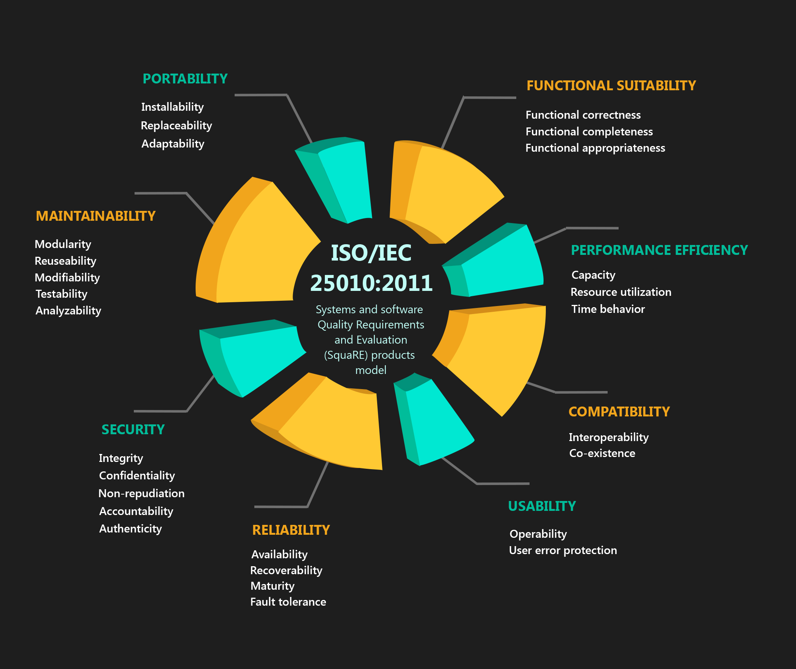
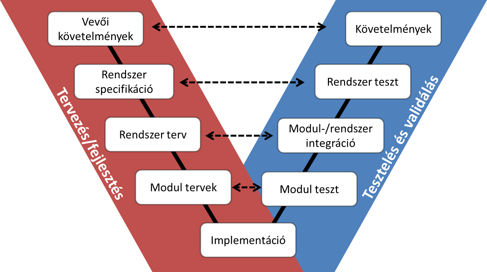
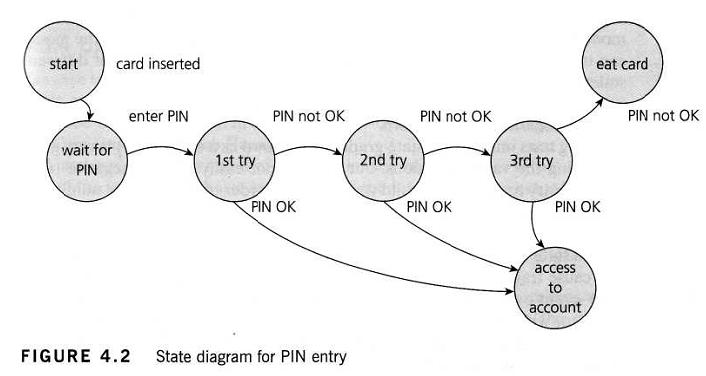

# S01-9 Szoftverfejlesztés minőségi aspektusai

## Tartalom
1. [A szoftverminőség komplex kérdésköre, termék és folyamat alapú megközelítés.](#chapter01)
2. [A szoftverfejlesztés és a tesztelés kapcsolata, V modell, agilitás.](#chapter02)
3. [A tesztelés szintjei.](#chapter03)
4. [A tesztelés életciklusa.](#chapter04)
5. [Teszttervezési technikák.](#chapter05)
6. [Specifikáció alapú: ekvivalencia-osztályozás, határérték elemzés, döntési táblák, állapotgépek,
használati eset tesztelés; struktúra alapú: utasítás és döntési lefedettség.](#chapter06)
7. [Review technikák, statikus tesztelés.](#chapter07)
8. [A tesztelés dokumentálása.](#chapter08)
9. [Teszteszközök.](#chapter09)

---
## 1. A szoftverminőség komplex kérdésköre, termék és folyamat alapú megközelítés. 
- A projekt célja, hogy a megrendelői igényeknek megfelelő specifikációt, valamint az ennek megfelelő szoftvert
elkészítse
- verifikáció: a termék megfelel a specifikációnak
- validáció: a termék megfelel a megrendelő igényeinek
- emberi hiba a szoftverfejlesztés élet-ciklusában bárhol okozhat problémát, ezért szigorú tesztelésre van szükség, hogy biztosítsuk a szoftver minőségi elvárásait, megfeleljünk az ipari szabványoknak, stb.
- egy észlelt hibát nem biztos, hogy azonnal javítani kell: súlyosság és kritikusság alapján kell dönteni

Az, hogy milyen a minőségi szoftver attól függ, hogy kit kérdezünk meg. pl.:

- megrendelő: költséghatékony
- felhasználó: könnyű használni, segíti a munkát
- fejlesztő: könnyű fejleszteni/karbantartani
- fejlesztés menedzsment: profitot termel

Két fő megközelítése van a szoftverminőségnek: termék és folyamat alapú megközelítés.

### 1.1 Folyamat alapú megközelítés
- annak biztosítása, hogy minden köztes termék egy fejlesztési folyamatban jó minőségű legyen, kielégítse a
belső ügyfelek igényeit akiknek a következő lépést kell végrehajtaniuk
- továbbá, hogy a fejlesztési folyamat során használt technológiák, módszerek és eszközök ellenőrzés alatt álljanak,
illetve, hogy fejlődjenek
- sok szervezeti keretrendszer van amelyek használatával növelhetjük a folyamatok minőségét, pl.:
    - SPICE
    - Plan-Do-Check-Act

### 1.2 Termék alapú megközelítés
- a termék magába foglalja a futtatható programokat, a forráskódot, az architektúrát tartalmazó dokumentumokat stb.
- ezek alapján a felhasználók csoportja sokkal tágabb
- az ISO/IEC 9126 szabványban rögzítették a minőségi karakterisztikákat, amelyek al-karakterisztikákra, az
al-karakterisztikák pedig attribútumokra oszlanak fel
- a szabványban csak a karakterisztikák és az al-karakterisztikák vannak meghatározva, az attribútumok nem, mert azok
termékenként változhatnak
- az attribútumok már ellenőrizhető és mérhető entitások
- a szabvány egy keretet biztosít a termék minőségi modelljének meghatározásához, a szervezetek feladata a saját modell
pontos meghatározása
- az ISO/IEC 9126 szabványt leváltotta a ISO/IEC 25010:2011 szabvány, amely a következő ábrán látható

## 2. A szoftverfejlesztés és a tesztelés kapcsolata, V modell, agilitás. 
- a tesztelés önmagában nem létezik, a tesztelési tevékenységek szorosan a fejlesztési tevékenységekhez kapcsolódnak
- a különböző fejlesztési élet-ciklus modellekhez más és más tesztelés megközelítés szükséges
- a tesztelés célja, hogy megállapítsa a termék tejesíti-e a követelményeket, illetve, hogy megfelel-e a projekt
céljainak
- a tesztelés felelős bárhol az élet-ciklusban elkövetett hibák megtalálásáért
- minél később találunk meg egy hibát az élet-ciklusban annál költségesebb lesz annak javítása

### 2.1 V-modell
- a vízesés modell egy kiterjesztése
- a vízesés modellben a tesztelés csak a projekt késői fázisában lett végrehajtva, így a hibák későn derültek ki
- a V-modell útmutatást nyújt ahhoz, hogy a tesztelést a lehető legkorábban el kell kezdeni az életciklusban
- azt is mutatja, hogy a tesztelés nem csak végrehajtás alapú tevékenység
- ezeket a tevékenységeket a fejlesztéssel párhuzamosan kell elvégezni, és a tesztelőknek együtt kell működniük
a fejlesztőkkel, üzleti-elemzőkkel
- a teszttervezés korai elkezdésével gyakran megtalálhatóak a hibák a tesztelési alapdokumentumokban
- jó gyakorlat ha már ezen dokumentumok review-olása során bevonják a tesztelőket
- minőségre és megbízhatóságra fókuszál

### 2.2 Agilitás
- körkörös szoftverfejlesztési modellek csoportja
- iteratívan és inkerementálisan készül el a szoftver
- iteratívan: a fejlesztési cikluson sokszor gyorsan áthaladunk, ismételjük azt
- inkrementális: az iterációk során apránként bővítjük a rendszer funkcionalitását
- a gyorsaságra fókuszál
- Alapelvek:
    - az egyének és a kommunikáció a folyamatok és az eszközök helyett - egy helyen dolgozás, pair-programming
    - működő szoftver az átfogó dokumentáció helyett
    - együttműködés a megrendelővel a szerződés egyeztetés helyett - a megrendelő képviselője a csapat tagja
    - válasz a változásokra a terv szigorú követése helyett
- tesztelés:
    - komponens teszt a komponens implementációja előtt, a futtatások automatizálása (TDD - Test Driven Development)
    - integrációs teszt a modul integrálása előtt
    - átvételi teszt a feature elkezdése előtt
- mindig a lehető legegyszerűbb megoldás alkalmazása

## 3. A tesztelés szintjei. 
### 3.1 Egység teszt
- önállóan tesztelhető szoftverrészek (osztályok, modulok, függvények) tesztelése
- a rendszer többi részétől függetlenül végzendő
- általában a fejlesztő készíti el ezeket a teszteket
- célja: az adott programrész megfelel a specifikációnak
- funkcionális és nem funkcionális tulajdonságok tesztelésére, illetve strukturális tesztelésre is használatos
- stub-ok és driver-ek segítségével szimuláljuk az interfészt a komponensek között
    - stub: a tesztelendő szoftverkomponensből kerül hívásra
    - driver: a tesztelendő szoftverkomponenst hívja

### 3.2 Integrációs teszt
- célja: az integrált egységek közötti interfészekben és kölcsönhatásokban lévő hibák megtalálása
- két típusa van:
    - komponensintegrációs
    - rendszer integrációs

### 3.3 Rendszerteszt
- a rendszer egészének működését vizsgálja
- pl.: használati eseten alapuló, operációs-rendszer erőforrásaival való kölcsönhatáson alapuló
- ellenőrzi, hogy az (átadás előtt álló) rendszer megfelel-e a specifikációnak

### 3.4 Átvételi teszt
- a megrendelő által a végterméken végzett feketedoboz teszt
- célja, hogy eldöntse, megfelel-e a végtermék a megfogalmazott elvárásoknak, valamint hogy növelje a rendszerrel
szemben érzett bizalmat
- nagyobb rendszereknél két szintű:
    - alfa teszt: potenciális felhasználók által, vagy egy független tesztelő csapat által a fejlesztői oldalon,
    de a fejlesztési környezeten kívül
    - béta teszt: potenciális vagy meglévő felhasználók által, külső helyszínen, a fejlesztők bevonása nélkül

## 4. A tesztelés életciklusa 
- a tesztelés inkább folyamat, mint egyszeri tevékenység
- a folyamat a szoftver specifikálásakor kezdődik
- a tevékenységek logikailag egymás után következnek, de ezek mégis átfedik egymást

### 4.1 Tervezés és irányítás
- a tesztelés céljainak kitűzése
- szükséges erőforrások meghatározása
- teszttervezési technikák megválasztása
- tesztlefedettség és kilépési feltételek meghatározása
- elemzési és tervezési feladatok ütemezése
- elkészítés, futtatás és kiértékelés ütemezése

### 4.2 Elemzés és műszaki tervezés
- a tesztelés általános céljait kézzelfogható tesztelési feltételekké és műszaki tervekké fordítjuk
- tesztbázis: dokumentumok, melyeken a tesztesetek alapulnak
- tesztkörnyezet és teszteszközök meghatározása

### 4.3 Megvalósítás és végrehajtás
- tesztesetek kialakítása, tesztkészlet létrehozása
- tesztesetek végrehajtása, tesztnapló készítése

### 4.4 Kilépési feltételek értékelése és jelentés készítése
- ellenőrzés, hogy az eredmények megfelelnek-e a kilépési kritériumoknak
- kritériumok többfélék lehetnek (lefedettség, átlagos válaszidő, stb.)
- döntés, hogy szükség van-e további tesztelésre, vagy a kilépési kritériumok módosítására
- tesztösszefoglaló készítése

### 4.5 Teszt lezárása
- ellenőrzés, hogy a terveknek megfelelően mindent átadtunk
- rendszerátvételi dokumentum készítés
- testware lezárása és archiválása
- testware átadása a karbantartó szervezetnek
- tanulságok elemzése, hogy hatékonyabbá tegyük a későbbi teszteléseket

## 5. Teszttervezési technikák. 
### 5.1 Tesztdokumentáció formalitása
- a tesztelést a formalizmus különböző szintjein végezhetjük
- minél formálisabb egy teszt, annál átfogóbb dokumentáció tartozik hozzá

### 5.2 Tesztelési feltételek meghatározása
- tesztelési feltétel = amit tesztelni tudunk
- kimerítő tesztelés lehetetlen, ezért a lehetséges tesztelési feltételek egy olyan részhalmazát kell meghatározni,
melyekkel jó eséllyel megtalálható a legtöbb hiba
- ezek kiválasztásában segítenek a teszttervezési technikák
- fontos ezek prioritási sorrendje

### 5.3 Tesztesetek meghatározása
- tesztorákulum: információforrás a rendszer elvárt működéséről
- tesztesetben meghatározni:
    - adott bemenetre a várt eredmény
    - tesztkörnyezet
    - előzetes és utólagos feltételek

### 5.4 Teszt megvalósítása és végrehajtása
- implementáljuk a teszteket
- ésszerű módon csoportosítjuk őket
- tesztszkript, a tesztelési lépések sorrendjét meghatározzuk
- futtatjuk a tesztszkriptet

### 5.5 Teszttervezési kategóriák
- specifikáción alapuló (feketedoboz) technikák
    - ekvivalencia-osztályozás
    - határérték elemzés
    - döntési táblák
    - állapotgépek
    - használati eset tesztelés
- struktúra alapú (fehér doboz) technikák
    - utasítás
    - döntési lefedettség
- tapasztalaton alapuló technikák
- hibán alapuló technikák

**Specifikáción alapuló tesztelés:** tesztesetek generálása a szoftver specifikációja alapján
**Struktúra alapú tesztelés:** tesztesetek generálása a struktúra alapján

A feketedoboz és fehér doboz tesztelés szinonimák a funkcionális és strukturális tesztelésre. Feketedoboz tesztelésnél
a belső felépítése a programnak rejtett a tesztelési folyamat elől. Fehér doboz tesztelésnél a belső struktúra
ismert és az alapján alakítjuk ki a teszteseteket.

Az elvárt kimenetet az orákulum segítségével tudhatjuk meg. Az orákulum megmondja, hogy mi az elvárt kimenete
az adott programnak. Ez alapján összetudjuk hasonlítani a teszteset aktuális kimenetét az elvárt, orákulum által
adott kimenettel és dönteni, hogy jó-e vagy sem. Orákulum használata nem mindig lehetséges.

## 6. Specifikáció alapú és struktúra alapú tesztelés 
### 6.1 Specifikáció alapú
#### 6.1.1 Ekvivalencia-osztályozás
- A tesztelési feltételeket particionáljuk aszerint, hogy melyeket tekintjük azonosnak. Ha egy partíció egy
elemére helyesen működik a szoftver, akkor feltételezzük, hogy a többire is.
- pl.: Adatszerkezet üres-e? két ekvivalencia osztály: üres, nem üres

#### 6.1.2 Határérték-elemzés
- Ekvivalencia-osztályok határainak tesztelése
- egy ekvivalencia-osztály minimum és maximum értéke a határok:
    - érvényes partíció esetén: érvényes határérték
    - érvénytelen partíció esetén: érvénytelen határérték
- példa: [-100, +100] egészeket tartalmazó partíció
    - -101 maximális érvénytelen határértéke a ]$-\infty$, -101] partíciónak
    - -100 minimális érvényes határértéke a [-100, +100] partíciónak
    - +100 maximális érvényes határértéke a [-100, +100] partíciónak
    - +101 minimális érvénytelen határértéke a [+101, $+\infty$] partíciónak
- kétféle megközelítés:
    - 2 értékű: kiválasztjuk a minimum és maximum értékét az érvényes partíciónak, illetve a szomszédos érvénytelen
    partíciók első és utolsó elemét, tehát egy-egy határ ellenőrzéséhez két értéket használunk
    - 3 értékű: annyi a különbség, hogy a szomszédos érvénytelen partíciók első két, illetve utolsó két elemét
    használjuk

#### 6.1.3 Döntési tábla
- a bemenetekre megfogalmazott igen/nem feltételeket és a végrehajtás eredményének kapcsolatát mutatja
- kell találnunk egy függvényt, mely a bemenetek kombinációjára megfelelően reagál
- igazságtáblázatot készítünk a feltételek I/H lehetséges kombinációival
- eltávolítjuk azon feltétel kombinációkat amik nem relevánsak, vagy lehetetlenek, illetve az ekvivalensek összevonjuk
- az elvárt működés szerint kitöltjük az eredményeket
- megjelöljük a teszteseteket

Példa:

| Bemenetek            |     |     |     |     |     |     |     |     |
| -------------------- | --- | --- | --- | --- | --- | --- | --- | --- |
| Valid felhasználónév |  I  |  I  |  I  |  I  |  H  |  H  |  H  |  H  |
| Valid jelszó         |  I  |  I  |  H  |  H  |  I  |  I  |  H  |  H  |
| Tagja a csoportnak   |  I  |  H  |  I  |  H  |  I  |  H  |  I  |  H  |

| Bemenetek            |     |     |     |     |
| -------------------- | --- | --- | --- | --- |
| Valid felhasználónév |  H  |  I  |  I  |  I  |
| Valid jelszó         |  *  |  H  |  I  |  I  |
| Tagja a csoportnak   |  *  |  *  |  H  |  I  |

| Bemenetek             |     |     |     |     |
| --------------------- | --- | --- | --- | --- |
| Valid felhasználónév  |  H  |  I  |  I  |  I  |
| Valid jelszó          |  *  |  H  |  I  |  I  |
| Tagja a csoportnak    |  *  |  *  |  H  |  I  |
| **Műveletek**         |     |     |     |     |
| Sikeres belépés       |  H  |  H  |  I  |  I  |
| Hozzáférés korlátozás |  *  |  *  |  I  |  H  |
| Címkék                |  A  |  B  |  C  |  D  |

#### 6.1.4 Állapotgépek
- akkor használjuk, ha a rendszert véges állapotú (lehetőleg kevés) gépezettel leírható
- 4 része van
    - állapotok
    - átmenetek az állapotok között
    - események, melyek átmenetet okozhatnak
    - tevékenységek, melyeket az átmenetek eredményeként végrehajtjuk
- az állapotgép alapján megkonstruálhatjuk a teszteseteket

| Teszteset    | 1            |  2            | ... |
| ------------ | ------------ | ------------- | --- |
| Kezdőállapot | start        | wait for pin  | ... |
| Input        | insert card  |  enter pin    | ... |
| Végállapot   | wait for pin |  first try    | ... |

#### 6.1.5 Használati eset
- a használati eset diagram a rendszer egy adott szereplő általi használatának leírása
- a rendszer és a felhasználó közötti interakciók leírása magas szinten
- a tesztesetek fejlesztésének alapjául szolgálnak, főleg rendszer és átvételi teszt szinten
- minden használati esethez meg kell adni elő- és utófeltételeket
- fő előnye, hogy valós felhasználói folyamatokat, illetve üzleti forgatókönyveket modellez
    - folyamatáramlási hibák,
    - illetve integrációs hibák felfedésében segít

## 7. Review technikák, statikus tesztelés. 
### 7.1 Review technikák
- a felülvizsgálatok formálisak és informálisak lehetnek
- a gyakorlatban az informális felülvizsgálás terjedt el
- Típusai:
    - Átvizsgálás: egy dokumentum szerzője lépésenként bemutatja a dokumentumot, hogy információt gyűjtsön és közös
    álláspontot alakítson ki
    - Technikai felülvizsgálat: megbeszélés, ahol egy dokumentum technikai tartalmával kapcsolatos konszenzus elérésére
    törekednek
    - Inspekció: egy dokumentumot a felülvizsgálók alaposan előkészítik és ellenőrzik a megbeszélés előtt.
    A hibákat naplózzák, de csak a tárgyalási szakaszban vitatják meg. Cél: termelékenység, eredményesség.

### 7.2 Statikus tesztelés
- a követelményeken, műszaki terven vagy a kódon hajtjuk végre
- cél: hibák megtalálása attól függetlenül, hogy ezek valóban meghibásodást okoznak-e
- leginkább a komponens és integrációs tesztek előtt és a tervezéskor a modellezésnél használják
- tipikus statikus elemzői célok:
    - kódolási szabályok betartása
    - kódmetrikák (beágyazás mélysége, ciklomatikus komplexitás) vizsgálata
    - kódszerkezettel kapcsolatos elemzések (vezérlési folyam, adatfolyam vizsgálat)
- előnyei:
    - hibák korai detektálása
    - automatikusan működik
    - hibák megelőzése
    - dinamikus tesztelés során nehezen megtalálható programhibák megtalálása

## 8. A tesztelés dokumentálása. 
**Műszaki tesztterv specifikáció:** Tesztelési feltételek és a követelmények,  
tesztelés megközelítése és magas szintű tesztesetek.

**Teszteset-specifikáció:** Egy tesztelemre vonatkozó a teszteseteket meghatározó dokumentáció
(cél, bemenetek, tesztelési tevékenységek, várt eredmények, végrehajtás előfeltételei)

**Teszteljárás specifikáció:** Tesztelés futtatásának tevékenységsorozatát rögzítődokumentum.
(tesztszkript néven is ismert)

**Tesztterv (test plan):** A tesztelés hatáskörét, megközelítését, erőforrásait, valamint a tevékenységek  
tervezett ütemezését tartalmazó dokumentum. Ezen kívül meghatározza a tesztelési elemeket, a  
tesztelendő funkciókat, feladatokat, a tesztelést végrehajtó személyek függetlenségét,  
a tesztelési környezetet, a műszaki teszttervezési technikákat, a belépési és kilépési feltételeket,
valamint a kockázatokat.

**Tesztnapló:** Tesztvégrehajtáshoz kapcsolódó részletek időrendi rögzítése.

**Tesztösszefoglaló:** A tesztelési tevékenységet és eredményeket tartalmazó dokumentum.

**Tesztelem kiadás jelentés:** Kiadott tesztelemek, kiadás dátuma és ki engedélyezte.

**Tesztincidens jelentés:** Hiba leírása, előfordulás körülményei, reprodukálás, súlyosság, gyakoriság.

## 9. Teszteszközök 
### 9.1 Tesztelést és tesztirányítást támogató eszközök
#### Tesztmenedzsment eszközök:
Tesztek ütemezése, eredmények naplózása, folyamatkövetés, incidensmenedzsment és tesztjelentések elkészítése

#### Követelménymenedzsment eszközök:
Követelményeknek, a követelmény jellemzőinek (pl. prioritás, tudásgazda) rögzítése és magyarázó jegyzetek készítése.

#### Incidens kezelő  eszközök:
Megkönnyíti az incidensek felismerését és állapotainak nyomon követését.

#### Konfiguráció kezelő  eszközök:
Támogatja a konfigurációs elemek meghatározását és ellenőrzését, ezek változásainak ill. verziók státuszainak
nyomon követését, valamint felügyeli a konfiguráció elemeit tartalmazó alapverziók kiadását.

### 9.2 Statikus tesztelést segítő  eszközök
#### Felülvizsgálatokat segítő  eszközök:
Felülvizsgálat tervezés, a változáskövetés, a felülvizsgálók közti kommunikáció,
a közösen végzett felülvizsgálatok támogatása.

#### Statikus elemző  eszközök:
Egy eszköz, ami statikus elemzést hajt végre.

### 9.3 Tesztspecifikálást támogató eszközök
#### Teszttervező  eszközök:
A műszaki teszt tervezési tevékenységet támogató eszköz, amely tesztelési bemeneteket generál egyéb forrásokból
pl. case eszközökből, követelménymenedzsment eszközből valamint magából a programkódból.

#### Tesztadat előkészítő  eszközök:
Olyan tesztelési eszköz, amellyel a teszteléshez adatokat állíthatunk elő meglévő adatbázisunkból. Az eszköz alkalmas
lehet egyéb adatok generálására, adatok manipulálására, valamint szerkesztésére is.

### 9.4 Tesztvégrehajtás és naplózás támogató eszközök
#### Tesztelés végrehajtó eszközök:
Olyan tesztelési eszköz, amely képes másik szoftvert futtatni egy automatizált szkript (pl felvétel/lejátszás)
segítségével.

#### Unit teszt keretrendszerek:
Olyan környezetet biztosító keretrendszer, amelyben egy komponens egyaránt tesztelhető különállóan, valamint megfelelő
segédprogramokkal. Hibakeresési funkciójával támogatja a szoftverfejlesztők munkáját is.

#### Teszt összehasonlító eszközök:
Egy tesztelési eszköz, amellyel a teszt elvárt és aktuális eredményeit automatikusan össze lehet vele hasonlítani.

#### Lefedettség mérő  eszközök:
Olyan eszköz, amely objektíven méri, hogy mely strukturális elemeket - pl. utasításokat,
elágazásokat - hajt végre a teszt készlet.

#### Biztonsági eszközök:
Eszköz, ami a biztonsági karakterisztikák és sebezhetőségek teszteléséhez nyújt támogatást.

### 9.5 Teljesítményt és monitorozást támogató eszközök

#### Dinamikus elemző  eszközök:
A szoftverkód állapotáról futási időben információt szolgáltató eszköz. Leggyakrabban érvénytelen mutatók,
memória foglalások és törlések, ill. a memóriaszivárgások felderítésére használják.

#### Teljesítmény tesztelő  eszközök:
Az eszköz terhelést generál több felhasználó szimulálásával illetve nagy mennyiségű bemenő adat elküldésével.
A futás során kiválasztott tranzakciók válaszidejét mérik és naplózzák, amelyekből teljesítményjelentés készül,
diagramokkal, pl. a terhelés és válaszidők aránya.

#### Stressz tesztelő  eszközök:
A rendszert előre elvárt vagy annál nagyobb terheléssel vagy csökkentett erőforrás rendelkezése bocsátásával
teszteljük. pl. korlátozott szerver memória hozzáférés.  

#### Monitorozó eszközök:
Egy szoftver vagy hardver eszköz, amely párhuzamosan fut a tesztelés alatt lévő komponenssel vagy rendszerrel,
ez utóbbiakat felügyeli, elmenti és/vagy elemzi azok viselkedését.

## További források
- Előadás anyag
- Korábbi kidolgozások
- ISTQB - Fundamentals of Software Testing
