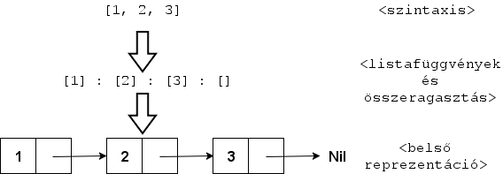
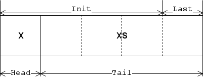

S2-01 Funkcionális nyelvek alapfogalmai
=======================================
Tartalom
---------------------------------------

1. [Funkcionális nyelvek alapfogalmai](#chapter01)
    + [Modell](#section01_01)
    + [Kiértékelés](#section01_02)
    + [Curry-zés](#section01_03)
    + [Magasabbrendű függvények](#section01_04)
    + [Listák](#section01_05)
    + [Tisztaság](#section01_06)
2. [Típusok](#chapter02)
    + [Algebrai adattípusok](#section02_01)
    + [Típusosztályok](#section02_01)
    + [Típuskonstruktorok](#section02_03)
    + [Kindok](#section02_04)
3. [Monadikus programozás](#chapter03)
4. [További források](#references)

## 1.Funkcionális nyelvek alapfogalmai <a name="chapter01"></a>
### 1.1 Modell <a name="section01_01"></a>

**Funkcionális programozási paradigma, nyelvek**

* Nem az algoritmust írjuk le
    $\Longrightarrow$ függvényekkel specifikáljuk a feladatot
* Deklaratív nyelvek családjába tartozik
    + Imperatív nyelvek: **HOGYAN** csinálja meg a feladatot a program, utasítások írása, sokszor a memóriát
      is mi kezeljük
    + Deklaratív nyelvek: **MIT** csináljon a program, magát a feladatot adjuk meg
* Minden program alapegysége a függvény
    + Maga a program, programmodul $\rightarrow$ az egy függvényhalmaz
    + Program végrehajtása $\rightarrow$ kezdeti függvénykifejezés (`main`) kiértékelése
* Matematikai számítási modellje a lambda-kalkulus
    + (*Érdekesség: szokták lambda-kalkulust a funkcionális nyelvek "assembly-jének" is hívni*)
* Nincsenek változók, nincsen állapot, minden immutable, minden másolódik
* Iteráció helyett paraméterek mintaillesztése (*pattern matching*) és rekurzió
    + Minteillesztés + rekurzió: mint a teljes indukció matematikában
    + Első minta: alapeset
    + Rekurzív minta: indukciós lépés

**Funkcionális programozás előnyei**

1. Közelebb áll a feladat és annak leírása
2. Szemlélete közelebb áll a formális, matematikai leíráshoz, precízebb
3. Helyességet könnyű kifejezni
    + Hoare-hármasokat (elő-utó feltétel) könnyű funkcionális nyelvekkel leírni
4. Feladatosztályok absztrakcióinak kifejezése
    + Van egy nagyon általános feladatsémám (nem algoritmus!)
    + Ezt egy függvénnyel felparaméterezve (*magasabbrendű függvények*) eljutok a konkrétabb feladathoz
5. Kevesebb sor, tömörebb program, kevesebb hiba, könnyebb karbantarthatóság
6. Könnyű funkcionális programokat párhuzamosítani
    + Például `(2 + 3) + (7 + 1)`
    + Egyik CPU: `(2 + 3)`
    + Másik CPU: `(7 + 1)`
    + Minden asszociatív műveletre igaz: ha zárójelezünk, akkor több CPU tudja feldolgozni a zárójelezett
      részeket

**Végrehajtási modell**

* Végrehajtási modell egy konfluens redukciós (átíró) rendszer
* Mitől konfluens:
    + Az egyes részkifejezések átírásának sorrendje a végeredményre nincs hatással
    + A sorrend legfeljebb azt befolyásolja

          $\Longrightarrow$ hogy az átírási lépéssorozattal eljutunk-e a végeredményig

* Tehát a végrehajtás redukciós, átírási lépések, redukáló kifejezések (redex-ek) sorozata

### 1.2 Kiértékelés <a name="section01_02"></a>

* Kiértékelőrendszer feladata
    + Kiértékeli a specifikációt
    + majd megadja a függvényértéket

* Függvénydefiníció részei
    1. Függvény azonosító
    2. Formális paraméterek
    3. Függvény törzse

* Kiértékelés menete
    + Átírási lépések (redukciók) sorozatával
    + Átírási lépésben függvény alkalmazásában:
          függvény helyettesítése $\Longrightarrow$ függvény törzsével
    + Addig írunk át, amíg el nem érjük a normálformát
          $\Longrightarrow$ azaz tovább már nem lehet átírni

* Kiértékelési stratégiák nem mások, mint redex-ek kiválasztási sorrendje. Ezek lehetnek:
    + Mohó
    + Lusta
    + Párhuzamos

#### Lusta (Lazy) kiértékelés

* Nem fontos a függvénykiértékelések sorrendje
* Először a **FÜGGVÉNYT** értékeli ki

```haskell
squareinc 7       =
square (inc 7)    =
(inc 7) * (inc 7) =
8 * (inc 7)       =
8 * 8             =
64
```

#### Mohó (strict) kiértékelés

* Fontos a függvénykiértékelések sorrendje
* Először az **ARGUMENTUMOKAT** értékeli ki
* Haskell-ban és Clean-ben: alfüggvény/paraméter `!`-el való megjelölése

```haskell
squareinc 7     =
square (inc 7)  =
square (1 + 7)  =
square 8        =
8 * 8           =
64
```

### 1.3 Curry-zés <a name="section01_03"></a>

* Matematikában: több argumentumot elfogadó függvény átalakítása
  **függvények sorozatára** amik csak egy-egy argumentumot kapnak
* Minden függvény csak egy argumentummal rendelkezik

```haskell
((+) x) y   -- x + y helyett
```

### 1.4 Magasabbrendű függvények <a name="section01_04"></a>

Függvények, melyeknek

* argumentumaik egy- vagy több függvény
* vagy visszatérési értékük egy függvény

```haskell
applyFunctionTwice :: (Int -> Int) Int -> Int
applyFunctionTwice f x = f(f x)

applyFunctionTwice (\x -> x + x) 3 = 12
```

### 1.5 Listák <a name="section01_05"></a>

#### Listák ábrázolása
* Láncolt listákkal
* Maga a listaábrázolás is egy függvény. Funkcionális programozásban mindennek az alapja a függvény.
    + `[]` listaépítés függvénye, listakonstruktor (`[a]` írható `[] a` -ként is, mint `[]` függvény
      alkalmazása)
    + `:` listaragasztás, konkatenáció függvénye
* Listaműveletek esetén nem írunk felül semmit, **NEM MÓDOSÍTUNK ELEMET!**
    + Listafüggvény eredménye egy új lista lesz
    + Immutable, mindig másolódik (valójában csak a lista váza másolódik)



Listakonstruktor mintaillesztést használ:

```haskell
                     -- "a" bármilyen típusú (polimorf) paraméter.
data [] a = []       -- Üres lista ha nem adunk elemet.
          | a : [a]  -- Értékhez hozzáragasztunk egy következő listát.
                     -- A következő lista lehet üres is ([]).
```

Lista típus definíciója Haskell-ban:

```haskell
data List a = Nil               -- Üres lista.
            | Cons a (List a)   -- "Cons" a ragasztás, "(List a)" lehet üres is
```

* Ez egy rekurzív, paraméteres típus
* Szétszedhető, újra összeragasztható, az elejéről könnyű kivenni, könnyű hozzátenni
    + Végére nehéz elemet tenni, költségesen végig kell járni
    + (*Megjegyzés: mint ahogy láncolt listákban szokás. Duh!*)

#### Szabványos listafüggvények (Clean nyelv)




* *Head*: lista elemének olvasása

```
hd [x : xs] = x                     -- Minteillesztés első elemre
hd []       = abort "hd of []"      -- Üres lista esetén hiba
```

* *Tail*: lista végéről olvasás
    + Nem egy elemet, hanem a maradék listát adja vissza

```
tl [x : xs] = xs                    -- Minteillesztés első elem után ragasztott listára
tl []       = abort "tl of []"      -- Üres lista esetén hiba
```

* *Last*: lista utolsó elemének olvasása (head ellentétje)

```
last [x]      = x                   -- Minteillesztés egy elemre
last [x : xs] = last xs             -- Rekurzív hívás maradék listára amíg egy elemet
                                    -- nem kapunk
last []       = abort "last of []"  -- Üres lista esetén hiba
```

* *Init*: lista elejének olvasása (tail ellentéte)

```
init []       = []                  -- "I didn't do anything and I still got paid."
init [x]      = []                  -- Utolsó elem a listában már nem kell
init [x : xs] = [x : init xs]       -- Rekurzív hívás amíg egy elem nincs a listában
```

* *Length*: lista hossza

```
length []       = 0                 -- Minteillesztés üres listára
length [_ : xs] = 1 + length xs     -- "_" a thunk-ot ("tönk") jelenti. Tökmindegy
                                    -- mi van ott, nem kerül kiértékelésre, nem
                                    -- foglalkozunk vele.
```

* *Reverse*: **NEM FORDÍTJA MEG A MEGLÉVŐ LISTÁT!** Másolatot készít, ami meg van fordítva.
* *Sort*: **NEM RENDEZI A MEGLÉVŐ LISTÁT!** Másolatot készít, ami rendezve van.

#### Magarabbrendű listafüggvények

* *Filter*: megadott logikai függvény (*predikátum*, *predicate*) alapján kiválogatja azokat az elemeket
  a listából amelyekre teljesül a logikai függvény

```
evenNumberFunction :: Int -> Bool
evenNumberFunction x = x mod 2 == 0

evenNumbers = filter (evenNumberFunction) [0..]
```

* *Map*: elemenkénti függvényalkalmazás
    + Első paraméter: függvény, amit `map` a második paraméterben kapott lista elemeire alkalmaz
    + Második paraméter: lista, aminek elemeire az első paraméterben kapott függvényt alkalmazza

```
map :: (a -> b) [a] -> [b]
map f [] = []
map f [x : xs] = [f x : map f xs]
```

* *Fold*: elemenkénti fogyasztás
    + Paraméterként kapott függvénnyel kicseréli a lista összeragasztó függvényt (`:`)
    + Van jobbasszociatív (`foldr`) és balasszociatív (`foldl`) változata

```
foldr :: (.a -> .(.b -> .b)) .b ![.a] -> .b)
foldr f e [] = e
foldr f e [x : xs] = f x (foldr f e xs)
```

További magasabbrendű listafüggvények:

* `takeWhile`: elemek megtartása míg predikátum teljesül
* `dropWhile`: elemek eldobása míg predikátum teljesül

### 1.6 Tisztaság <a name="section01_06"></a>

* Nyelvi elemei felhasználásánál mellékhatások biztosan nem lépnek fel (*pure programming*)
* Az előző értéket megsemmisítő értékadás vagy más imperatív programozásra jellemző nyelvi elem nem áll
  rendelkezésre

Pár tulajdonság:

* *Hivatkozási helyfüggetlenség*
    + Ugyanannak a kifejezésnek a programszöveg bármely pontján $\Longrightarrow$ ugyanaz lesz a végeredménye
* *Egyenlőségi érvelés*
    + Minden egyes előforduláshoz beírható a „végeredmény”
          $\Longrightarrow$ hisz úgy is egyenlőek a hivatkozási helyfüggetlenség miatt

Egyéb tulajdonságok:

* *Szigorú típusosság*
    + Kevés, vagy egyáltalán nincs implicit típuskonverzió
* *Statikus típusrendszer*
    + A kifejezések típusa fordítási időben ismert
    + Absztrakt- és algebrai adattípusok leírásához adottak a nyelvi eszközök
    + Hindley–Milner-féle korlátozottan polimorfikus típusrendszer
* *Rekurzió, mintaillesztés*
    + Konstruktorokra, típusértékekre (amelyek valójában konstruktorok, konstans függvények)
    + Joker minta
    + Őrfeltételek (argumentumokra, `x when x > 10`)
* *Margó-szabály*
    + Összetartozó kifejezések csoportjának azonosítására és deklarációk hatáskörének korlátozására alkalmas
      a bal oldali margó szélességének változtatása
* *IO-modell*
    + Haskell `IO` monádja
    + Vagy a Clean `Unique World` típusa (egyszeresen hivatkozott, egyedi környezet)
    + A műveletek „láncolásával” (`>>=`, *bind*) egy rejtett változó, a külvilág modellje adódik át

## 2.Típusok <a name="chapter02"></a>
### 2.1 Algebrai adattípusok <a name="section02_01"></a>

Algebrai adattípusok: összetett típusok amiket több típusból kapjuk

Példák:

* `List`: `Nil`, `Cons` és `List`-ből épül fel
* `Tree`: `Node`, `Leaf` és `Tree`-ből épül fel

De mitől algebrai egy algebrai adattípus?

* Típuselméletből:
    + összeg típusok (*sum types*)
    + szorzat típusok (*product types*)
* Összeg típus: `A | B`, választás, `A` és `B` altípus egy összeg típust alkot (mintha $A + B$ lenne)
* Szorzat típus: `A B` együtt, kombináció, `A` és `B` altípus egy szorzat típust alkot
  (mintha $A \times B$ lenne)

#### Paraméteres algebrai adattípusok

* Fa (egyparaméteres algebrai típus)
* Ez a paraméter most az `a` lesz
* Típus definiálása

```haskell
data Tree a = Node a (Tree a) (Tree a)
            | Leaf
```

* Jelölések:
    + `Tree`: alaptípus
    + `a`: típusváltozó
    + `Node`: adatkonstruktor (ragasztó, fordító lefoglal neki memóriát)
    + (`Tree a`): leszármazott típus, lehet `Tree Int` vagy `Tree String` is

Típus használata

```haskell
fa = Node 2 (Node 1 Leaf Leaf) (Node 3 Leaf Leaf)
```

Lehet akár két különböző típusparamétere, `a` és `b`, ekkor kétparaméteres lesz

```haskell
data Tree a b = Node b (Tree a b) (Tree a b)
              | Leaf a                        -- most Leaf-ben is tárolok értéket
```

#### Paraméternélküli adattípus

* Nem adok típusváltozót paraméterként
* Ilyen például a felsorolásos típus (*enumeration*)
* Tipikusan összeg típusokból áll

```haskell
data Day = Mon | Tue | Wed | Thu | Fri | Sat | Sun
```

* `Day` típuskonstruktornak hét darab adatkonstruktora van

#### Rekurzív adattípusok

* Olyan adattípus, ami saját magát is tartalmazza más értékkel

```haskell
data List a = Cons a (List a)
            | Nul
```

* Lista adatkonstruktorai
    + `Nul`: üres lista (`[]`)
    + `Cons`: összeragasztott lista (`:`)

#### Más adattípusok felírása

Például parser-ek írásához kifejezésfákat (parse tree) BNF-formában megadhatjuk

```
:: Statement  = Skip
              | Sequence Statement Statement
              | Assign Var ArithmeticExpression
              | If BoolExpression Statement Statement
              | While BoolExpression Statement
```

### 2.2 Típusosztályok <a name="section02_02"></a>

* Hasonló egy interfészhez
    + Megad pár függvényt, melyet a típusnak teljesíteni kell
* Azt mondjuk: egy típusnak van példánya adott típusosztályra
    + amennyiben megadtunk egy példányt (instance)
    + és definiáltuk a megfelelő függvényeket.
* Van lehetőség egy függvényre megadni „default” implementációt a többi függvény felhasználásánál.
* A függvények típusdeklarációiban előfordulhatnak típusparaméterek
    + Ezekre megadhatóak megszorítások
    + Hiszen egyébként a paraméter helyére bármely típus behelyettesíthető lenne
      (ez a parametrikus polimorfizmus egyébként)
* A megszorításban megadható, milyen típusosztály példányokat várunk el az adott típustól.
* Egyes funkcionális nyelvek képesek az alapvető típusosztályok függvényeit automatikusan levezetni egy típus számára
  (`deriving`).
  Ezek beépített, egyszerűbb típusosztályok
    + `Eq`: egyenlőség
    + `Ord`: rendezés
    + `Show`: sztringgé alakítás
    + `Read`: beolvasás sztringből

### 2.3 Típuskonstruktorok <a name="section02_03"></a>

* Típuskonstruktor: típus felépítése és származtatása. Például `List` és `Tree`
* Adatkonstruktor: típuskonstruktor paramétere. Ezektől függ mi lesz a típus.

Nulláris típuskonstruktor

* Ha nulla argumentuma van: nulláris típuskonstruktornak hívják (*nullary type constructor*)
    + Például `data Bool = True | False` (Haskell)
    + `Bool`: típuskonstruktor
    + `True` és `False`: két nullás adatkonstruktor

Unáris típuskonstruktor

* `data Tree = Leaf | Node a (Tree a) (Tree a)`
* `Tree`: típuskonstruktor

### 2.4 Kindok <a name="section02_04"></a>

* Magasabb rendű típus: típust kap argumentumként (akárcsak magasabb rendű függvényeknél)
* Kind: típusok, amik információt mondanak el a kapott típusról
* "Kind of a type", avagy "mi a típus típusa?"

* Elsőrendű típus kindja (konkrét típus vagy típuskonstans):   *
* Magasabbrendű típus kindjai (Curry-zve írjuk őket)
    + Unáris típuskonstruktor kindja (egy típusparamétert fogad el): $* \rightarrow *$
    + Bináris típuskonstruktor kindja (két típusparamétert fogad el): $* \rightarrow * \rightarrow *$

Kind-ok nyelvtana:
$$K :== * | (K \rightarrow K)$$

Kind-ok jobb asszociatívak (jobbról kezdjük a zárójelezést)
$$* \rightarrow * \rightarrow * = * \rightarrow (* \rightarrow *)$$

#### Melyik típus milyen kind-al rendelkezik?

* `Int`: \* (konkrét típus)
* `Char`: * (konkrét típus)
* `Bool`: * (konkrét típus)
* `[a]`: $* \rightarrow *$ (unáris típuskonstruktor)
    + Mert még kell neki hogy milyen típusú lista lesz belőle
    + Ne felejtsd el, `[a]` ugyanaz mint `[] a`
* `List`:  $* \rightarrow *$ (unáris típuskonstruktor)
    + `data List a = Nil | Cons a (List a)`
    + Argumentum: milyen típusú értékek leygenek a listában és milyen típusú értéket ragasszon össze `Cons`
* `Tree`: $* \rightarrow * \rightarrow *$ (bináris típuskonstruktor)
    + `data Tree a b = Leaf a | Node b (Tree a b) (Tree a b)`
    + Argumentumok: milyen típusú legyen `a`, majd utána milyen típusú legyen `b`

## 3.Monadikus programozás <a name="chapter03"></a>

* Módszer mellyel számításokat lehet építeni
    + Funkcionális nyelvekben adattípus, amiben a számítások lépések láncaiként vannak definiálva
    + Monád meghatározza hogy az összekombinált számítások hogyan alkossanak egy új számítást

* Három fő művelet:
    + bind (`>>=`)
    + `>>`
    + `return`
* Ha nem lennének monadikus műveletek, akkor fejjel lefelé nézne ki egy program tele lambda kifejezésekkel
* Pure programming: funkcionális nyelvekben nincsenek mellékhatások.
    + Monádok: "Lennél szíves csinálni nekem egy mellékhatást?" (*Rinus Plasmeijer*)

#### Monad mint típusosztály

```haskell
class Monad m where
    return :: a -> m a
    (>>=) infixl 1 :: (m a) (a -> m b) -> m b

    (>>) infixl 1 :: (m a) (m b) -> m b
    (>>) m k :== m >>= \_ -> k

    fail :: String -> m a
```

Amikor ezt a típuszosztályt akarjuk példányosítani

* `>>` műveletet már meg se kell adni az instance-ban, mert `>>=` definíciójából származtatjuk

### return

* Egyszerű típusból (`a`) fogja az értéket $\Longrightarrow$ monadikus értéket (`m a`) csinál belőle
* Értéket beemeli a monadikus környezetbe
* Szerencsétlen elnevezése van, semmi köze az imperatív megfelelőjéhez, nem tér vissza semmivel

### Bind művelet (>>=)

* Számítás eredményét másik akcióhoz rendeli
* Argumentumként vesz
    + Monadikus értéket (`m a`)
    + Függvényt, mely egyszerű típusból monadikus értéket csinál (`a -> m b`)

* Visszatérési értéke újabb monadikus érték lesz (`m b`)
* Utána lambdakifejezést kell használni

```haskell
f >>= \x -> return x
```

### >>

* Bind-ból származtatott művelet
* Nem bind-ol semmilyen eredményt
* Szekvenciaként lehet felfogni
* Programozható pontosvesszőnek is mondják

```haskell
m >> k

(>>) m k = m >>= \_ -> k
```


#### Maybe

* Mellékhatás: számítás eredményének opcionalitása adható meg
    + Exception-ök szimulálása
    + "Hiba" a függvényből felfele propagálódik
* Ha függvény adott pontban nem értelmezhető: `Nothing`
* Ha igen: számításokat sorba is kapcsolhatjuk bind-al amíg van eredmény

```haskell
:: Maybe a = Just a
           | Nothing

instance Monad Maybe where
    return x = Just x
    (>>=) (Just m) k = k m
    (>>=) _ _ = Nothing
```

#### State

* Mellékhatás: bármilyen típusú állapotinformációt lehet rendelni számításhoz
* Bemenetként állapotot kap
* Kiementként
    + `t` típusú visszatérési értéket
    + és egy `s` típusú új állapotot add
* Önmagában még nem monád, hanem absztrakt monád
    + állapot típusával, `s`-el paraméterezhető

```haskell
:: State s a = ST (S s a)     -- Clean nyelv

unST :: (State s a) -> S s a
unST (ST m) = m
```

* `State` kétparaméteres típus, `Monad` csak egy
    + nem baj, mert `State` kind-jait lehet Curry-zni

```haskell
instance Monad (State s) where  -- (State s) absztrakt monád, kell még s típusa
    return x = ST (return_S x)
    (>>=) m k = ST ((unST m) bind_S (\x -> unST (k x)))
```

#### List monád

* Lista típusára, `[]` típusra is felírható egy monadikus típuspéldány
    + Listák segtíségével is lehet monadikus műveleteket ábrázolni
* Mellékhatás:
    + egy monadikus akciót egyszerre több elemen lehet végrehajtani
    + ezeket az elemeket újra listává ragasztjuk össze

```haskell
instance Monad [] where
    return x = [x]
    (>>=) m k = flatten [k x \\ x <- m]
```

#### "do" jelölés

* Szintaktikai cukor monadikus programozásra Haskell-ban
* Megfelelő átírási szabályok, melyekkel olvashatóbbá tehető a program
* Mintha imperatívan programoznánk

```haskell
do { e1; e2 }         -- e1 >> do { e2 }

do { p <- e1; e2 }    -- e1 >>= \x -> case x of p -> do { e2 }
                      --                        _ -> fail "error"

do { let p = e1; e2 } -- let p = e1 in do { e2 }

do { e }              -- e
```

4.További források <a name="references"></a>
---------------------------------------
* Egy korábbi Funkcionális Nyelvek 1 vizsga anyagom
* Korábbi záróvizsga tételkidolgozások
* https://wiki.haskell.org/Thunk
* https://wiki.haskell.org/Constructor
* https://wiki.haskell.org/Monad
* http://adit.io/posts/2013-04-17-functors,_applicatives,_and_monads_in_pictures.html
