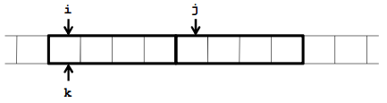

S2-02 Multiparadigma programozás és Haladó Java 1
=======================================
Tartalom
---------------------------------------

1. [Memóriakezelés: referencia- és érték-szemantika](#chapter01)
2. [Referenciakezelési technikák, Objektumok másolása, move-szemantika](#chapter02)
3. [Erőforrásbiztos programozás, RAII, destruktor és szemétgyűjtés](#chapter03)
4. [Kivételkezelés, kivételbiztos programozás](#chapter04)
5. [A konkurens programozás alapelemei Javában és C++-ban](#chapter05)
6. [További források](#references)

## 1. Memóriakezelés: referencia- és érték-szemantika <a name="chapter01"></a>

## 2. Referenciakezelési technikák, Objektumok másolása, move-szemantika <a name="chapter02"></a>

### Referenciakezelési technikák

#### Memóriakezelés

**Memória szegmens**: Operációs rendszer $\Rightarrow$ minden programnak egy területet tart fenn a memóriából.

**Memóriacím**: Minden bájt (memória hely) rendelkezik egy sorszámmal.
Ezen keresztül elérhető a memória szegmensben. (Általában hexadecimális, pl.: `0x34c420`)

* Minden változó rendelkezik memóriacímmel
* C++-ban változókhoz hasonlóan kezelhetjük őket
* Típustól függően több bájton is tárolódhat egy változó értéke $\Rightarrow$ mindig az első bájt címét kapjuk vissza

#### Referencia

Egy változó memóriacímét az `&` operátorral kérdezhetjük le, ez a referenciaoperátor.
(`&<változónév>` a változó első bájtjának memóriabeli címe).

* Referenciákat eltárolhatjuk változókban
    + ezzel alias lesz egy változónévhez (mint Linuxban a szimbolikus linkek)

```C++
int i = 128;
int j = i; // egyszerű változó
int& k = i; // referencia változó
```

{width=200px}

#### Pointerek

Speciálisabb változótípus: memóriacímet tárol értékként.

* új adat, mely másik adat memóriacímét tárolja
* általánosabb célú, mint a referencia
* Létrehozáskor: megadjuk a mutatott érték típusát
    + mutató létrehozása: `<típus>* <mutatónév>`
    + mutató típusa: `<típus>*`
    + pl.: `int* ip; // egy int-re mutató pointer`

* Ökölszabály:
    + ahol lehet használj referenciákat
    + ahol muszáj, ott pointereket (de akkor már smart pointert a mai világban)

#### Memóriaterületek

Használat szempontjából háromféle memóriaterületet különböztetünk meg:

* _globális terület_
    + konstansok, globális változók, statikus lokális változók
    + program indulásakor le van foglalva nekik terület (még ha nincsenek is inicializálva)
    + program futásának végéig jelen vannak

* _stack (verem)_
    + lokális változók
    + automatikusan jönnek létre definiáláskor, lokális scope végén automatikusan felszabadulnak
    + függvények memóriaterületeit stack frame-eknek hívjuk
        1. függvényhíváskor hívó függvény (caller) stack frame-jének elmentése és hívott függvény (callee)
        stack frame-jének beállítása (function prologoue)
        2. paraméterek mozgatása regiszterekbe
        3. függvény végrehajtása
        4. végén return value írása regiszterbe
        5. hívott függvény stack frame pop-olása és visszatérés hívó függvénybe (function epilogue)
* _heap (kupac)_
    + futásidőben dinamikusan lefoglalható (általában a legnagyobb része a programnak)
    + akkor, amikor változó mérete csak futásidőben határozható meg vagy mérete stack overflow-t eredményezne
    + lassabb elérni, mint a stack-et

#### Memóriahely felszabadítás

A lefoglalt memóriát fel is kell szabadítani.

* automatikusan lefoglalt memória $\Rightarrow$ program automatikusan végzi, nincs befolyásunk
* manuálisan létrehozott memória $\Rightarrow$ nekünk kell törölni
* törlés: 
    + `delete` operátorral
    + tömböket a `delete[]` operátorral (Ha tömbre is a `delete`-et használjuk, csak az első elem törlődik)
* Nem a mutatót, hanem a dinamikusan lefoglalt területet kell felszabadítani
* Több mutató hivatkozik ugyanarra a területre $\Rightarrow$ elég egyszer törölni

#### Konstans mutatók, referenciák

Módosíthatatlanná tehetjük a referenciákat a pointereket és az értékeket is:

_(Trükk: Értelmezzük fordított sorrendben a deklarációkat)_ 

```C++
double d1 = 10, d2 = 50;
double const_reference &d1r = d1;                         // konstans referencia
double const * pointer_to_const = &d1;                    // mutató konstansra
double * const const_pointer = &d1;                       // konstans mutató
// konstans mutató konstans értékre
double const * const const_pointer_to_const_value = &d1;  

const_reference = 100;                    // HIBA, az érték nem módosítható
*pointer_to_const = 50;                   // HIBA, az érték nem módosítható
*const_pointer = 50;                      // az érték módosítható
*const_pointer_to_const_value = 50;       // HIBA
pointer_to_const = &d2;                   // átállíthatjuk más memóriacímre
const_pointer = &d2;                      // HIBA, a mutató nem állítható át
const_pointer_to_const_value = &d2;       // HIBA
```

#### Konstruktor, Destruktor

Típusok mezői is lehetnek mutatók, melyeknek dinamikusan allokálhatunk memóriaterületet. Ezt a _konstruktorban_ végezzük.

A törlésről viszont gondoskodnunk kell. Ezt megtehetjük a _destruktorban_

* A destruktor automatikusan lefut, ha a változó törlésre kerül
    + lokális változó $\Rightarrow$ blokk végén automatikusan törlődik
    + dinamikus létrehozás esetén a `delete` váltja ki a destruktor meghívását
* A destruktorban csak a dinamikusan lefoglalt mezőket kell törölni (ha ilyen nincs, akkor a destruktor nem szükséges)
* mindig publikus
* nincs típusa
* nincs paramétere
* nem túlterhelhető

```C++
class <típus> {
    public:
    <typusnév>() { … } // konstruktor
    ~<típusnév>() { … } // destruktor
    …
};
```

### Objektumok másolása

Kétféle másolási megközelítés ismert:

* _Sekély másolás (shallow copy)_: A típuspéldány a mezőivel együtt másolásra kerül egy új memóriaterületre.
    A dinamikusan lefoglalt mezőknek azonban az értéke nem másolódik (A régi és új példány mutatói ugyanazon területre
    fognak mutatni.)

* _Mély másolás (deep copy)_: A típuspéldány minden mezőjével és azok által lefogalt memóriaterülettel együtt
    kerül másolásra. (A régi és az új példány mutatói nem ugyanazon területre fognak mutatni.)

Példányok másolását két művelet teszi lehetővé: _másoló konstruktor_, _értékadó operátor_

#### Copy-konstruktor

Egy létező példány alapján újat hoz létre. Paraméterként egy másik (ugyanolyan típusú) példány referenciáját kapja,
ennek a mezőit másolja le. (Ha nincs dinamikus tartalom, akkor az alapértelmezett megfelelő.)

* törzsben tud hivatkozni a másolandó példány mezőire
* a következő esetekben fut le:
    + közvetlen hívás: `MyType b(a);`
    + kezdeti értékadás: `MyType b = a;`
    + érték szerinti paraméterátadás

```C++
class MyType {
    private:
        int* _value;
    public:
        MyType(const MyType& other) { // másoló konstr.
            _value = new int;

            // a dinamikus taralom létrehozása
            *_value = *other._value; // érték másolása
        }
};
```

#### Értékadó operátor

A kezdeti értékadást kivéve, amikor a változónak értéket adunk, az értékadó operátor lép érvénybe.

Megkapja a másolandó példány (konstans) referenciáját, és biztosítja taralmának átmásolását.

* az eddig meglévő, dinamikusan létrehozott értékeket törölni kell
* ellenőrizni kell, hogy a paraméterben kapott változó nem saját maga-e
* a `*this` (aktuális példány) referenciával kell visszatérni (a többszörös értékadás használatához)

```C++
class MyType {
    public:
    …
        MyType& operator=(const MyType& other){
            if (this == &other)
                // ha ugyanazt a példányt kaptuk
                return *this; // nem csinálunk semmit

            *_value = *(other._value);
            // különben a megfelelő módon másolunk
            return *this; // visszaadjuk a referenciát
        }
};
```

#### Paraméterátadás

Ahogy a változókat, úgy a paramétereket is háromféleképpen tudjuk átadni: `érték szerint`, `referenciaként`, `pointerként`

Az érték szerinti átadás sokszor költséges lehet, mert ekkor a paraméterek másolódnak. A pointer és a referencia közötti
döntést pedig az határozza meg, hogy míg a pointerek felvehetik a `NULL` értéket, addig a referenciák nem.

Tehát a következők szerint érdemes a paraméterátadást használni:

* _érték szerinti_: `f(int x)`
    + a függvény **nem módosíthatja a paramétert**
    + használd ezt, ha **ha könnyű másolni**
    + Ökölszabály: ha a paraméter mérete legfeljebb 2- vagy 3 szó (word), azaz 32-bit, akkor érdemes érték szerint átadni
        + egyszerű primitív típusok esetén ajánlott, mint pl.: `int`, `double`, `char`, `bool`, stb.
        + Komplex típusok, saját osztályok, `std::string` és a
        különböző STL konténerek nem ajánlottak (továbbiakban ezeket a példákban `T`-vel jelöljük)
* _pointer szerinti_: `f(T* x)`
    + a függvény **módosíthatja a paramétert**,
    + használd ezt, ha **ha költséges a másolás**,
    + továbbá a **NULL lehet valid** érték
* _konstans pointer szerinti_: `f(const * T x)`
    + a függvény **nem módosíthatja a pointer által mutatott értéket**,
    + használd ezt, ha **ha költséges a másolás**, 
    + továbbá a **NULL lehet valid** érték
* _referencia szerinti_: `f(T& x)`
    + a függvény **módosíthatja a paramétert**
    + használd ezt, ha **ha költséges a másolás**,
    + továbbá a **NULL NEM lehet valid** érték
* _konstans referencia szerinti_: `f(const int& x)`
    + a függvény **nem módosíthatja a paramétert**,
    + használd ezt, ha **ha költséges a másolás**
    + továbbá a **NULL NEM lehet valid** érték
    + próbáljuk mindig ezt a változatot használni saját osztályokhoz, `std::string`-hez és STL adatszerkezetekhez,
    ha paramétert nem akarjuk módosítani
        + copy konstruktorok, copy assignmentek paraméterei

### Move-szemantika

A C++-ban értékszemantika van. Ez egy tiszta memóriaterület szeparációt tud eredményezni, de sokszor
teljesítmény romlást okozhat nagy objektumok másolása esetén.

Tekintsük a következő `Array` implementációt:

```C++
class Array{
    public:
        Array (const Array&);
        Array& operator=(const Array&);
        ~ Array ();
    private:
        double *val;
};
Array operator+(const Array& left,const Array& right){
    Array res = left;
    res += right;
    return res;
}
```

Az `Array` egy osztály, melynek + operátora összekonkatenálja a két paramétert és visszaad egy új listát.

A következő függvény meghívásánál azonban több köztes `Array` példány keletkezik és szűnik meg:

```C++
void f()
{
 Array b, c, d;
 …
 Array a = b + c + d;
}
```

A move-szemantika az ehhez hasonló problémákra ad megoldást.

* másolás helyett "ellopja" az erőforrást
* törölhető állapotban hagyja a másik objektumot

Ehhez kell:

* overloadolni lehessen a _Copy-konstruktort_ és az _értékadó operátort_, illetve egyéb függvényeket
    + meg kell tartani a backward compatibility-t
    + meg kell különböztetni a bal- és jobbértékeket

#### RValue, LValue

** //TODO **

Korábbi nyelvekben értékadás: `<variable> = <expression>` (pl.: `x = 5`)

C/C++-ban értékadás: `<expression> = <expression>` (pl.: `*++ptr = *++qtr`)

* de nem minden esetben működik, pl.: `a+5 = x` helytelen.

**LValue**: kifejezés, mely egy memóriaterületre hivatkozik és lehetővé teszi, hogy a `&` operátorral
megszerezzük annak memóriacímét

**RValue**: olyan kifejezés, mely nem LValue.

#### Move-operátor

A move-operátorral castolni lehet LValue-t RValue-vá. (balértékből jobbértéket)

* kikényszeríthethük a move-szemantika használatát

Példa: 
```C++
struct S
{
 S() { a = ++cnt; std::cout << “S() << std::endl”; }
 S(const S& rhs) { a = rhs.a; std::cout << “copyCtr << std::endl”; }
 S(S&& rhs) { a = rhs.a; std::cout << “moveCtr << std::endl”; }
 S& operator=(const S& rhs) { a = rhs.a; std::cout << “copy= << std::endl”; return *this; }
 S& operator=(S&& rhs) { a = rhs.a; std::cout << “move= << std::endl”; return *this; }
 int a ;
 static int cnt;
};
int S::cnt = 0;

int main()
{
 S a, b;
 swap( a, b);
}
```

Move-operátor használata nélkül:

```C++
template<class T>
void swap(T& a, T& b)
{
    T tmp(a);
    a = b;
    b = tmp;
}

```

Eredmény: 
```C++
S()       // S a
S()       // S b
copyStr   // T tmp(a)
copy=     // a = b
copy=     // b = tmp
```

Move-operátor használatával:

```C++
template<class T>
void swap(T& a, T& b)
{
    T tmp(std::move(a));
    a = std::move(b);
    b = std::move(tmp);
}
```

Eredmény: 
```C++
S()       // S a
S()       // S b
moveCtr   // T tmp(std::move(a))
move=     // a = std::move(b)
move=     // b = std::move(tmp)
```

## 3. Erőforrásbiztos programozás, RAII, destruktor és szemétgyűjtés <a name="chapter03"></a>

## 4. Kivételkezelés, kivételbiztos programozás <a name="chapter04"></a>

### Hibakezelés

Hiba: program futása alatt bekövetkezett nemkívánt állapot. Két fajtáját különböztetjük meg:

* Logikai hiba (logic error): a program nem az elvárásnak megfelelő eredményt nyújtja, elő- vagy utófeltétel megsértése
* Futásidejű hiba (runtime error): rendszer állapotától függő hibás végrehajtás vagy megszakítás,
mint például memória elfogyása, hibás IO, hibás hálózati kapcsolódás

Hibakezelés alatt a runtime error-okkal foglalkozunk.

#### Hibakezelés klasszikus C-ben

* függvény visszatérési értékei hibakódok / NULL referencia
* externális `errno` kód
* visszatérési érték vizsgálat, pl.: `fseek`, `int`-et ad, `bool`-ként kezeljük
* hiba flag-ek, pl.: hibaflag beállítódik $\Rightarrow$ többi IO művelet nem csinál semmit
* `assert()`: nem teljesül a feltétel $\Rightarrow$ hibaüzenet, mely a felhasználó számára nemigazán érthető
    (pl. egy repülőpilótának nem bizalomgerjesztő egy ilyen üzenet: `Assertion failed: Inv() line 64`)
* hibakód változójának paraméterként való átadása referenciaként (klasszikus C-ben pointer)
* struct-al való visszatérés, mely az eredmény mellett tartalmazza a hibakódot is (mintha egy pair-ünk lenne)

#### Kivételkezelés alapköve C-ben: jump műveletek

* Call-stack állapotát lehet a módszerrel elmenteni/visszaállítani
    + függvényhíváskor $\Rightarrow$ függvény stackframe a stack-re kerül
    + a jump műveletekkel vissza lehet állni a stack-en korábbi állapotra (a bázispointer helyének segítségével)

1. `jmp_buf x;` - reprezentálja az elmentett stack állapotot
2. `setjmp(x)` - elmenti a stack állapotát, illetve ide ugrik vissza a vezérlés `longjmp` hívása után
3. `longjmp(x, 5)` - kiváltja a stack visszaállítását az `x` által reprezentált állapotba. Mellékel egy hibakódot is,
    melyet a `setjmp` visszaad.

Használat:

```C++
#include <setjmp.h>
#include <stdio.h>

jmp_buf x;

void f()
{
    longjmp(x,5);
}

int main()
{
    int i = 0;

    if ( (i = setjmp(x)) == 0 )
    {
        f();
    }
    else
    {
        switch( i )
        {
        case  1:
        case  2:
        default: fprintf( stdout, "error code = %d\n", i); break;
        }
    }
    return 0;
}
```

Érezhetőek a következő megfeleltetések:

* `setjmp` - `try`
* `longjmp` - `throw`
* `else` - `catch`

#### Static Assert (C++11)

Fordítási időben kiszámolható boolean kifejezések (`bool_constexpr`) igazságértékét vizsgálja

* ugyanúgy, mint a sima `assert()`, hamis esetben hibát dob, de jelen esetben forítási hibát.

### Kivételkezelés

#### Kivételkezelés célja

* elválasztani a hiba fellépésének és kezelésének helyét (én detektálhatom a hibát, de másvalaki más modulban tudja mit
csináljon vele)
* az adatot típushelyesen tudjuk a hiba fellépési helyétől a handler-hez szállítani
* ne járjon semmilyen extra (kód/idő/hely) hátránnyal, ha nem használjuk
* minden kivételt a megfelelő handler kapja el
* többszálú környezetben is megfelelő
* ha nincs hiba $\Rightarrow$ ne legyen overheadje (vagy legalábbis minimális legyen)
    + `if`-ek nem jók, mert a folyamatos kiértékelés órajelet emészt
    + kivételek megcsinálhatók úgy, hogy majdnem költségmentesek
    legyenek

#### try-catch

```C++
try {
    f();
    // ...
}
catch (T1 e1) { /* handler for T1 */ }
catch (T2 e2) { /* handler for T2 */ }
catch (T3 e3) { /* handler for T3 */ }
```

* `throw` - bármi dobható, de az értelmes: `std:exception` leszármazottjai
    + Futásidejű hibákhoz: `std::runtime_error`
    + Logikai hibákhoz: `std::logic_error`
* `catch(T e)` - `T` típusú érték handlere
    1. Elkapja a kivételt, ha az `T` típusú
    2. vagy annak leszármazottja
    3. illetve pointer vagy referencia és a hivatkozott értékre fennáll 1) vagy 2)
* Nem szabad `new`-val exception-t létrehozni $\Rightarrow$ memóriaszivárgás

#### Hierarchia

* Az öröklődést használjuk kivételek csoportosítására
* Az általánosabb handler elkapja a speciálisabb exceptiont
* A `catch` ágak a megadott sorrendben értékelődnek ki
* ezért figyelni kell a handlerek általánosságát és sorrendjét
    + A speciálisabb kerüljön felülre és az általánosabb alulra

Továbbra sem ajánlott `new`-val kivételt létrehozni. Ha a dianamikus típussal akarunk játszani,
inkább használjuk a következő megoldást:

```C++
struct ExceptionBase{
    virtual void raise() { throw *this; }
    virtual ~ExceptionBase() {}
};

struct ExceptionDerived : ExceptionBase{
    virtual void raise() { throw *this; }
};

void foo(ExceptionBase& e){
    e.raise(); // Uses dynamic type of e while raising an exception.
}

int main (void){
    ExceptionDerived e;
    try {
        foo(e);
    }catch (ExceptionDerived& e) {
        ...
    }catch (...) {
        ...
    }
}
```

#### Kivételkezelés és osztályok

Kérdéses esetek: konstruktor, destruktor

* Konstruktor
    + Ha a konstruktor dob, terület le lett foglalva, de a pointer nem lett beállítva $\Rightarrow$ nincs gond,
    a rendszer deallokálja
    + De: a konstruktoron belül lefogalt területet a destruktor tudja felszabadítani. A destruktort viszont nem lehet 
    meghívni mert az objektum létre se jött rendesen $\Rightarrow$ probléma
    
```C++
class X
{
    public:
        X(int i) { p = new char[i]; init(); }
        ~X() { delete [] p; }       // must not throw exception
    private:
        void init() { ... throw ... }   // BAD: destructor won't run !
        char *p;                        // constructor was not completed
    };
```

\newpage

    + Ha tagváltozó inicializálása dob hibát, akkor dob a konstruktor is
    
```C++
class X
{
    public:
        X() { throw 1; }
};
class Y
{
    public:
        Y()
        try
            : x()
        { }
        catch( ... ) { /* throw; */ }
    private:
        X x;
};
int main(){
    try {
        Y y;
        return 0;
    }
    catch (int i)
    {
        std::cerr << "exception: " << i << std::endl;
    }
}
```

* Destruktor
    + destruktorokat kétféle okból hívunk
        - nomális esetben
        - kivételkezeléskor $\Rightarrow$ ha a destruktor is kivételt dob az nem definiált
        viselkedéshez vezet (legtöbbször a `terminate()` meghívásához)
    + $\Rightarrow$ Ökölszabály: **destruktor nem dobhat kivételt**

#### Noexcept (C++11)

* Kifejezhető vele, hogy egy kifejezés, függvény biztosan nem dob-e exceptiont
* Fordítási időben értékelődik ki

Kétféle formában létezik:

* operátor forma: `bool noexcept(expr);`
    + Nem értékeli ki a kifejezést (hasonló a `sizeof`-hoz)
    + `false`, ha
        - a kifejesés dob
        - a kifejesésben van dynamic_cast
        - a kifejesésnek van `type_id`-ja
        - van a kifejesésben függvény, ami nem `noexcept(true)` és nem `constexpr`
    + `true` különben

* specifier forma: `void f() noexcept(expr) { }`
    + a régi `throw()` helyett van
    + pl.: Ha `g()` nem dob, akkor `f()` sem:

```C++
    template <typename T>
    void f() noexcept ( noexcept( T::g() ) )
    {
      g();
    }
```

Magyarázat: `noexcept( T::g() )` - operátor formás noexcept, megmondja, hogy `g()` dob-e exception-t

+ Ha igen, akkor `void f() noexcept(false)` lesz fordítás után
+ Ha nem dob, akkor `void f() noexcept(true)` fordítás után
+ tehát ha `g()` nem dob, akkor `f()` sem

## 5. A konkurens programozás alapelemei Javában és C++-ban <a name="chapter05"></a>

## 6. További források <a name="references"></a>

* http://aszt.inf.elte.hu/~gsd/multiparadigm/
* https://isocpp.org/faq
* http://thbecker.net/articles/rvalue_references/section_01.html
* https://docs.oracle.com/javase/tutorial/essential/concurrency/
* http://www.cplusplus.com/articles/z6vU7k9E/
* http://people.inf.elte.hu/groberto/elte_amp/eloadas_anyagok/elte_amp_ea09_eml.pdf
* http://people.inf.elte.hu/groberto/elte_amp/eloadas_anyagok/elte_amp_ea10_eml.pdf