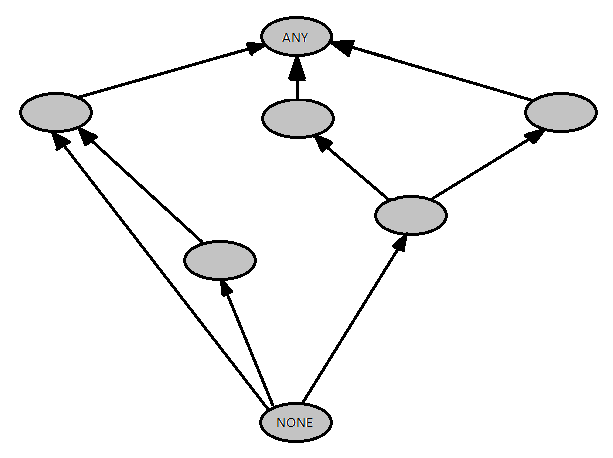

S2-03 A szerződésalapú programtervezés
=======================================
Tartalom
---------------------------------------

1. [A szerződésalapú programtervezés és -megvalósítás módszere, célja, szerepe](#chapter01)
2. [Szerződések leírását támogató nyelvi eszközök az Eiffel nyelvben](#chapter02)
3. [A szerződések formális jelentése Hoare-hármasokkal](#chapter03)
4. [A szerződések és a típusrendszer viszonya](#chapter04)
5. [Szerződések és objektum-orientáltság: öröklődés és felüldefiniálás](#chapter05)
6. [Üres referenciák](#chapter06)
7. [Kivételek](#chapter07)
8. [További források](#references)

1.A szerződésalapú programtervezés és -megvalósítás módszere, célja, szerepe <a name="#chapter01"></a>
---------------------------------------

### A szerződésalapú programtervezés módszere
A szerződésalapú programtervezés (Design by Contract, DbC) Bertrand Meyer nevéhez fűződik és a 80-as évek közepén
 alakult ki. A módszer három megközelítésen alapszik: a formális verifikáció, formális specifikáció, és a Hoare-hármasok.

Az elképzelés lényege, hogy a rendszer komponensei együttműködésének elősegítéséhez a résztvevők kölcsönösen
kötelezettségeket vállalnak, melyek segítségével biztosítva lesznek a haszonról. Ez a megközelítés nem meglepő módon az
üzleti élettel hozható párhuzamba, ahol a felek az előbb említetteknek megfelelően szerződéseket kötnek.

Példa:

* A _kereskedő_ terméket ad (kötelezettség), és  feltételezi, hogy a _vásárló_ fizetett érte (haszon)
* A _vásárló_ fizet a termékért (kötelezettség), és feltételezi, hogy a _kereskedő_ terméket biztosít (haszon)
* Mindkét résztvevő eleget tesz olyan egyéb megkötéseknek, mint például a jogi szabályok betartása

A fenti példának megfelelően egy Objektum-orientált programban egy osztály egy szolgáltatásának három kérdésre kell
választ adnia:

* Mik az eljárás megfelelő működéséhez szükséges megkötések - **előfeltétel**
* Milyen eredményt garantál az eljárás (az előfeltételben megszabottak alapján) - **utófeltétel**
* Milyen állapotot tart meg az eljárás (amit feltételezünk az eljárás előtt és garantálunk az után) - **invariáns**

### A szerződésalapú megvalósítás módszere
Sok programozási nyelv ad támogatást a DbC-hez hasonló technikához az `assert`-ek segítségével. A szerződésalapú
programtervezés szerint azonban a szoftver megfelelőségéhez alapvető, hogy ezek a szerződések a tervezés szerves részét
képezzék. (A gyakorlatban ez azt jelenti, hogy az `assert`-ek kerülnek először megírásra.) A szerződéseket egyébként
meg lehet fogalmazni comment segítségével, alá lehet támasztani tesztekkel (vagy mindkettő), ha a programnyelv nem ad
más támogatást.

Nyelvek melyek natívan támogatják a szerződésalapú programtervezést: _Eiffel_, _Ada 2012_, _Clojure_, stb.

Nyelvek melyekhez létezik third-party könyvtár: _Java_, _C#_, _C_, _C++_, _Ada_, _JavaScript_, _PHP_, _Python_, _Ruby_,
_Groovy_, stb.

Ahogy az előbb már láthattuk a szerződések a legtöbb programozási nyelvben `assert`-ek segítségével fogalmazható meg.
Azonban ha a program komponensei nem sértik meg a szerződéseket (bug-mentesek), ezek az `assert`-ek nem fognak hibát
jelezni. Mivel ezek az ellenőrzések nagy hatással lehetnek a teljesítményre, így csak _debug_ módban szokták őket
bekapcsolni, _release_ módban ezek a fordítás során törlésre kerülnek.

A szerződésalapú programtervezés szerint a szerződések megszegése kritikus hiba kell legyen. Ez annyit tesz, hogy a
programnak hibát kell jeleznie, ha olyan dolgok történik, ami a szerződések szerint nem megengedett. Így tehát a hívó
fél felelőssége lesz, hogy megfelelően működjön a program. Ezzel a szemlélettel tehát az `assert`-ek használata egy
megfelelő megoldás lehet. Némileg ellentétes felfogás a defenzív programozás, ahol a szolgáltatónak kell
felkészülnie a különböző nem megengedett esetekre és aszerint eldönteni, hogy mi történjen.

### A szerződésalapú program célja, szerepe
A szerződésalapú programtervezés elsődleges célja, hogy bug-mentes OO programokat tudjunk készíteni, de több előnnyel
is jár a használata:

* Az objektum-orientált megközelítés (vagy általánosabban a szoftverfejlesztés) megértését segíti elő
* Szisztematikus megközelítést ad bug-mentes Objektum-orientált rendszerek építéséhez
* A debuggoláshoz, tesztéshez (vagy általánosabban a quality assurance-hez) nyújt hatékony keretrendszert
* Szoftverkomponensek dokumentálására ad módszert.
* Az öröklődési mechanizmus megértését és kezelését segíti elő
* A abnormális esetek kezelésére ad technikát, ami biztonságos és hatékony nyelvi konstrukció a kivételkezelésre.

2.Szerződések leírását támogató nyelvi eszközök az Eiffel nyelvben <a name="#chapter02"></a>
---------------------------------------
#### Előfeltétel, utófeltétel
A szerződésalapú programtervezésben talán a legfontosabb szerepet a metódusok elő- és utófeltételei kapják. Az Eiffel nyelvben ezeket külön szintaktikus
elemekkel (blokkokkal) lehet kifejezni. (Eiffelben mind az attribútumokat, mind a metódusokat _feature_-öknek nevezzük)
Egy feature (metódus) a követekzőképp néz ki:
```Eiffel
feature_name(...): C is -- zárójelben a paraméterek,
                        -- majd a visszatérési érték típusa
    require
        -- előfeltétel
    local
        -- lokális változók
    do
        -- implementáció
    ensure
        -- utófeltétel
    end
```

Az elő- és utófeltételek minden sorában egy logikai kifejezést kell írni, melyeket akár fel is cimkézhetünk:
```Eiffel
     put (x: ELEMENT; key: STRING) is
                     -- Insert x so that it will be retrievable through key.
             require
                     container_is_not_full: count <= capacity
                     key_is_not_empty: not key.empty
             ...
```
A fenti példában láthatjuk, hogy egy gyűjtemény `put` feature-éhez megfogalmaztunk egy `container_is_not_full`
előfeltételt, mely azt mondja ki, hogy a gyűjtemény nem lehet tele a berakás esetén, illetve egy `key_is_not_empty`
előfeltételt, miszerint a kulcs nem lehet az üres sztring.

Az utófeltétel vizsgálata esetén már olya vizsgálatokat is végezhetünk, melyekben a múltbéli állapotra hivatkozunk. Erre
az `old` kulcscszót használjuk:

```Eiffel
     put (x: ELEMENT; key: STRING) is
                     -- Insert x so that it will be retrievable through key.
             require
                -- precondition
             do
                -- implementation
             ensure
                has (x)
                item (key) = x
                count = old count + 1
```
Láthatjuk, hogy az utófeltételben megfogalmaztuk, hogy a feature meghívása után az elemnek a gyűjteményben kell lennie,
méghozzá a kulccsal elérhetőnek kell lennie. Ezen felül az `old` kulcsszó segítségével ki tudtuk fejezni, hogy az új
elemszám a régi elemszámhoz képest eggyel nagyobbnek kell lennie.

_Megjegyzés: Létezik egy **strip** kulcscszó is, mellyel bonyolultabb utófeltételek esetén azt tudjuk meghatározni, hogy
a kizárólag a felsorolt attribútumok változhatnak meg._

#### Osztályinvariáns
Ahogy a bevezetőben is olvashattuk az elő- és utófeltételek mellett az osztályinvarians is fontos szerepet kap a
szerződések szempontjából. Ezzel határozzuk meg egy osztály helyes állatpotainak halmazát, melyet ugyanúgy logikai
állításokkal tudunk leírni. Az osztály szintaxisa Eiffelben a követekző:
```Eiffel
class MYCLASS
create
    make -- Konstruktor feature-ök
feature {A}
    -- A osztály számára látható feature-ök
feature {B}
    -- B osztály számára látható feature-ök
invariant
    -- osztályinvariánsok
end
```

Az osztályinvariánst pedig egy Stack esetén például a következőképp tudjuk leírni:

```Eiffel
class STACK[T]
creation
    make
feature
    size: INTEGER

    capacity: INTEGER
    do
        Result := data.count
    ensure
        Result > 0
    end -- capacity

feature {}

    data: ARRAY[T]

invariant
    data.lower = 1
    data.upper = capacity
    0 <= size
    size <= capacity
end -- class STACK
```

#### Ciklusok

Eiffelben a ciklusok is kiemelt figyelmet kapnak, mivel ezeknek is lehet megkötéseket, kiegészítő információkat
adni. A nyelv Programozáselméletből ismert _ciklus invariáns_ és _variáns függvény_ kifejezésére ad lehetőséget.
Egy ciklus szintaxisa a következő:

```Eiffel
from
    -- inicializációs blokkok
invariant
    -- ciklus invariáns
until
    -- termiánálási feltétel
loop
    -- ciklusmag
variant
    -- ciklus variáns
end
```

A _ciklus invariáns_ egy olyan állítás, melynek a ciklus előtt, majd minden iteráció után igaznak kell lennie.

A _ciklus variáns_ vagy _variáns függvény_ pedig olyan nem-negatív egész szám, melynek értéke minden iteráció után
legalább eggyel csökken. Mivel egy nem-negatív egész szám nem csökkenthető a végtelenségig, illetve mivel kötelező a
csökkenés így biztosítva van a terminálás. (Másként: A variáns függvény szigorúan monoton csökkenő, így el fogja érni a
nullát.)

#### Check

A `check` konstrukcióval lehetőségünk nyílik az implicit feltételezések dokumentálására. Szintaxisa követekző:

```Eiffel
check Assertion then
    -- ...
end
```

Olyan esetekben például, mikor egy feature-nek egy előfeltételére nem végzünk explicit ellenőrzést, mert tudjuk, hogy
teljesülni fog, akkor ezt jelezhetjük ezzel a blokkal. A `check` hasonló az `if`-hez azzal a különbséggel,
hogy release módban fordítva törlésre kerül ez az ellenőrzés, illetve mindig igaz kell legyen. Debug módban ezen
ellenőrzések jelezhetnek nekünk, ha a feltételezés mégsem feljesülne.

#### Bonyolultabb logikai állítások
Sok esetben fordul elő, hogy matematikailag, logikailag megfogalmazott fontos állításunk lenne egy viselkedésről,
ami azonban nem kiszámolható. Ilyen például az univerzális kvantálás. Erre jó példa a legnagyobb közös osztó számítása:
```Eiffel
lnko( a, b: INTEGER ): INTEGER is
    require    0 < a; 0 < b
    local
        tmp: INTEGER
    do
        from
            Result := a
            tmp := b
        invariant
            0 < Result; 0 < tmp;
        variant Result + tmp
        until     Result = tmp
        loop
            if Result > tmp
            then Result := Result - tmp
            else tmp := tmp - Result
            end
        end
    ensure    Result > 0; a \\ Result = 0; b \\ Result = 0;
        -- for all n: (a \\ n = 0 and b \\ n = 0) implies n <= Result
    end -- lnko
```

Az _lnko_-nak egy fontos tulajdonsága, hogy az a legnagyobb a két szám közös osztói közül, azaz:

$$ \forall n: a \equiv 0 \land b \equiv 0 \pmod{n} \Rightarrow n \leq Result $$

Ezt azonban kiszámolni nem lehet, az ilyenfajta állításokat kommentekben szokták megfogalmazni.

3.A szerződések formális jelentése Hoare-hármasokkal <a name="#chapter03"></a>
---------------------------------------

A Hoare-hármasok felépítése a következőképp néz ki:
```
{P} S {Q}
```

Ahol **P** és **Q** logikai állítások (**P** - előfeltétel, **Q** - utófeltétel), míg **S** utasítások sorozata.
A leírás jelentése pedig:

_Amennyiben **P** igaz **S** lefutása előtt és **S** terminál, akkor **Q** igaz lesz **S** lefutása után._

Láthatjuk, hogy a terminálás nem garantált, ezt másfajta bizonyítással érhetjük el. 

#### Szerződések

Az eddig látott feature elő- és utófeltételek természetes módon leírhatók tehát Hoare-hármasok segítségével.
Tekintsük a követekző négyzetgyök függvényt:

```Eiffel
     sqrt (x: REAL) : REAL is
             require
                 x >= 0
             do
                -- implementation
             ensure
                Result >= 0
```

Hoare-hármasokkal felírva a szerződés:

```
{ x >= 0 } Result := sqrt(x) { Result >= 0 }
```

#### Ciklusok

Ciklusok esetén sok állítást fogalmazhatunk meg, mint például a _ciklus invariáns_ vagy a _variáns függvény_.
A követekző Hoare-hármasok igazak egy ciklusra:

1. $\{REQ\} \ INIT \ \{INV\}$
2. $\{ REQ \} \ INIT \ \{ VAR \geq 0 \}$
3. $\{INV \land \lnot EXIT\} \ BODY \ \{INV\}$
4. $\{INV \land \lnot EXIT \land VAR = v\} \ BODY \ \{0 \leq VAR < v \}$


Ahol:

* `REQ` - a ciklus előfeltétele (milyen feltételek mellett hatjható végre a ciklus
* `INIT` - a ciklus inicializációs blokkja
* `INV` - ciklusinvariáns
* `EXIT` - kilépési feltétel
* `VAR` - variáns függvény

A jelentések pedig a követekzők:

1. A ciklus előfeltétele mellett az inicializációt végrehatjva a ciklusinvariáns igazzá válik
2. A ciklus előfeltétele mellett az inicializációt végrehatjva a variáns függvény értéke nem-negatív
3. A ciklus megőrzi a ciklusinvariánst (ha igaz az invariáns és nem kell kilépni, akkor a ciklusmag végrehajtása után
    is igaz lesz az invariáns.)
4. A variáns függvény értéke csökken (az invaráns mellett, ha nem kell kilépni és a variáns függvény értéke _v_, akkor
    a ciklusmag végrehajtása után a variáns függvény értéke _v_-nél kisebb nem-negatív kell legyen.)

4.A szerződések és a típusrendszer viszonya <a name="#chapter04"></a>
---------------------------------------

Az Eiffel tisztán Objektum-orientált nyelv, így a típusrendszere is az ilyen nyelvekben megszokott, erősen típusos,
típusöröklősést és polimorfizmust támogató.

#### Kapcsolt típus (anchored type)
Az öröklődés és polimorfizmus miatt Objektum-orientált nyelveknél sok esetben fordulhat elő az az eset, hogy nem
ismerjük az egyes változók dinamikus típusát fordítási időben. Ez az ismeret viszont sok esetben fontos lenne.
Gondoljunk csak például arra az esetre, mikor síelő fiúkat és lányokat akarunk elszállásolni, viszont csak az azonos
neműeket szeretnénk egy szobába  tenni. Ezt a típusokkal tudjuk elérni a követekző módon:
```Eiffel
class SKIER
feature
    roommate: like Current

    share( other: like roommate ) is
    require
        other /= Void
    do
        roommate := other
    ensure
        other = roommate
    end
end
```

Láthatjuk, hogy a `roomate` attribútum típusa `like Current` azaz meg kell egyezzen az aktuális típussal 
(A `Current` az aktuális objektumot jelöli. Olyan, mint Java-ban a `this`.). Ez azt jelenti, hogy Ha egy `Girl`
osztályt leszármaztatunk a `Skier` osztályból, akkor annak a `roomate` attribútumoka is `Girl` típusú kell legyen.
Emellett láthatjuk, hogy a `share` metódus paramétere `like roomate` típusú, magyarul csak olyan objektumot adhatunk
paraméterként, mely megegyezik a `roomate` típusával. (`Girl` esetén csak `Girl` lehet)

_Megjegyzés: Létezik kiskapu, és mégis van lehetőségünk fiúkat és lányokat egy szobába rakni. Ezt a kiskaput 
"Polymorphic CAT-call"-nak hívják._

#### Expandált és referncia típusok
Eiffelben lehetőségünk van meghatározni, hogy egy típus érték vagy referncia típus legyen. Alapvetően referencia
típusúak az osztályaink, de az `expanded` kulcsszóval érték típusúvá alakíthatjuk őket:
```Eiffel
expanded class PONT
feature

    x,y: REAL

    eltol( dx, dy: REAL )
    do
        x := x + dx
        y := y + dy
    end -- eltol

end --class PONT
```

Ebben az esetben természetesen más nyelvekhez hasonlóan figyelembe kell venni a paraméterátadásokat, értékadásokat, stb.,
ugyanis ezekben az esetekben a példány másolódik.

#### Void, attached, detachable
Referencia típusok esetén a nullreferencia kérdése, illetve a nullable típusok természetesen Eiffelben is felmerülnek.
A nullreferencia Eiffelben `Void` névre hallgat. A nullable vagy non-nullable tulajdonságok egy változó típusának
meghatározásánál kapnak szerepet. A nullable Eiffelben `detachable`, míg a non-nullable `attached` kulcsszavakkal
fejezhető ki.
```Eiffel
    my_attached_string: STRING
    my_detachable_string: detachable STRING

            ...

        my_attached_string := my_detachable_string    -- Invalid
        my_detachable_string := my_attached_string    -- Valid
```

A fenti példában láthatjuk, hogy milyen módon feleltehetők meg egymásnak az `attached` és `detachable` változók,
illetve, hogy alapvetően minden változó `attached`.

#### Deferred

Más nyelvekből ismert `abstract` tulajdonságot megfogalmazhatunk Eiffelben. Erre a `deferred` kulcsszó használható.
Ahogy megszoktuk, amennyiben legalább egy feature `deferred` egy osztályban, az adott osztály is automatikusan
`deferred` kell legyen. Ezen kívül Eiffelben lehetőségünk van arra, hogy a szerződést megfogalmazzuk és csak
az implementációt tegyük `deferred`-dé:

```Eiffel
deferred class VEHICLE feature
    dues_paid (year: INTEGER): BOOLEAN is
         do ... end
    valid_plate (year: INTEGER): BOOLEAN is
         do ... end
    register (year: INTEGER) is
            -- Register vehicle for year.
         require
             dues_paid (year)
         deferred
         ensure
             valid_plate (year)
         end
end -- class VEHICLE
```

Attól függetlenül, hogy egy motornak és egy autónak más a regisztrációs eljárása, az elő- és utófeltételeik megegyeznek.
Ezeket meghatározhatjuk a jármű szintjén, így a leszármazottakban csak az implementációt kell megírnunk.

5.Szerződések és objektum-orientáltság: öröklődés és felüldefiniálás <a name="#chapter05"></a>
---------------------------------------
#### Öröklődési gráf
Az Eiffel támogatja a többszörös öröklődést, így lehetőség van egy különleges öröklődési gráf kialakítására.



Minden osztály az `ANY` osztályból származik. A `NONE` egy fiktív osztály mely minden osztályból öröklődik,
mindennek altípusa.


#### Láthatóságok

Egy osztály feature-einek láthatóságát osztály szinten tudjuk korlátozni. Ez azt jelenti, hogy meg tudjuk határozni,
hogy egy feature egy konkrét osztály (és annak leszármazottai) számára látható:

```Eiffel
class MYCLASS
    ...
    feature {A}
        -- A osztály számára látható feature-ök
    feature {B}
        -- B osztály számára látható feature-ök
    feature {ANY}
        -- Minden osztály számára látható (public)
    feature {NONE}
        -- Senki számára nem látható (private)
    ...
end
```

#### Többszörös öröklődés, átnevezés
A több osztályból való öröklés egyik legnagyobb kérdése az ún. _diamond inheritance_, melyre különböző nyelvek más-más
megoldást adnak. Eiffelben sok lehetőség van az ősosztály megörökölt metódusainak kezelésére, hogy el tudjuk kerülni
a névütközést.

```Eiffel
class
    LINKED_QUEUE [G]
inherit
    QUEUE [G]
        undefine
            is_empty,
            copy,
            is_equal
        redefine
            linear_representation,
            prune_all,
            extend
        select
            item,
            put
        end
    LINKED_LIST [G]
        rename
            item as ll_item,
            remove as ll_remove,
            make as ll_make,
            remove_left as remove,
            put as ll_put
        export
            {NONE}
                all
            {ANY}
                writable,
                extendible,
                wipe_out,
                readable
        undefine
            fill,
            append,
            prune,
            readable,
            writable,
            prune_all,
            extend,
            force,
            is_inserted
        redefine
            duplicate,
            linear_representation
        select
            remove
        end
```

A fenti példában a `LINKED_QUEUE`-t láthatjuk, ami a `LINKED_LIST` és a `QUEUE` osztályokból származik. Az ősosztályok
metódusait pedig különféle módon kezeli, melyek a követekzők:

* `rename` - Átnevezhetjük az ősosztály metódusait
* `export` - megváltoztathatjuk az ősosztály metódusának láthatóságát (export státusz)
* `undefine` - `deferred`-dé teszi a feature-t (névütközés estetén ekkor egy másik implementáció érvényesül
* `redefine` - új implementációt fog kapni a leszármazottban az adott feature.
* `select` - csak különleges esetekben kell használni, melyre az Eiffel language reference külön fejezetet szentel.

#### Kovariancia, kontravariancia

Az öröklődés és polimorfizmus talán legnagyobb kérdése a variancia. A variancia két típus helyettesíthetőségét
fejezi ki. 

Vezessük be az altípus relációt:

```
A :> B
```
Ebben az esetben a _B_ típus az _A_-nak altípusa.

**Kovarianciának** nevezzük, ha az általánosabb típus (_A_) helyére a speciálisabb típust (_B_) behelyettesíthetjük.

**Kontravarianciának** nevezzük, ha a speciálisabb típus (_B_) helyére az általánosabb típust (_A_) helyettesíthetjük be.

**Invariáns** vagy **Nonvariáns** a reláció, ha a fentiek közül egyik sem mondható.

A fent említett tulajdonságok kontextustól függőek. A legfontosabb felhasználási területe ezeknek a tulajdonságoknak
az örlődés során a metódusok specializációja. Egy metódus akkor tudunk típushelyesen specializálni, ha a paraméterei
_kontravariánsak_ az ősosztály metódusának paramétereivel, míg a visszatérési típusa _kovariáns_ a ősosztály
metódusának visszatérési típusával.

Nézzük meg erre a követekző példát:

Tegyük fel, hogy `CREATURE :> ANIMAL :> MONKEY` és `FOOD :> FRUIT :> BANANA`, illetve létezik egy osztályunk:

```Eiffel
class ANIMAL_FEEDER 
create
    make
feature {ANY}
    feed(a : ANIMAL) : FRUIT
    do 
        -- implementation
    end
end
```

Ha létre akarjuk hozni a `MY_FEEDER` osztályt és specializálni szeretnénk a `feed` metódust, akkor a paramétere lehet
továbbra is `ANIMAL` típusú, vagy `CREATURE`, de `MONKEY` semmiképp. Ugyanis azon a helyen, ahol kicseréljük az
`ANIMAL_FEEDER` példányt, az azt használók nem feltétlenül csak `MONKEY` típusú paramétereket adhatnak át.
Hasonlóképpen a visszatérési érték csak `FRUIT` és `BANANA` lehet. Az `ANIMAL_FEEDER`-t használók `FRUIT` típust
vagy annak altípusait várják értékül.

##### Szerződések
Ahogy a metódusok paramétereire és visszatérési értékére, a szerződésekre is érvényes a variancia. A feature-ök
előfeltételeit lazítani lehet, míg az utófeltételeit megszorítani. Erre a `require else` és `ensure then` kulcsszavakat
lehet használni.

##### Osztályinvariáns

Az öröklődés során a Eiffelben a leszármazottak megőrzik az ősök osztályinvariansait. Így leszármazott invariánsa 
a leszármazottakban megfogalmazott invariáns és annak ősei invariánsainak konjukciója lesz (össze és-elődnek).

6.Üres referenciák <a name="#chapter06"></a>
---------------------------------------
7.Kivételek <a name="#chapter07"></a>
---------------------------------------
8.További források <a name="#references"></a>
---------------------------------------
* http://kto.web.elte.hu/hu/oktatas/eiffel/anyagok/eloadasok/
* https://en.wikipedia.org/wiki/Design_by_contract
* https://www.eiffel.com/values/design-by-contract/introduction/
* http://se.ethz.ch/~meyer/publications/computer/contract.pdf
* http://www.cse.yorku.ca/~eiffel/ISE/doc/html/manuals/language/intro/deferred.maker.html
* https://archive.eiffel.com/doc/online/eiffel50/intro/language/invitation-06.html
* https://www.eiffel.org/doc/eiffel/An%20Eiffel%20Tutorial%20%28ET%29
* http://nyelvek.inf.elte.hu/leirasok/Eiffel/index.php
* https://www.eiffel.org/doc/eiffel/Void-safety%3A%20Background%2C%20definition%2C%20and%20tools
* https://www.eiffel.org/doc/solutions/Inheritance#The_Inheritance_Part_of_Classes_in_Eiffel