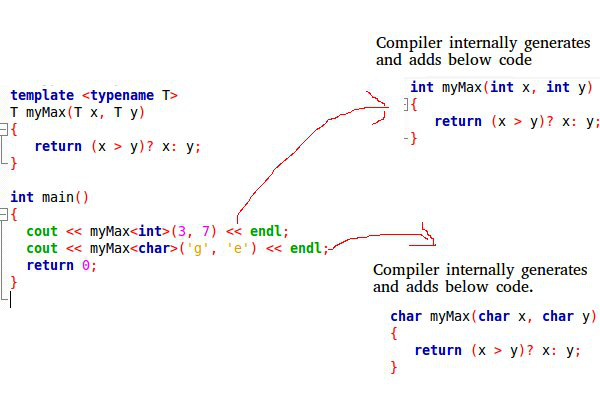

# S02-3 Multiparadigma programozás és Haladó Java 2

## Tartalom

1. [Generikus programozás, típussal való paraméterezés, példányosítás és típustörlés](#chapter01)
2. [Absztrakt adatszerkezetek és algoritmusok, konténerek és iterátorok Javaban](#chapter02)
3. [A C++ standard template könyvtár.](#chapter03)
    1. [Konténerek és iterátorok](#section01_01)
    2. [Funktorok](#section01_02)
    3. [Algoritmusok](#section01_03)
4. [Java annotációk](#chapter04)
5. [Önelemzés, osztálybetöltés](#chapter05)
6. [Objektumszerializáció](#chapter06)

---
## 1. Generikus programozás, típussal való paraméterezés, példányosítás és típustörlés <a name="chapter01"></a>

### Generikus programozás (Java generics)

- A sablonoknak hasonló a célja, mint a függvényeké: csökkentik a kódredundanciát
    - metódus: érték paraméterez metódustörzset
    - sablon: típus paraméterez osztályt vag metódust
- Így sablonnal csak egy osztályt kell megírnunk, nem kell az összes típusra megírni, amivel használni szeretnénk
- pl:

```Java
class Pair<T1, T2> { T1 elem1; T2 elem2; }
```

*Megjegyzés: ezt úgy is megvalósíthatnánk, hogy ```class Pair {Object elem1; Object elem2; }``` viszont ebben az esetben
akkor nekünk kellene mindenhova a típuskényszerítéséket leírnunk. -> sok hibalehetőség*

- **példányosítás:** a sablon konkrét paraméterekkel való ellátása
- sablonparaméter megjelenhet a műveletekben formális paramétereként, lokális változóként, és műveletek visszatérési
érték típusában
    - **reification:** sok nyelvben minden paraméterezésre külön típust hoz létre. pl: `Pair<String, Character>`
    a `PairSC` típushoz, a `Pair<double[], Boolean>` a `PairDB` típushoz hasonló típust hoz létre.
    A `PairSC` olyan, mint a fenti kód, csak `T1`, `T2` helyett a konkrét típusok vannak: String és Character
    - **típustörlés:**
        - a típusértékek minden előfordulás helyére `Object` kerül a fordítás során, vagy ha megszorításokat
        (`Example<T extends String>`) alkalmaztunk, akkor specifikusabb típus is kerülhet a helyére.
        - a futtatórendszer nem is tud a típusparaméterekről
        - törlés előtt a fordító megvizsgálja, hogy típushelyesen használjuk-e a sablonpéldányokat
        - nem lehetnek primitív típusok, hiszen azokat nem lehet `Object`-tel helyettesíteni
        - a fordító legenerálja a típuskényszerítéseket
        - ha fordul a kód, akkor futási időben biztos, hogy nem kapunk típuskényszerítés miatt hibát
        - `List<Integer>` nem altípusa `List<Number>`-nek hiába `Integer <: Number` igaz: gondoljunk bele, hogy létrehozunk egy `Integer`-ek listáját, majd azt értékül adjuk egy `Object`-eket tartalmazó listának
        (itt lesz fordítási hiba), akkor az `Integer`-ek listájába pakolhatnánk mindenféle `Object`-et

### Típussal való paraméterezés (C++ templates)

A template-ek (sablonok) a generikus programozás alapját képezik C++-ban. Céljuk a típusoktól független kód (osztályok, függvények) írása. A template egy tervrajz vagy formula egy generikus osztály vagy függvény leírására. A template-ek használatára jó példák az iterátorok és az (STL-beli) algoritmusok.  

#### Működés  

A template-ek fordítási időben értékelődnek ki (kódgenerálás), miután a fordító elvégezte típusellenőrzést.  



Szintaxis:  

* Template függvény példa:  
  ```C++
    template <typename T>
    T myFunction (T var1, T var2);
  ```
  ```C++
    template <class T>
    T myFunction (T var1, T var2);
  ```  
  A két jelölésmód (typename vagy class) között nincs szemantikai különbség, ugyanazt a hatást váltják ki.  
  Használat:  
  ```C++
    int x,y;
    myFunction<int>(x,y);
  ```  

* Template osztály példa:  
  ```C++
    template <class T>
    class myClass { ... };  

    myClass<int> myObject;
  ```  

* A template-eket konkrét típusparaméterekkel, vagy paraméterek nélkül is használhatjuk. Ezt részleges, illetve teljes template specializációnak nevezzük. Utóbbi akkor hasznos, ha egy már létező template-es osztályhoz vagy függvényhez új definíciót szeretnénk adni.  
  ```C++
    template <class S, int T>
    class myClass { ... };

    myClass<double, 5> myObject;
  ```
  ```C++
    template <class T>
    class myClass { ... };

    template <>
    class myClass <char> { ... };
  ```  
  * Példa: a `vector<bool>` a `vector` egy specializált sablonja. Célja a helytakarékosabb tárolás. Nem foglal le minden egyes elemnek 1 byte-ot, hanem több `bool` értéket tesz egyetlen `char`-ba.

* A típusparamétereknek adhatunk alapértelmezett értéket is:
  ```C++
    template <class S = char, int T = 5>
    class myClass { ... };

    myClass<> myObject;  // alapértelmezett értékek behelyettesítése
    myClass<double, 10> myOtherObject;
  ```

#### Típusparaméterek dedukciója függvénysablonok esetén

Egy függvénysablon példányosításához minden template argumentumot ismernünk kell. Ennek érdekében a fordító a függvény argumentumai alapján visszafejti a template argumentumokat, amikor csak lehetséges: függvényhíváskor, függvénysablon címére hivatkozáskor, stb. A dedukció a konkrét típusok behelyettesítése előtt történik meg.  

```C++
  template<typename T, typename S>
  T convert(S s);

  void myFunction(double d)
  {
    int i = convert<int>(d);    // calls convert<int, double>(double)
    char c = convert<char>(d);  // calls convert<char, double>(double)
    int(*ptr)(float) = convert; // instantiates convert<int, float>(float)
  }
```  

A dedukció lehetővé teszi a template operátorok használatát úgy, hogy függvényhívássá írja át.  

## 2. Absztrakt adatszerkezetek és algoritmusok, konténerek és iterátorok Javaban <a name="chapter02"></a>

### Konténerek

#### Konténer interface-ek
* `Collection`: a gyűjtemények legáltalánosabb interface-e, amit minden más konténer megvalósít.
* `Set`: a klasszikus halmaz interface-e.
* `List`: egy rendezett sorozat. (a Vector legacy implementációja)
* `Queue`: a klasszikus (LIFO) sor interface-e.
* `Deque`: a kétvégű sor interface-e.
* `Map`: kulcs-érték párok konténere. Csak egyedi kulcsokat engedélyez. (a Hashtable legacy implementációja)

#### Absztrakt adatszerkezetek  

A konténer interface-ek absztrakt megvalósítása. Céljuk, hogy megkönnyítsék a saját implementációk készítését.

* `AbstractCollection`
* `AbstractSet`
* `AbstractList`: random accesst biztosít (tömbhöz hasonló).
* `AbstractSequentialList`: sequential accesst (sorfolytonos hozzáférést) biztosít (láncolt listához hasonló).
* `AbstractQueue`
* `AbstractSet`

#### Konténer implementációk
* `HashSet`: a `Set` interface hasítótáblás implementációja. Ez a leggyakrabban használt a Set implementációi közül.
* `TreeSet`: a `NavigableSet` interface-t implementálja _piros-fekete fa_ megvalósításával.
* `ArrayList`: a `List` interface dinamikus tömbszerű megvalósítása. Ez a leggyakrabban használt a List implementációi közül.
* `ArrayDeque`: a `Deque` interface dinamikus tömbszerű megvalósítása.
* `LinkedList`: a `List` és a `Deque` interface-eket implementálva megad egy kétirányú láncolt listát.
* `PriorityQueue`: a `Deque` interface heap implementációja, egy prioritásos sort ad meg.
* `HashMap`: a `Map` interface hasítótáblás implementációja. Ez a leggyakrabban használt a Map implementációi közül.
* `TreeMap`: a `NavigableMap` interface-t implementálja _piros-fekete fa_ megvalósításával.

### Algoritmusok
* `sort(List)`: a _merge sort algoritmussal_ rendezi a megadott listát O(n*log n)-es műveletigénnyel.
* `binarySearch(List, Object)`: _bináris kereséssel_ keresi a megadott objektumot a rendezett listában.
* `reverse(List)`: megfordítja a lista elemeinek sorrendjét.
* `shuffle(List)`: összekeveri a lista elemeit.
* `copy(List, List)`: az első lista elemeit a másodikba másolja.
* `min(Collection)`: a gyűjtemény legkisebb elemével tér vissza.
* `max(Collection)`: a gyűjtemény legnagyobb elemével tér vissza.
* `swap(List, int, int)`: a megadott pozíciókon lévő elemeket megcseréli.
* `frequency(Collection, Object)`: megszámolja, hogy a megadott elem hányszor fordul elő a gyűjteményben.
* `disjoint(Collection, Collecion)`: megállapítja, hogy az adott gyűjtemények diszjunktak-e.

### Iterátorok
Az iterátorok segítik a konténerek elemeihez való hozzáférést, a rajtuk végzett iterációt.  

* `Iterator`: a Java Collections Framework eleme, az Enumeration interface-t helyettesíti. Metódusai:
  * `hasNext`: megvizsgálja, hogy a konténernek vannak-e további elemei.
  * `next`: a következő elemre lép.
  * `remove`: kitörli az aktuális elemet. Az iterátor ezt követő viselkedése nem definiált.
* `ListIterator`: speciálisan listákhoz készített iterátor. Engedi a lista módosítását, és a kétirányú bejárást. Nincs aktuális eleme, mindig két elem között áll.

## 3. C++ Standard Template Library <a name="chapter03"></a>
Az STL-t _Alexander Stepanov_ írta eredetileg Ada-hoz, majd C++-ban is implementálta, és javasolta a szabványosítását. Így kisebb módosításokkal az Alexander Stepanov-féle STL része lett a C++ Standard Librarynek. Az eredeti STL tehát nem a C++ szabvány része, de ami átkerült a C++ Standard Libary-be, az igen. Tehát a C++ szabvány megmondja például, hogy mi az a vector, és ha egy gépen van szabványos C++ fordító, akkor garantáltan ott kell lennie a Standard Library-nek is.  

* Mitől "Template"?  
  * A konténerek bármely beépített típussal használhatóak, vagy felhasználó által definiált típussal is, ha az
      megvalósít néhány alapvető metódust, pl: értékadás
  * Az algoritmusok a konténerektől függetlenek, amely leegyszerűsíti a könyvtár komplexitását.
  * Ereje a template-ek használatában rejlik, amely _fordítási idejű polimorfizmust_ tesz lehetővé.

### 3.1 Konténerek és iterátorok <a name="section01_01"></a>

#### Szekvenciális konténerek

* array
* vector
* deque
* forward_list
* list

#### Adapterek

* stack
* queue
* priority_queue

#### Asszociatív konténerek

* set
* multiset
* map
* multimap

* Tulajdonságok:  
  * rendezettség, összehasonlító típus
  * keresőfa
  * ekvivalencia
  * logaritmikus bonyolultságú műveletek
  * ekvivalens a és b:
      * `(!(a < b) && !(b < a))`
      * általános eset: `(!(s.key_komp() (a, b)) && !(s.key_komp() (b, a)))`
  * `multiset` és `multimap` esetén az ekvivalens elemek sorrendje nem definiált
  * Általánosan igaz, hogy megegyező értékekre a predikátumoknak hamisat kell visszaadniuk, multikonténereknél is, különben a konténer invaliddá válik.

#### Rendezetlen asszociatív konténerek

* unordered_set
* unordered_multiset
* unordered_map
* unordered_multimap

#### Iterátorok

Az iterátorok célja, hogy végig tudjuk járni a konténereket.  

* Fő típusai:  
  * _Input_: előrefelé tudunk menni, illetve olvasni, módosítani nem tud, a dereferálás csak jobbértéket (rvalue) adhat vissza, létezik hozzá másoló konstruktor, értékadás operátor, lehet inkrementálni és egyenlőségvizsgálatot végezni rajta.
  * _Output_: előrefelé tudunk menni, illetve csak írni, olvasni nem tud, a dereferálás csak balértéket (lvalue) adhat vissza, létezik hozzá másoló konstruktor, értékadás operátor, lehet inkrementálni.
  * _Forward_: input + output + van alapértelmezett konstruktor
  * _Bidirectional_: forward + lehet dekrementálni (kétirányú)
  * _Random access_: bidirectional + random hozzáférést tesz lehetővé, nem csak egyesével tudunk lépkedni + léteznek hozzá a következő operátorok: +, -, +=, -=, >, <, >=, <=, []

- `vector`: random access iterátor
- `deque`: random access iterátor
- `list`: bidirectional
- asszociatív konténerek: bidirectional
- iterátorok invaliddá válhatnak (Ld. következő kép):
    - `vector`-nál ha re-allokáció történik, akkor minden invaliddá válik: iterátorok, referenciák, pointerek
    - `deque`-nél:
        - széléről való törléskor csak a szélső iterátorok válnak invaliddá
        - középről való törléskor minden invaliddá válik: iterátorok, referenciák, pointerek
        - beszúráskor az összes, ha középre szúrtunk be, szélre való beszúráskor csak az iterátorok, a pointerek és
        referenciák megmaradnak


- példa: `std::vector<double>::iterator i = v.begin()`
- iterátorok fajtái:
    - `const_iterator`
    - `reverse_iterator`
    - `const_reverse_iterator`
    - `istream_iterator`, `ostream_iterator`
    - `istreambuf_iterator`, `ostreambuf_iterator`

#### Vector re-allokáció

- `vector` re-allokáció folyamata:
    - új memóriaterület allokálása
    - elemek átmásolása
    - régi elemek megszüntetése
- re-allokáció költséges, illetve invalid iterátorokhoz vezet
- a kapacitás nem csökken automatikusan
- swap trükk:

```C++
vector<int> v;
//...
vector<int>(v).swap(v);
```

- C++ 11-től van `v.shrink_to_fit()`
- van `iterator` -> `const_iterator` konverzió, viszont visszafele nincs, érthető okokból
- van `reverse_iterator` -> `iterator` konverzió a `base()` tagfüggvénnyel, ami trükkös, lásd a következő képet


- tehát i = ri.base() máshova fog mutatni
- törléskor ezért nem lesz jó, de beszúráskor még jó

#### Speciális iterátorok
```C++
// másoljuk a std.input-ot std.output-ra...
copy( istreambuf_iterator<char>( cin ),
      istreambuf_iterator<char>(),
      ostreambuf_iterator<char>( cout ) );
```

### 3.2 Funktorok <a name="section01_02"></a>
- olyan objektumok, amelyeknek van `operator()`-a globális függvényhívások szimulálására
- objektumok - állapotok, adattagok, egyéb tagfüggvények
- hatékonyak
- speciális hibák elkerülése
- két ősosztály van: `unary_function`, `binary_function` sablonok
- C++ 11-től a lambdákkal kiválthatók
- `unary_function`, `binary_function`:
    - speciális `typedef`-eket biztosítanak
    - a `typedef`-ekre szükségük van a függvényobjektum adaptereknek: `not1`, `not2`...
    - ezek sablonosztályok és származtatni példányokból lehet
    - `unary_function` két sablonparaméter
    - `binary_function` három sablonparaméter
    - az utolsó paraméter mindig a visszatérési érték
    - az első, vagy első kettő, az `operator()` paramétere illetve paraméterei, értelemszerűen unary esetén 1, míg
    binary esetén kettő
- ha függvényekre akarjuk használni az adaptereket, akkor közvetlenül ezt nem tudjuk megtenni, mert hiányoznak a `typedef`-ek
- `ptr_fun` lehet a segítségünkre, ami egy alkalmazkodóképes funktort ad vissza, aminek az `operator()`-a majd meghívja
az eredeti függvényt

```C++
bool is_even( int x );
// Első páratlan szám megkeresése:
list<int> c;
//...
list<int>::iterator i = find_if( c.begin(), c.end(),  not1( ptr_fun( is_even ) ) );
```

- `mem_fun_ref`: lehetőséget ad arra, hogy a sorozat minden elemére meghívjuk az elemnek egy tagfüggvényét

```C++
struct Foo
{
    void bar();
};
list<Foo> c;
// bar meghívása c összes elemén?
for_each( c.begin(), c.end(), mem_fun_ref( &Foo::bar ) );
```

- `mem_fun`: ugyanaz, mint az előbbi, csak ha `bar` virtuális metódus, akkor a dinamikus típusnak megfelelőt fogja
meghívni

```C++
struct Figure
{
    virtual void draw() const = 0;
    virtual ~Figure() { };
};
//...
list<Figure*> c;
// draw meghívása (a dinamikus típusnak megfelelő):
for_each( c.begin(), c.end(), mem_fun( &Figure::draw ) );
```
Funktoroknál elvárás, hogy ne tartson fenn olyan változót, illetve ne érjen el, amely befolyásolja az `operator()`
eredményét, azaz az operátor értéke csak a paraméterektől függjön. Ez azért van így, mert az algoritmusok másolatokat
készíthetnek a funktorokról.

### 3.3 Algoritmusok <a name="section01_03"></a>

Az `algorithms` könyvtár olyan, különböző célokat szolgáló (pl. keresés, rendezés, számlálás) függvényeket definiál, amelyek elemek sorozatán végeznek el műveleteket. Ezek a sorozatok balról zártak, tehát [első, utolsó) alakúak, ahol az "utolsó" valójában az utolsó utáni elemre mutat.  

Az algoritmusokat célszerű ciklkusok helyett használni. Előnyeik:  

* Hatékonyság
* Érvénytelen iterátorok elkerülése
* Kód átláthatóságának javítása

#### Fontosabb nem módosító szekvenciális műveletek

* `for_each(_n)`: egy megadott művelet alkalmazása egy sorozat elemeire/első n elemére.
* `count(_if)`: visszaadja a megadott feltételnek megfelelő elemek számát. Értéket vagy predikátumot vár.
* `find(_if(_not))`: visszaad egy, a megadott feltételnek megfelelő első elemre mutató iterátort.

#### Fontosabb módosító szekvenciális műveletek

* `copy(_if)`: lemásolja a megadott helyre az elemek sorozatát (a megadott feltételnek megfelelően).
* `move`: áthelyezezi a megadott elemek sorozatát egy másik helyre.
* `transform`: elvégzi a (predikátummal) megadott műveletet az elemek sorozatára.
* `remove(_if)`: eltávolítja a megadott feltételnek megfelelő elemeket a sorozatból. Valójában nem töröl (mivel az algoritmus konténerfüggetlen, és nem ismeri a specifikus törlés műveletet), ezért csak átrendezi a konténer elemeit, hogy a megmaradóak előre kerüljenek. Egy iterátort ad vissza, ami a konténer új logikai végére mutat. A konténer fizikai méretét nem csökkenti. Általában a konkrét konténer `erase` műveletének paramétereként használjuk, így a konténer úgy logikai és fizikai mérete egyezni fog. A `remove(_if)` tehát memóriaszivárgást okozhat.


* `swap`: megcseréli két objektum értékeit.
* `reverse`: megfordítja a megadott sorozat elemeinek sorrendjét.
* `unique`: eltávolítja a megegyező értékű elemeket úgy, hogy az elsőt meghagyja. Az elemek összehasonlítása a `==` operátorral vagy a megadott predikátummal történik. A "törlést" a `remove`-hoz hasonlóan végzi, ebben az esetben is az `erase` metódussal együtt érdemes használni.

#### Fontosabb rendező műveletek

* `sort`: növekvő sorba rendezi a megadott elemeket. Az összehasonlításhoz a `<` operátort vagy a megadott összehasonlító predikátumot használja.
* `partial_sort`: növekvő sorba rendezi az első n elemet.
* `is_sorted`: visszaadja, hogy a megadott elemek növekvő sorrendbe vannak-e rendezve.

#### Fontosabb bináris keresőműveletek

* `binary_search`: bináris keresést használva megkeresi az adott elemet a sorozatban.
* `lower_bound`: visszaad egy iterátort az első elemre, ami kisebb vagy egyenlő, mint a megadott elem.
* `upper_bound`: visszaad egy iterátort az első elemre, ami nagyobb, mint a megadott elem.

Bizonyos konténerek rendelkeznek `algorithm` könyvtárbeli algoritmusokkal megegyező nevű tagfüggvényekkel. Konkrét konténer esetében célszerű inkább a saját függvényét használni, mert így a működés garantáltan helyes lesz.

## 4. Java annotációk <a name="chapter04"></a>

Az annotáció a metaadat egy formája, amely olyan adatokat szolgáltat egy programról, amely nem része a programnak. Az annotációknak nincs közvetlen hatásuk a program működésére. Csomagokhoz, osztályokhoz, metódusokhoz stb. lehet hozzárendelni őket.

### Használati esetek
* Információ szolgálatatása a fordító számára.
* Fordítási időben történő feldolgozás
* Futási időben történő feldolgozás

### Szintaxis  

```Java
public @interface Copyright { // saját annotáció létrehozása
    String value();
}

@Copyright(value="Copyright: Bender") // annotáció használata (@)
public class Metal {
//...
}
```

### Fontosabb beépített annotációk
* `Deprecated`: egy figyelmezetetés, hogy az adott nyelvi elem (metódus, mező, stb.) elavult. Minden használatkor warningot fog generálni.
* `Override`: tájékoztatja a fordítót, hogy az elem valamilyen ősosztálybeli elem felülírt változata.
* `SuppressWarnings`: megmondja a fordítónak, hogy rejtse el a megadott warningokat, amiket egyébként adna.

#### Más annotációkra vonatkozó beépített annotációk
* `Retention`: tájékoztatás, hogy a megjelölt annotáció milyen módon van eltárolva.
* `Target`: megmondja, hogy a megjelölt annotáció milyen elemekre alkalmazható.

### Tulajdonságok

* Implicit módon kiterjeszti a `java.lang.annotation.Annotation` interface-t
* Nulla, egy vagy több eleme is lehet
  * Nulla: _marker annotációnak_ nevezzük, elhagyható az üres zárójel
  * Egy: konvenció, hogy az érték neve legyen `value`, ezáltal nem muszáj kiírni, hogy `value="blah"`
* A `default` kulcsszóval alapértelmezett értéket rendelhetünk hozzá, pl. `String date() default "[not_defined]";`
* Lehet belőle leszármaztatni
* Egymásba ágyazhatóak
* Megszorítások:
  * Nem lehet generikus
  * Nem lehet szülőinterface-e
  * Nem lehet `throws` klóza
  * Nem lehet rekurzív a definíciója
  * Nem ütközhetnek metódusai az `Object` és az `Annotation` metódusaival (felüldefiniálás-ekviv.)
  * Metódusok megszorításai:
    * Nem lehetnek generikusak
    * Nem lehet paraméterük
    * A visszatérési érték típusa lehet: primitív, enum, annotáció, `String`, `Class` vagy annak példányosítása, vagy az előzőekből képzett 1 dimenziós tömb

## 5. Önelemzés, osztálybetöltés <a name="chapter05"></a>

A **Reflection** (magyarul önelemzés) egy API (`java.lang.reflect`), amelyet arra használhatunk, hogy futási időben vizsgáljunk vagy módosítsunk interface-eket, osztályokat, metódusokat.  

Előnyei:  
* _Bővíthetőség_: felhasználhatunk egységeket a kódból, amelyeknek csak a nevét ismerjük.
* _Újrafelhasználhatóság_
* _Rugalmasság_
* _Hibakeresés és tesztelés_: a debuggerek reflectiont használnak, hogy privát tagokat vizsgáljanak.

Hátrányai:  
* _Költséges_: végrehajtása lassú.
* _Hibalehetőségek_: futási idejű hibákhoz vezethet a kódmanipuláció.
* _Biztonság csökkenése_: a privát tagokhoz való hozzáféréssel csökken a kódbiztonság.  

A vizsgálat egy típusleíró fájl alapján történik:
    - osztályok
    - interface-ek
    - annotációk
    - felsorolási típusok

```Java
import java.lang.reflect.*;
class Example {
    public static void main(String[] args) throws Exception {
        Class c = Class.forName(args[0]);
        Class[] formalArgs = (args.length > 2)
                                ? new Class[] {String.class}
                                : new Class[] {};
        Object o = c.newInstance();
        Method m = c.getMethod(args[1],formalArgs);
        Object[] actualArgs = (args.length > 2)
                                ? new Object[] {args[2]}
                                : new Object[] {};
        System.out.println( m.invoke(o,actualArgs) );
    }
}
```

### Osztályok (`Class`)

* `getClass`: egy `Class` objektummal tér vissza, ami az adott objektum típusa.
  * Pl.: `"Hello".getClass()` -> String
* `class`: akkor használjuk, ha csak a típus adott, de nincs belőle példány, illetve primitív típusok visszanyerésére.
  * Pl.: `String.class`
* `forName`: ha a adott az típus teljes neve, készíthetünk belőle egy `Class` példányt. A fordításhoz nem szükséges a típus, de futtatáskor a classpath-ban kell lennie.
  * Pl.: `Class.forName("java.util.List")`
  * Betöltéskor kétfajta hiba léphet fel:
    * `ClassNotFoundException`
    * `LinkageError`
* `newInstance`: az osztály példányosítása a `Class` paraméter nélküli konstruktorával.
* Már visszanyert osztályokhoz kapcsolódó további osztályok elérése (csak akkor hívhatóak, ha már van egy `Class` objektum):
  * `Class.getSuperClass()`
  * `Class.getInterfaces()`
  * `Class.getClasses()`
* A `Class` egy generikus osztály, mindig a visszanyert típusnak megfelelő paramétert veszi fel.
  * Pl.: `Class<String>`

### Konstruktorok (`java.lang.reflect.Constructor`)

* `getConstructor`: a hívó `Class` publikus konstruktorával tér vissza, ami megfelel a megadott paramétertípusoknak.
* `getConstructors`: a hívó `Class` publikus konstruktorainak tömbjével tér vissza (az örökölt konstruktorok is benne vannak).
* `getParameterTypes`: megadja a hívó `Constructor` paramétereit.
* `newInstance`: egy új objektumot hoz létre a megfelelő `Constructor` hívásával.

### Metódusok (`java.lang.reflect.Method`)

* `getMethod`: vissaadja a megadott névnek és paramétertípusoknak megfelelő publikus metódust a hívó `Class`-ban.
* `getMethods`: a hívó `Class` publikus metódusainak tömbjével tér vissza (az örökölt metódusok is benne vannak).
* `getParameterTypes`: megadja a hívó `Method` paramétereit egy `Class` tömbben.
* `getReturnType`: megadja a hívó `Method` visszatérési értékének típusát.
* `invoke`: meghívja a megadott osztálynak és paramétereknek megfelelő metódust.

### Mezők (`java.lang.reflect.Field`)

* `getField`: a megadott névnek megfelelő publikus mezőt adja vissza a hívó `Class`-ban.
* `getFields`: a hívó `Class` publikus mezőinek tömbjével tér vissza (az örökölt mezők is benne vannak).
* `getName`: visszaadja a hívó `Field` nevét.
* `getType`: visszaadja a hívó `Field` típusát (`Object` formájában).
* `get`: visszaadja a hívó `Field` konkrét értékét.
* `set`: beállítja a megadott paraméternek megfelelően a hívó `Field` értékét.

### Egyéb tulajdonságok
- módosítók lekérdezése:
    - annotációk: külön erre a célra való műveletek
    - nem annotáció módosítók maszkolással:
        - a `getModifiers()` egy integert ad vissza
        - az int-ből maszkolással nyerhető ki a módosítók
        - kinyerésre vannak speciális műveletek:
            - `public static boolean isStatic(int mod)`
- minden információ:
    - `getDeclaredMethods()`, ...
    - az örököltek nem
- típuskényszerítés a `public T cast(Object obj)` segítségével
- dinamikus típusellenőrzés a `public boolean isInstance(Object obj)` használatával
- lekérdezések: `isArray()`, `isPrimitive()`
- értéklekérdezés, beállítás:

```Java
Class<Point> c = Point.class;
Object o = c.newInstance();
Field x = c.getField("x");
x.setInt(o,12);
Point p = c.cast(o);
System.out.println(p.x);
```

- mire használjuk:
    - előre nem ismert kódot manipuláló kód írásánál:
        - keretrendszerek
        - EJB
        - vizuális szerkesztők
        - nyomkövető, log rendszerek
    - generatív programozás
    - kóddal paraméterezhető kód

## 6. Objektumszerializáció <a name="chapter06"></a>
- objektum elmentése -> rekurzívan az általa hivatkozott objektumok mentése is
- hivatkozott objektum többszöri előfordulása esetén csak egyszer lesz elmentve
- a Serializable interfész megvalósításával érhetjük el
    - ennek nincsenek metódusai, csak oda kell rakni az osztályhoz
    - csak arra a célra szolgál, hogy megjelöljük mint szerializálható osztályt
- a szerializációt a Java elvégzi helyettünk
- ha valami speciális dolgot kell csinálni az osztályunkkal szerializáció során akkor a következő metódusokat kell
implementálnunk
    - `writeObject`
    - `readObject`
    - `readObjectNoData`
- mi történik:
    - metainformációk elmentése (objektum osztály, verzió)
    - objektum adattagjainak elmentése
    - hivatkozott objektumok rekurzív mentése
    - korábban mentett objektum helyett egy mutató mentése
- `transient` kulcsszó: ha az adattagot nem akarjuk szerializációkor menteni
- a szerializáció során mindegyik osztályhoz hozzárendelésre kerül egy verzió szám melynek neve `serialVersionUID`, ezt
a futtató környezet arra használja, hogy de-szerializáció során megbizonyosodjon arról, hogy az objektum küldője és
fogadója kompatibilis osztályt használnak
- ha a két verzió különbözik akkor egy `InvalidClassException` kivételt kapunk
- a verziót a `Serializable` interfészt megvalósító osztályunkban a `serialVersionUID` mező deklarálásával
adhatjuk meg, amelynek `static`, `final` és `long`-nak kell lennie
    - pl.: `static final long serialVersionUID = 42L`
- ha nem adjuk meg akkor generál nekünk egyet, de warning-ot kapunk

## További források
- Előadás anyagok
- http://www.cplusplus.com/reference/stl/
- https://www.tutorialspoint.com/cplusplus/cpp_templates.htm
- http://www.cplusplus.com/doc/oldtutorial/templates/
- https://en.cppreference.com/w/cpp/language/template_argument_deduction
- https://docs.oracle.com/javase/6/docs/technotes/guides/collections/reference.html
- https://www.geeksforgeeks.org/reflection-in-java/
- https://en.cppreference.com/w/cpp/algorithm
- https://docs.oracle.com/javase/tutorial/java/annotations/
- https://en.cppreference.com/w/cpp/container?fbclid=IwAR1ForAErGGfQCW0gBXJ9P2B6QkOnwfNzJN0imi9aRpF_ok9m2frDoUAdUs
- https://www.tutorialspoint.com/java/java_serialization.htm
