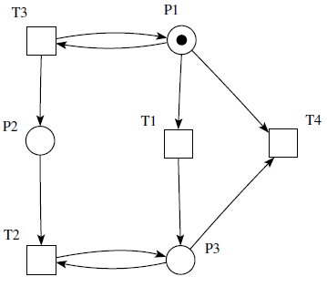
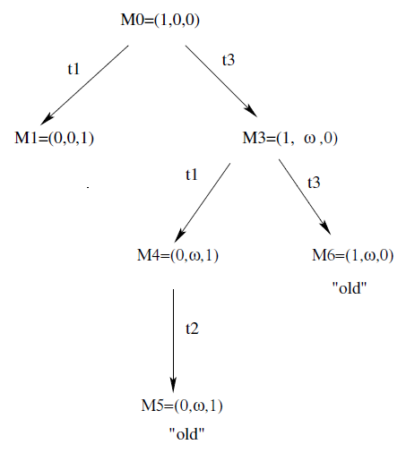
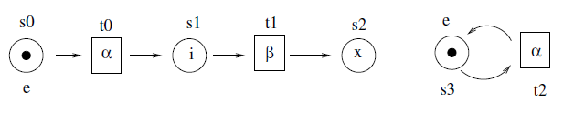

# S04-1 Párhuzamos folyamatok modellezése Petri hálók segítségével

1. Petri hálók definíciója és működési szabálya
2. Párhuzamos folyamatok legfontosabb viselkedési tulajdonságai (elevenség, biztonságosság, korlátosság) és azok 
vizsgálatára szolgáló eszközök (elérési, fedési fa).
3. Petri doboz alkalmazása párhuzamos folyamatok modelljének felépítésében.
4. Párhuzamos és elosztott rendszerek szemantikai leírása lehetséges formáinak (műveleti, leíró, axiomatikus) 
bemutatása egy konkrét példán keresztül.

---
## Petri hálók definíciója és működési szabálya

__Páros gráf:__ olyan gráf, amelyben a csúcsok két diszjunkt halmazba sorolhatóak oly módon, hogy az azonos halmazba 
tartozó csúcsok között nem vezet él.

__Petri háló:__ (N, $M_0$) rendezett pár, ahol:

* N = (P, T, R, v) a tartó gráf, irányított, páros gráf, amelynek az élei súlyozottak 
* P, T: a csúcsok véges halmazai. P a helyek halmaza, T az átmenetek halmaza
* P $\cup$ T $\not=$ $\oslash$
* P $\cap$ T = $\oslash$
* R - az éleket megadó reláció: R $\subseteq$ (P × T) $\cup$ (T × P)
* v: R → $N_0$ - az élek súlyait megadó függvény
* A helyek kezdeti súlyozását (kezdőállapot) az $M_0$ adja meg 
    - $M_0$: P → $N_0$
    - A helyek súlyozását (állapot) általában rendezett n-esként adjuk meg, pl.: $M_0$ = (1, 0, …, 2)

__Normális háló:__ minden él súlya 1.

__Kapacitás korlát:__

A háló egyes helyeinek súlya nem haladhat meg egy előre megadott értéket: $k: P \rightarrow N_0$

* Szigorú működési szabály: a kapacitáskorlát túllépése esetén az átmenet nem megengedett
* Gyenge működési szabály: a felesleg elnyelődik

__Jelölések:__

* p helyet megelőző átmenetek halmaza: $\bullet$p = $R^{(-1)}$(p)
* t átmenetet megelőző helyek halmaza: $\bullet$t = $R^{(-1)}$(t)
* Adott csúcs utódja(i): p$\bullet$ = R(p), t$\bullet$ = R(t)

__Működési szabály:__

1. t átmenet aktivizálható, ha $\forall$p $\in$ $\bullet$t: M(p) $\ge$ v(p, t),  
vagyis minden őt megelőző hely súlya legalább akkora, mint az őket összekötő él súlya
2. t átmenet után az új M' súlyozás: 
$\forall$p $\in$ P: M'(p) = M(p) + v(t,p) - v(p,t),  
vagyis az átmenetbe vezető élek súlyával csökken a kiinduló helyek súlya, és az átmenetből vezető élek súlyával nő a 
cél helyek súlya (ha egy hely nem kapcsolódik az adott átmenethez, akkor a súlya a régi marad)

## Viselkedési tulajdonságok

__Jelölések:__

* $M_0$ [$\varsigma$> $M_n$, ahol $\varsigma$ = $t_1, t_2, .., t_n$ akciósorozat  
    $M_0 [t_1> M_1 [t_2> M_2 ... M_{n-1} [t_n> M_n$
* $L(N,M_0):$ azon akciósorozatok halmaza, amely az N-ben elérhető az $M_0$ súlyozásból
* R(N, $M_0$) : N hálóban az $M_0$ kezdő súlyozásból elérhető súlyozások halmaza
* $\sharp$($\varsigma$, t): $\varsigma$-ban t átmenet előfordulásának száma

__K – korlátosság (k $\in$ N):__

Az (N, $M_0$) Petri háló k - korlátos, ha $\forall$M $\in$ R(N,$M_0$) : $\forall$p $\in$ P : M(p) $\leq$ k

__Biztonságos:__

Egy Petri háló biztonságos, ha 1 - korlátos

__Elevenség:__

Legyen t $\in$ T. $M_0$ kezdősúlyozástól függően az N Petri hálóban a t átmenet eleven

* $L_0$ szinten (holt): $\forall$$\varsigma$ $\in$ L(N, $M_0$) : t $\not\in$ $\varsigma$  
    (Nem lehet egyszer se végrehajtani az átmenetet)
* $L_1$ szinten (aktivizálható): $\exists$$\varsigma$ $\in$ L(N, $M_0$) : t $\in$ $\varsigma$  
    (Végrehajtható az átmenet)
* $L_2$ szinten: $\forall$k $\in$ N : $\exists$$\varsigma$ $\in$ L(N,$M_0$) : #($\varsigma$, t) $\geq$ k  
    (Bármely korlátnál többször végrehajtható az átmenet)
* $L_3$ szinten: $\exists$$\varsigma$ $\in$ L(N, $M_0$) : #($\varsigma$, t) = $\infty$  
    (Van olyan végrehajtás, melyben tetszőlegesen sokszor végrehajtható az átmenet)
* $L_4$ szinten: $\forall$M $\in$ R($M_0$)-ra a t L1 szinten eleven  
    (Minden elérhető állapotban az átmenet aktivizálható)

Szigorúan $L_k$ eleven: $L_k$ eleven, de nem $L_{k+1}$

Petri háló $L_k$ eleven: (N, $M_0$) $\forall$t $\in$ T : t $L_k$ eleven

__Lefedhetőség:__

(N, $M_0$) Petri háló esetén az M súlyozás lefedhető, ha $\exists$M' $\in$ R($M_0$) : $\exists$p $\in$ P : M'(p) $\geq$ M(p)

## Petri hálók vizsgálata

__Elérhetőségi fa:__

(N, $M_0$) Petri háló elérhetőségi (végtelen esetben fedési) fája, olyan gráf, amelyben a csúcsok súlyozásokkal vannak 
címkézve, az élek pedig átmenetekkel.

Konstrukció:

1. új := {$M_0$}
2. ciklus, amíg új $\not=$ $\oslash$
    a) M :$\in$ új, új := új \ {M}
    b) ha M-ig a gyökértől létezik már M címkéjű csúcs $\Rightarrow$ M régi
    c) ha M-ben nincs aktivizálható átmenet $\Rightarrow$ M zsákutca
    d) M-ben $\forall$t aktivizálható átmenetre kiszámoljuk MtM'-t
        i. Ha a gyökértől M-ig $\exists$M'' : M'' -t lefedi M' és M' $\not=$ M'', akkor minden p $\in$ M' : M'(p) > M''(p)
		helyre: M'(p) := $\omega$
        ii. M' új csúcs: új := új $\cup$ {M'}, az él címkéje t lesz

{ width=250 } { width=200 }

Legyen G a (N,M0) Petri háló lefedhetőségi fája.

* Korlátos a Petri háló $\Leftrightarrow$ ha nincs G-ben $\infty$ címkéjű csúcs.
* 1-korlátos (biztonságos) $\Leftrightarrow$ csak 0, 1-es szám szerepel a címkékben.
* t holt ($L_0$ eleven) $\Leftrightarrow$ $\neg\exists$t él címke a G fedési fában.

__Állapotgép:__ $\forall$t $\in$ T: |•t| = |t•| = 1

__Jelzett háló:__ $\forall$p $\in$ P: |•p| = |p•| = 1

## Petri dobozok

A Lab halmaz események egy előre megadott halmaza.

__Átcímkézés:__

$\rho$ átcímkézés egy reláció:

$\rho$ $\subseteq$ (mult(Lab)) × Lab, úgy, hogy ($\oslash$, $\alpha$) $\in$ $\rho$ akkor és csak akkor, ha $\rho$ = 
{($\oslash$, $\alpha$)}.

__Címkézett Petri háló:__

$\Sigma$ = (S, T, W, $\lambda$, M), ahol

* S a helyek halmaza
* T az átmenetek halmaza (S $\cap$ T = $\oslash$)
* W az éleket leíró reláció (W: ((S × T) $\cup$ (T × S)) → $N_0$)
* $\lambda$ a címkefüggvény
    - $\forall$s $\in$ S: $\lambda$(s) $\in$ {e, i, x},
        + $\lambda$(s) = e (entry), akkor s belépési hely,
        + $\lambda$(s) = x (exit), akkor s kimenő hely,
        + $\lambda$(s) = i (internal), akkor s belső hely,
    - $\forall$t $\in$ T: $\lambda$(t) egy átcímkézés,
* M a súlyozás (M: S × $N_0$)

__Lépés:__

Átmenetek egy véges zsákja U $\in$ mult(T), (egy lépés) engedélyezett $\Sigma$-ban, ha minden helyen van elég súly 
ahhoz, hogy szimultán végre tudjuk hajtani az összes U-beli átmenetet.

Megjegyzés: Egy lépés nem kell, hogy maximális legyen, például {$t0$} is egy lépése, illetve {$t_0$}{$t_1$}{$t_2$}
{$t_2$} és {$t_0$,$t_2$}{$t_1$}{$t_2$} is egy lépéssorozata $\Sigma_0$-nak.

__T-megszorítás:__ $\forall$t $\in$ T :• t $\not=$ $\oslash$ $\not=$ t•

__ex-megszorítás:__ létezik legalább egy belépési és egy kilépési hely.

__e-irányított háló:__ $\Sigma$ e-irányított, ha a belépési helyekhez nem vezet él.

__x-irányított háló:__ $\Sigma$ x-irányított, ha a kilépési helyekből nem vezet ki él.

__ex-irányított háló:__ $\Sigma$ ex-irányított, ha e-irányított és x-irányított

__Petri doboz__

$\Sigma$ címkézett Petri háló Petri doboz, ha ex-megszorított valamint ex-irányított (és T megszorított).

__Operátor doboz__

Egy operátor doboz olyan doboz, melynek minden átmenetéhez transzformációs (nem konstans) átcímkézés van rendelve.

Megjegyzés: Az operátor dobozt úgy képzelhetjük el, mint egy mintát, amely sima dobozok egy halmazát (átmenetenként 
egyet) köt össze a belépési és a kilépési helyeiken keresztül.

Speciális operátor dobozok

* Párhuzamos kompozíció: $\Omega_{||}$ operátor doboz két teljesen különálló másolatot készít $\Sigma_1$-ből és $\Sigma_2$-ből.
* Elágazás: $\Omega_{\square}$ egy elágazásban összekapcsolja $\Sigma_1$-et és $\Sigma_2$-t.
* Szekvenciális kompozíció: $\Omega_{;}$ szekvenciálisan összekapcsolja $\Sigma_1$-et és $\Sigma_2$-t.

## Párhuzamos és elosztott rendszerek szemantikai leírásának lehetséges formái

__Műveleti szemantika:__

A műveleti szemantika azt mondja meg, hogy milyen lépéseket hajt végre a program, azonban helyesség bizonyítására nem alkalmas.

Példák:

1. _a b nil + b c nil || a(b nil + c nil) $\xrightarrow{\text{a}}$  
b nil || b nil + c nil $\xrightarrow{\text{b}}$  
nil || nil_

    Ez esetben jobb oldal nil, tehát a program megfelel a környezetnek.

2. _a b nil + b c nil || a nil + b(c nil + a nil)_

    Jelen esetben két megvizsgálandó ág lesz:

    * _a b nil + b c nil || a nil + b(c nil + a nil) $\xrightarrow{\text{b}}$  
    c nil || c nil + a nil $\xrightarrow{\text{c}}$  
    nil || nil_
    * _a b nil + b c nil || a nil + b(c nil + a nil) $\xrightarrow{\text{a}}$  
    b nil || nil_

    A baloldal nem nil, de ez nem jelent problémát, mert a környezet (tehát a jobb oldal) nil lett.

    Tehát ez esetben is megfelel a program a környezetnek.

__Leíró szemantika__

A leíró szemantika a részprogramok viselkedéséből következtet az összetett programra (program szintézis).

__Axiomatikus szemantika__

Az axiomatikus szemantikát a programok verifikálásra (helyességellenőrzésre) fejlesztették ki.
