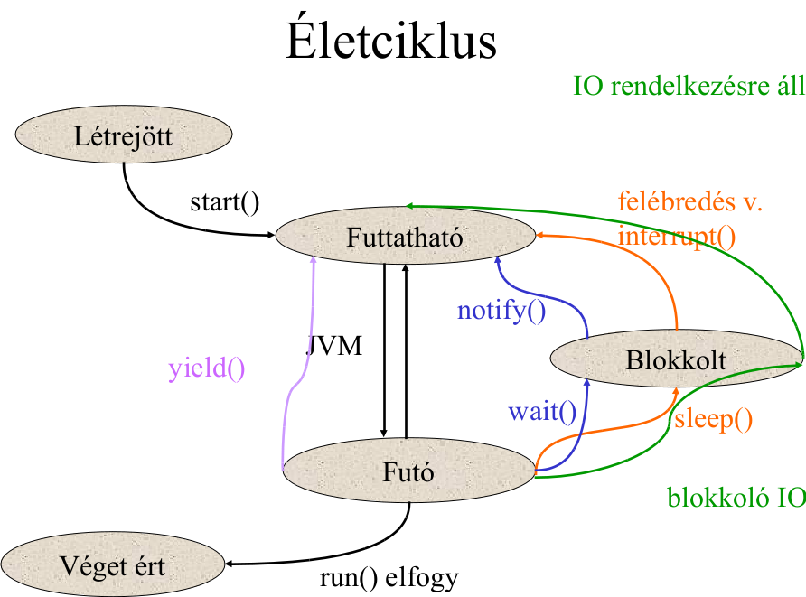

S4-03 Többszálú programok, a Java nyelv szinkronizációs eszközei
=======================================
Tartalom
---------------------------------------

1. [Többszálú programok ütemezése](#chapter01)
2. [A Java nyelv szinkronizációs eszközei](#chapter02)
3. [Jól szinkronizált programok, a happens-before reláció](#chapter03)
4. [Data race és race condition fogalma](#chapter04)
5. [Konkurrens használatra tervezett adatszerkezetek](#chapter05)
6. [Szinkronizáló osztályok](#chapter06)
7. [Szálak és feladatok](#chapter07)
8. [Félbeszakíthatóság](#chapter08)
9. [Haladási problémák (holtpont, kiéheztetés, livelock, priority inversion)](#chapter09)
10. [További források](#references)

1.Többszálú programok ütemezése 
---------------------------------------
### Konkurens programok
* Programok, melyekben több végrehajtási stream hajtódik végre konkurensen. Ezeket az utasítás szekvenciákat hívjuk
 *szálaknak*.
* Minden ilyen szál ugyanúgy hajtódik végre, mint egy szekvenciális program
    + azzal a különbséggel, hogy a szálak képesek egymással kommunikálni
    + rosszul szervezett esetben akár *interferálni* is.
* Többszálú program esetén átfedések lehetségesek a folyamatok életciklusában, a különböző számítások nem kell, hogy
  ugyanabban az időben történjenek, bár előfordulhat, hogy párhuzamosan futnak le.
* **Nem determinisztikus** végrehajtás
* Problémát a megosztott, közösen használt adatokhoz való hozzáférés okozhatja
    $\Longrightarrow$ indokolt a megfelelő memória kezelés megoldása

### Párhuzamos programok
* Programok, melyeknél minden számítás a szó legszorosabb értelmében egyszerre történik
    + egy másik processzoron, vagy másik magon, esetleg egy másik gépen.
* Párhuzamos programokat lehetetlen egyszálú környezetben futtatni.
* Végrehajtásuk **determinisztikus** és eredményük megegyezik a soros végrehajtással.

### Ütemezés
#### Run-to-Completion
Egy folyamatot addig futtatunk,

* amíg kész nem lesz,
* vagy explicit vissza nem adja a vezérlést az ütemezőnek (`yield()`).

#### Pre-emption
Az aktuális szálat az ütemező megszakíthatja, és kontextusváltással egy másik szálat futtathat.

#### JVM implementációtól függő időosztás
Ekkor a szálak adott időszeleteket kapnak a végrehajtásra és kontextus váltásokat hajt végre köztük a JVM az idő
lejártakor, ha a szálak még mindig futtatható állapotban maradtak.

* Minden szálnak kioszt egy minimális időszeletet (quantum), amit az kihasználhat
* ha ez túl kicsi, sok lesz a kontextusváltás, így nagy az ütemező overhead-je
* ha ez túl nagy, az egyes szálak "válaszideje" megnövekszik
* egy szál lemondhat az időszeletének további részéről `yield()` hívásával

2.A Java nyelv szinkronizációs eszközei 
---------------------------------------
### Folyamatok (Process)
* Egy folyamat önálló futtatási környezettel rendelkezik.
* Több folyamat felépíthet egy alkalmazást
* Legtöbb JVM implementáció egy folyamatként fut
* Általában privát, teljes erőforrás halmazzal rendelkezik.
* A folyamatok izoláltam futnak egymástól, és nincs lehetőség közvetlenül egymás erőforrásaihoz hozzáférni.

### Szálak (Thread)
* Amolyan "pehelysúlyú folyamatok".
* Létrehozásuk kevesebb erőforrást igényel, mint a folyamatoké.
* A folyamatokon belül léteznek és minden folyamat rendelkezik legalább egy szállal (*main thread*).
* A szálak megosztják az erőforrásaikat, beleértve a memóriát is ami a kommunikáció alapját képezi.
* Működhetnek több CPU magon vagy egy magon időosztással (*time slicing*)

### java.lang.Thread
* Szinkronizációhoz alapul szolgáló eszközünk Java esetén maga a `java.lang.Thread` osztály.

Kétféle módszerrel definiálhatunk szálakat Java-ban:

1. **Thread osztályból származtatjuk az osztályunkat.** Ekkor felüldefiniáljuk a `Thread` osztály `run()` metódusát.
     Az osztályunknak lesz egy `start()` metódusa, amit meghívva elindíthatjuk a `run()` végrehajtását egy külön
     szálban.

      `new HelloThread().start()`

2. **Megvalósítjuk a Runnable interfészt.** Adhatunk `Thread` konstruktorának egy `Runnable` interfészt megvalósító
     osztályt

      `new Thread(new HelloRunnable()).start()`

* Mindkét esetben a `run()` metódust kell felüldefiniálni
* Elindítani a `start()` metódussal lehet.

* Lehet prioritást rendelni hozzá,
* Futhat háttérszálként (daemon thread),
* Adhatunk neki nevet,
* JVM generál hozzá azonosítót (újrahasznosítható).

### Szálak életciklusa
Lehetséges ciklusok:

1. Létrejött (created)
2. Futtatható (runnable)
3. Futó (running)
4. Blokkolt (blocked)
5. Végetért (terminated)

* `start()`-al elindított szál futtatható (runnable) állapotba kerül, de ütemező még nem választotta ki.
* Ha az ütemező kiválasztja, futó (running) állapotba kerül, ekkor indul el a végrehajtása.
* Ha egy szál elkezdett futni, akkor addig fut, amíg az alábbiak valamelyike be nem következeik:
    + `Thread.sleep()` (blokkolt)
    + Lock-ra kezd várni, hogy egy `synchronized` metódust futtasson (blokkolt)
    + I/O-n blokkolódik (blokkolt)
    + Explicit visszaadja a vezérlést a `yield()`-el (futtathatóba kerül)
    + terminál, `run()` elfogy (véget ért)

#### Életciklus változása
* `start()`: Létrejött $\Longrightarrow$ Futtatható
* ütemező: Futtatható $\Longrightarrow$ Futó
* `run()`: Futó $\Longrightarrow$ Véget ért
* `yield()`: Futó $\Longrightarrow$ Futtatható
* `sleep()`: Futó $\Longrightarrow$ Blokkolt
* `sleep()` vége: Blokkolt $\Longrightarrow$ Futtatható
* `interrupt()`: Blokkolt $\Longrightarrow$ Futtatható
* `wait()`: Futó $\Longrightarrow$ Blokkolt
* `notify()`: Blokkolt $\Longrightarrow$ Futtatható
* blokkoló IO: Futó $\Longrightarrow$ Blokkolt

### Szinkronizációs eszközök
#### Synchronized
* Kulcsszó, amivel nem csak metódusok és blokkok kölcsönös kizárását valósíthatjuk meg
    + hanem a kölcsönös kizárás közben többi szál blokkolását is

**Intrinsic lock-olás (Monitor pattern)**

* Java-ban minden objektum rendelkezik egy lock-al (hívják monitornak is), melyet szálak lefoglalhatnak és
  elengedhetnek
* Egy időben csak egy szál foglalhatja az objektum lock-ját
* Addig a többi szál egy várakozási sorban vár amíg a lock fel nem szabadul
    + Vezérlésük addig blokkolódik
* A lock reentráns: a lock-ot birtokló szál többször egymás után foglalhatja
    $\Longrightarrow$ nem fogja saját magát blokkolni
* Java-ban egyetlen mód intrinsic lock megszerzésére:
    + `synchronized` metódus végrehajtása
    + `synchronized` blokkba lépés

**Synchronized metódus**

* Szál annak az objektum lock-ján zárol, akié maga a `synchronized` metódus.

**Synchronized blokk**

* Természetesen nem csak metódusokra implikálható, szinkronizációs blokkot is hozhatunk létre, melynek belsejében
  adhatjuk meg azokat az utasításokat melyekre kizárólagos hozzáférést szeretnénk biztosítani.
    + Ebben az esetben meg kell adni, hogy melyik objektum lock-ján akarunk szinkronizálni: `synchronized(obj) {...}`.
    + Létjogosultsága leginkább akkor van, ha nem egy objektumban vannak azok az utasítások amelyeken szinkronizálni
    akarunk vagy ha nem a `this`-en akarunk lock-olni.

#### Volatile
* Gyenge szinkronizációt biztosító eszköz (gyors, szálbiztos, lock-free hozzáférés).
* Explicit lock nélküli szinkronizációt biztosít, rákényszerítve a fordítót, hogy mindig olvassa ki a volatile változó
  értékét s így nem fordulhat elő az, hogy elavult (cache-elt) értéket kapjunk.
* Szálak között megosztott volatile változónak mindig az aktuális értékét látjuk minden szálban.
* A `volatile` változó olvasása/írása szinkronizációs akciót vált ki.
* Azért csak gyenge szinkronizációs eszköz, mert nincs kölcsönös kizárás a változó használatán, csak a láthatóságot
  biztosítja, atomiságot nem (a synchronized azt is).
* A fordító és runtime nem optimalizálhat rajta, azaz például nem rendezheti át az utasításokat rajtuk.
* Értékét nem szabad kizárólagosan egy szálra cache-elni.
* Nem menthetőek regiszterekbe.
* Használatuk leginkább az állapotjelzőkre, megszakítókra, kiegészítő feladatokra korlátozódik.
* Bármely `volatile` változó írása *happens-before* relációban kell legyen az utána következő olvasásaival.

#### Immutable (módosíthatatlan) objektumok
* A módosítathatlan objektumok szinkronizáció nélkül megoszthatóak a szálak között.
    + Funkcionális stílusú programozás
* Az ilyen objektumok mindig szálbiztosak, mert létrejöttük után nem változik az állapotuk.
* Invariánsaikat a konstruktor határozza meg.
* Egy objektum immutable, ha:
    + az állapota létrehozás után nem változtatható meg
    + minden mezője `final` (igazából technikailag nem feltétel)
    + biztonságosan jött létre, azaz nem szökött ki a `this` referencia a konstruálódása során
    + opcionálisan maga az osztály is lehet `final`
* Gyors allokációja és szinkronizációmentessége lévén gyors teljesítményt nyújt.
* Best practice: ha egy objektum nem immutable, a módosíthatatalan adattagokat akkor is érdemes megjelölni,
  ezáltal kevesebb lehetséges állapota lesz az objektumnak.
* Java memória modell kimondja: konstruktor befejezésekor a `final` mezők garantáltan inicializálva lesznek

3.Jól szinkronizált programok, a happens-before reláció 
---------------------------------------
### Atomicitás
*A* és *B* művelet akkor atomi egymáshoz képest, ha az *A* műveletet végrehajtó szál szempontjából a *B*
műveletet végrehajtó szál

* vagy teljes egészében végrehajtotta a műveletet
* vagy egyáltalán nem.

Egy művelet akkor atomi, ha ugyanazon az állapoton végrehajtott művelethez képest atomi, beleértve önmagát is.

### Happens-before reláció
#### "Laikus" magyarázat
* Kulcs memóriakonzisztencia hibák elkerülésére
* Ha egy esemény happens-before relációban áll a másikkal
    $\Longrightarrow$ az első esemény hatása látható a második
  számára

#### Definíció
Ha van *x* és *y* műveletünk $\Longrightarrow hb(x, y)$-al jelöljük hogy *x* végrehajtása megelőzi *y*
végrehajtását ("*x* az *y* előtt történik", "*x* happens before *y*")

#### Mit garantál?
Garantálja, hogy ha két akció, *x* és *y* ilyen relációban áll, akkor *x* eredménye látható *y* számára.

#### Formálisabb definíció
A *program order* (*po*) és a *synchronizes-with* (*sw*) relációk uniójának tranzitív lezártja

$$hb = (po \cup sw)^+$$

Ebből tranzitív: ha $hb(a, b)$ és $hb(b, c)$ akkor $hb(a, c)$

#### *hb*-re vonatkozó szabályok:
* Minden esemény egy szálon belül *hb* relációban áll a többivel ha azok később következnek a program order szerint.
* Minden objektum konstruktorának vége relációban áll az objektum finalizer-ének első utasításával.
* Unlock monitor *hb* relációban áll ugyanazon monitor lock-jával, amely utána következik
* `volatile` változó írása is *hb* relációban áll az azt követő olvasásaival
* A szál `start()` metódusa *hb* relációban áll minden más eseményével
* Minden esemény egy szálon belül *hb* relációban áll a többi szál `join()` általi visszatérésével

### Happens-before konzisztencia

* Legyen
    + *A*: műveletek halmaza
    + *r*: olvasások *A*-ban
    + *w*: írási műveletek *A*-ban
    + *v*: változó amit *r* olvas és *w* ír
    + *W(r)*: írási műveletek, amiket *r* lát

* Happens-before konzisztens *A* műveletek halmazában minden egyes *r* olvasás olyan *w* írást lát
    $\Longrightarrow$ ami olvasásnak megengedett, hogy happens-before sorrendben lássa

Nem létezik olyan, hogy

* $hb(r, W(r))$
  $\Longrightarrow$ olvasások happens-before relációban vannak az írásokkal amiket az olvasások
  látnak
* van *w* írás *A*-ban, amiben
    + $w.v = r.v$   (*w* által írt és *r* által olvasott *v* változó értéke megegyezik)
    + $hb(W(r), w)$ (*r* által látott *W(r)* írások *w* előtt vannak)
    + $hb(w, r)$    (*w* írás *r* olvasás előtt történik)

Magyarul:

1. Minden olvasás látja az azt megelőző írásokat
2. Ha írunk egy *v* változót, azt az olvasó folyamatnak mindenképp látnia kell

#### Miről biztosít a happens-before konzisztencia?
* Minden olvasás mely egy írás előtt ment végbe, nem láthatja annak az írásnak az eredményét
* Az olvasás akkor sem láthatja az írás eredményét ha épp egy másik írás van folyamatban

### Szekvenciális konzisztenica
* Minden változó olvasás $\Longrightarrow$ az előző írás eredményét látja egy megadott sorrend alapján, függetlenül
  attól, hogy melyik processzoron történtek a műveletek.
* Tehát minden akció atomi és eredménye minden szál számára azonnal látható.

Ha az egyes akciók teljes rendezésben vannak, amik konzisztensek a program order-el
  $\Longrightarrow$ akkor *v* változó *r* olvasása esetén, *v* változó a *w* által írt értéket tartalmazza, ha:

* *w* írás az *r* olvasás előtt áll
* nincs más *w'* írás a *w* írás és *r* olvasás között.

### Jól szinkronizált program
* A program akkor és csak akkor jól szinkronizált, ha minden szekvenciálisan konzisztens végrehajtása data race-mentes.
* A jól szinkronizált programok minden végrehajtása szekvenciálisan konzisztensnek tűnik.

4.Data race és race condition fogalma 
---------------------------------------
### Interferencia
* Két művelet különböző szálon fut, de ugyanazon az adaton dolgoznak
    $\Longrightarrow$ "összefésülődnek"

* Egy-egy művelet több lépésből áll, ezek a lépések pedig összefolynak

### Read-modify-write
* Egy értéket változóból kiolvas (*read*), módosítja az értéket (*modify*), majd visszaírja a változóba (*write*)
* Nem atomi művelet: a három esemény közötti időben megváltozhat a változó amiből az érték lett kiolvasva.
* Tipikus példája ennek a post-increment (`i++`)
    1. `i` értékének kiolvasása, másolat készítése az értékből (*read*)
    2. magának az érték növelése eggyel (*modify*)
    3. érték visszaírása `i`-be (*write*)

### Check-then-act
* Egy állapotot megvizsgál (*check*), majd azalapján cselekszik egy szál (*act*)
* Nem atomi művelet: a két esemény közötti időben megváltozhat az eredetileg megvizsgált állapot.
* Másik megfogalmazás: Teendő elvégzéséhez (*act*) olyan megfigyelést (*check*) vesz alapul, ami valószínűleg elavult
  adatra épül

### Data race
* Akkor következik be, mikor egy változót több szál olvas és legalább egy szál ír, viszont az írások és olvasások
  között nincs happens-before reláció.
* A jól szinkronizált program data race nélküli.
* Ha nincs data race, minden végrehajtás szekvenciálisan konzisztensnek tűnik

### Race condition:
Akkor következik be, mikor a számítás helyessége

1. a relatív időzítésen
2. vagy több szál futásidőben történő összesorolásán múlik.

Magyarul race condition esetén a helyes válasz a szerencsés időzítésen múlik ("szerencsén múlik").

* Megoldás: például szinkronizálás monitorral.

### Mitől szálbiztos (thread safe) egy program?
* *Read-modify-write* és *Check-then-act* utasítások atomikusan hajtódnak végre
* Nincs data race

5.Konkurrens használatra tervezett adatszerkezetek 
---------------------------------------
### `Vector`, `Hashtable`
* Alapból szinkronizált (saját intrinsic lockjával).
* Szinkronizációs burkoló objektumot készítő, intrinsic lock-ot bevezető factory metódusok: `Collections.synchronized*`

#### Egy hibaforrás:
* Az iterálás során szintén zárolni kell az adatszerkezetet (atomi legyen, hogy közben ne változzon az elemszám), mert
  a szinkronizált kollekciók iterátorait nem kötelező lock-olni a bejárás közben.
* Így megfelelő zárolás hiányában egyszerű `for-each` bejárásnál vagy rejtett iterációnál (pl: `toString()`) nem lesz
  szálbiztos.

### `java.util.concurrent.*`
* A szinkronizált kollekciók (`Vector`, `Hashtable`) nem eléggé jó teljesítményűek, mivel a műveleteik az egész kollekciót
  zárolják.
* Ezzel szemben a konkurens kollekciók egyszerre írhatók és olvashatók több szálból.
* Nincs szükség lock-olásra az egész gyűjteményen (nem is ajánlott, mert elveszíti hatékonyságát), elég egy részén
  (lock striping).
* Atomi `putIfAbsent()`, `remove()` és `replace()` check-than-act típusú műveleteket biztosít.
* A `size()` illetve `isEmpty()` eredménye viszont csak approximális.

### `CopyOnWriteArrayList` és `CopyOnWriteArraySet`
* a `synchronizedList` párhuzamos megfelelője.
* Kiküszöböli  a gyűjtemény zárolásának vagy lemásolásának szükségességét bejárás közben.
* A `CopyOnWrite` gyűjtemények ereje abban rejlik
$\Longrightarrow$ hogy a gyűjtemény minden módosításakor másolatot készítenek  és tesznek közzé.
* Másolat készítése drága $\Longrightarrow$ akkor hatékony, ha több az olvasás mint az írás

### `BlockingQueue`
* Blokkol, ha
    + nincs benne kivehető elem (kivételnél),
    + vagy tele van (berakásnál).
* Van felső határ nélküli változat is, itt a berakás soha nem blokkol.
* `poll()` és `offer()`: időhöz kötött várakozással blokkoló elem kivétel és berakás.

Fajtái:

  * `LinkedBlockingQueue`
  * `ArrayBlockingQueue`: igazából tömb típusú
  * `PriorityBlockingQueue`: nem FIFO típusú, prioritás számít
  * `SynchronousQueue`: igazából nincs eleme, de nem null az átadott érték
  * `BlockingDeque`: kétvégű változata

6.Szinkronizáló osztályok 
---------------------------------------
Ezek közé bármi olyan objektum tartozik, ami a szálak vezérlését koordinálja saját állapota alapján.

### `Latch`
* Feltartja  a folyamatokat, amíg elér egy megadott termináló pontot.
* Feltart minden szálat míg el nem éri végállapotát, ezután mindet tovább engedi. A továbbiakban nem változik az
  állapota.
* Implementáció: például `CountdownLatch`, mely egy nem negatív értéktől számol vissza (`countDown()` csökkenti egyel)
  0-ig.

### `Semaphore`
* Klasszikus számláló szemafor (lehet bináris is), mely korlátozott számú erőforráshoz vagy korlátozott méretű
  adatszerkezethez való hozzáférést szabályozhat.
* Konstruktorában adható meg a szálak max. száma, melyek egyidőben bent tartózkodhatnak,
    $\Longrightarrow$ ez az érték fix egy szemaforra nézve.

### `Barrier`
* Egy bizonyos pont elérése után engedi tovább a szálakat (barrier pont).
* Alap implemetációja a `CyclicBarrier`, mely a konstruktorában megadott számú szálat vár be.
* Nincs végleges termináló állapota, újraindul.

### `Future`
* Interfész, egy aszinkron számítás eredményét reprezentálja.
* Eredményt `get()`-el kaphatjuk meg, mely addig blokkolódik, míg meg nem kapja az eredményt.
* Állapota lekérdezhető, félbeszakítható.
* `FutureTask` az alap implementációja, egy aszinkron számítást végez.
* Konstruktorába `Callable` vagy `Runnable` objektumot kell adni
* Csak a számítás módját adjuk meg vele, a számítás elvégzését legtöbbször egy `Executor`-ra bízzuk.

7.Szálak és feladatok 
---------------------------------------
#### Feladatok (task)
* A feladat az elvégzendő munka egy egysége.
* Ezeket konkurrensen hajtjuk végre szálakban.
* Ideális esetben egymástól
független az
    + állapotuk
    + eredményük
    + és mellékhatásaik is.

* Ha a feladatokat függetlenítjük a szálaktól (nincs explicit
összekapcsolás)
    $\Longrightarrow$ jobb skálázódási tulajdonságot kapunk.

A feladatok méretének meghatározása kritikus:

* Feladat/szál költséges lehet
* Túl kicsi feladatok: versengés, ütemezési overhead
* Túl nagy feladatok: kismértékű párhuzamosíthatóság

4 folyamat / 4 feladat esetén a legnagyobb folyamat lesz a mérvadó sebesség terén.

#### `Executor`
* Feladatok beküldése végrehajtásra.
* `Executor` egy szálat több `Runnable` objektum végrehajtására tud felhasználni. Elosztja a beérkező feladatokat a
  szálak között.
* `ExecutorService` egy kiterjesztése az `Executor`-nak. A taszkok beküldésekor (`submit()`) nem csak `Runnable`-t,
  hanem `Callable`-t is elfogad, ez `Future`-t tud visszaadni.

8.Félbeszakíthatóság 
---------------------------------------
### Szál félbeszakítása (`interrupt()`)
* Egyfajta üzenetküldés a szál megállításához, melyben közreműködik a kezdeményező, illetve az interruptot kapó szál
  is.
* Nem állíthat le egy szál egy másik még futásban lévő szálat, de megszakító kérést küldhet neki, amire a futásban lévő
  szál  megáll és átadja a vezérlést.
* Ezt egy kontextusváltás keretében teszi, mely magába foglalja a szál
    + stack-jének ürítését,
    + processzor regisztereinek ürítését,
    + cache ürítését
    + és a program counter elmentését. Ezután tölti be a másikét.
* Interrupt hívásakor beállítódik egy interrupt flag a szálban, ami lekérdezhető `interrupted()` és `isInterrupted()`
  segítségével.
    + Szál ekkor `InterruptedException`-t dob
    + Használható alvó (`sleep()`) szál felébresztésére is
    + `isInterrupted()`: tagmetódus, csak megvizsgálja az interrupt flag-et
    + `interrupted()`: statikus metódus, törli az interrupt flag-et lekérdezés után, azaz második lekérdezéskor már
      `false` lesz

### Feladat félbeszakítása (`cancel()`)
* Egy feladatot egy Future objektum reprezentál
* `cancel()` metódusában megadható, hogy megszakítható legyen-e

### Executor félbeszakítása (`shutdown()` vagy `shutDownNow()`)
* Minden szálnak van egyfajta implicit "tulajdonosa" (legtöbbször aki létrehozta) és a szál leállítását a tulajdonosa
  kell, hogy elvégezze,
* Ezért minden szálakat kezelő szolgáltatásnak kell legyen valamilyen shutdown mechanizmusa
* `shutdown()` megvárja míg az éppen futó szál befejezi feladatát és ezután állítja le, `shutdownNow()` meg is szakítja
  a jelenleg futó szálakat.

9.Haladási problémák (holtpont, kiéheztetés, livelock, priority inversion) 
---------------------------------------
### Holtpont
* Folyamatok egy nem üres halmazát holtpontosnak nevezzük, ha a benne szereplő minden folyamat egy olyan feltétel
  bekövetkeztére vár (feltétlenül, időkorlát nélkül),
    + amely feltétel csak a halmazban lévő más folyamatok továbbhaladása esetén következhet be.
* Ha a halmaz minden folyamata arra vár, hogy sikerüljön lekötnie egy erőforrást,
    + amit egy, a halmazban lévő folyamat már lekötve tart,
    + akkor holtpont alakulhat ki.

#### Holtpont formális definíciója
1. Tekintsünk egy páros gráfot, amelynek csúcsai a folyamatokat, illetve az erőforrásokat reprezentálják.
2. Ha a folyamat zárolta azt az erőforrást
    $\rightarrow$ húzzunk be egy élt egy erőforrásból egy folyamatba

3. Ha a folyamat épp vár az erőforrás megszerzésére
    $\rightarrow$ húzzunk be egy élt egy folyamatból egy erőforrásba

4. Ha az így készített gráfban kör van
    $\Longrightarrow$ a körön lévő folyamatok holtpontba került folyamathalmazt adnak.

#### Étkező filozófusok példa
Ha minden filozófus felveszi a bal villáját
$\rightarrow$ majd elkezd várni arra, hogy felvehesse a jobb villát is
$\Longrightarrow$ holtpont alakult ki.

### Kiéheztetés
* Egy száltól huzamosabb ideig megtagadják azt az erőforrást, ami a továbbhaladásához szükséges.
* Sok esetben ez maga a végrehajtó egység, tehát egyszerűen nem kerül beütemezésre.
* Ez lehet például
    + a nem megfelelő szálprioritások megválasztásának eredménye
    + vagy ha egy szál úgy tart egy mások számára szükséges zárat, hogy közben végtelen ciklusba kerül.

### Livelock
* Szálak nem blokkolódnak, de valódi "haladás" nem történik.
* Olyan műveletet próbálnak végrehajtani, ami mindig sikertelen eredménnyel zárul.
* Például tranzakcionális üzenetsoroknál léphet fel ilyen, ha az üzenetek feldolgozása nem sikerül, és a sikertelen
  tranzakció esetén az üzenet visszakerül a sor elejére (poison message).
* Esetleg a szálak egymástól függően váltanak állaptotot, de pont úgy, hogy nem tudnak haladni.

### Priority inversion
* A fontosabb feladatok elvégzésése érdekében prioritást rendelhetünk a szálakhoz.
* Ha egy magasabb prioritású folyamat futtathatóvá válik, akkor a rendszer késlelteti az alacsonyabb prioritású
  folyamatok futását.
* Priority inversion: ha egy alacsonyabb prioritású folyamat implicit megelőz egy magasabb prioritású folyamatot

#### Priority inversion formális definíciója
Legyen

* Két folyamat *H* és *L*, amik magas és alacsony prioritásuak
* *M* közepes prioritású folyamat
* Ezek egy
megosztott erőforrást akarnak megszerezni kizárólagos használatra, ami legyen *R*.

1. Ha *H* próbálja megszerezni *R*-t miután *L* megszerezte

      $\rightarrow$ *H* nem futtatható amíg *L* el nem ereszti.

2. Mivel *H* nem futtatható

      $\rightarrow$ ezért *M* a legnagyobb prioritású folyamat

      $\rightarrow$ ami miatt *L* késleltetődik és ezért *L* nem tudja feloldani az erőforrást.

3. Ebben az esetben $\Longrightarrow$ a közepes prioritású *M* folyamat megakadályozza hogy a magas prioritású
   *H* folyamat futhasson.

10.További források 
---------------------------------------
* Előző kidolgozott záróvizsga tételek
* http://kto.web.elte.hu/hu/oktatas/eak2/
* https://docs.oracle.com/javase/tutorial/essential/concurrency/index.html
* https://docs.oracle.com/javase/specs/jls/se8/html/jls-17.html
* https://en.wikipedia.org/wiki/Java_memory_model
* https://en.wikipedia.org/wiki/Thread_safety
* https://en.wikipedia.org/wiki/Monitor_(synchronization)
* http://brevitaz.com/race-condition-java-concurrency-2/
* https://stackoverflow.com/questions/17853112/in-what-situations-is-the-copyonwritearraylist-suitable
