S05-01 A B nyelv szemantikája
=======================================
Tartalom
---------------------------------------
0. [Bevezetés](#chapter00)
1. [A B helyettesítések szemantikája](#chapter01)
2. [A B komponensek fajtái, tulajdonságai](#chapter02)
3. [Interaktív bizonyítórendszer](#chapter03)
4. [Bizonyítandó állítások](#chapter04)

*Ez a tétel nem teljes, a vizsgán inkább a helyettesítések és bizonyítások elméleti hátterére kérdeznek rá!*

## 0. Bevezetés 

A formális módszer a rendszer leírásának szemantikája és szintaktikája formális matematikai eszközökkel definiálva. Bizonyítórendszer is tartozik hozzá. A biztonságkritikus rendszerek megbízhatóságának ellenőrzése miatt szükség van a bizonyításra.  

A formális módszer több témakörben is megjelenik:  

  * Specifikációban
  * Fejlesztésben
  * Ellenőrzéseben

### B-módszer
* Halmazelméletre és az absztrakt gép fogalmára épít.
* A B egy eszközökkel támogatott, "absztrakt gép" jelölésmódszert használó formális módszer, amelyet a szoftverfejlesztésben használnak.
* Egy formális szoftverfejlesztési módszer, amelynek segítségével a program viselkedését lehet absztrakt módon modellezni B nyelven.
* Több finomítással egy konkrét modellt lehet kapni, amely átkódolható ADA-ba.
* Egy formális bizonyítási tevékenységgel ellenőrizni lehet az absztrakt modell koherenciáját, valamint minden finomítás megfelelőségét a felsőbb modellnek, így biztosítva a teljes konkrét megvalósítás megfelelését az absztrakt modellnek.
* Formális eszköz, mivel formális szintaktikából és szemantikából áll.
* Helyesség bizonyítása a specifikációtól az implementációig.
* Lépésenkénti finomítás
* Automatikus kódgenerálás

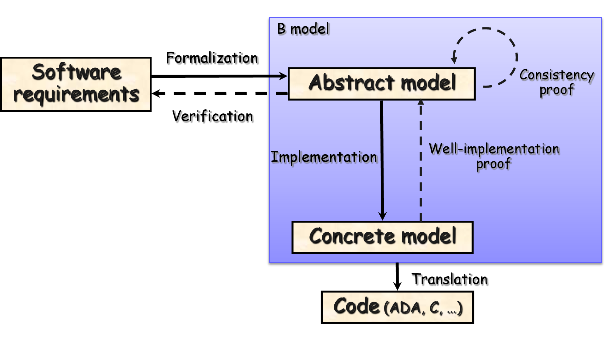

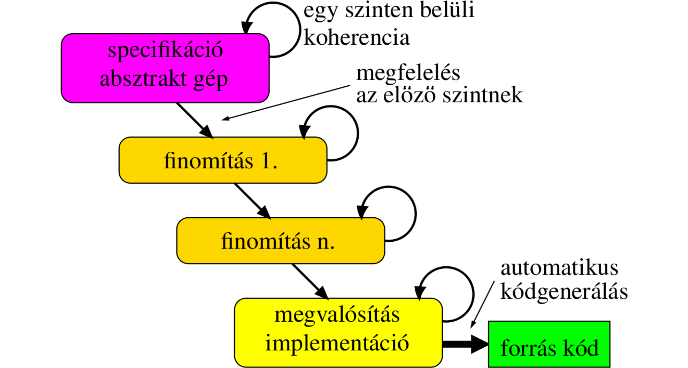

#### B-módszer vs. V-modell

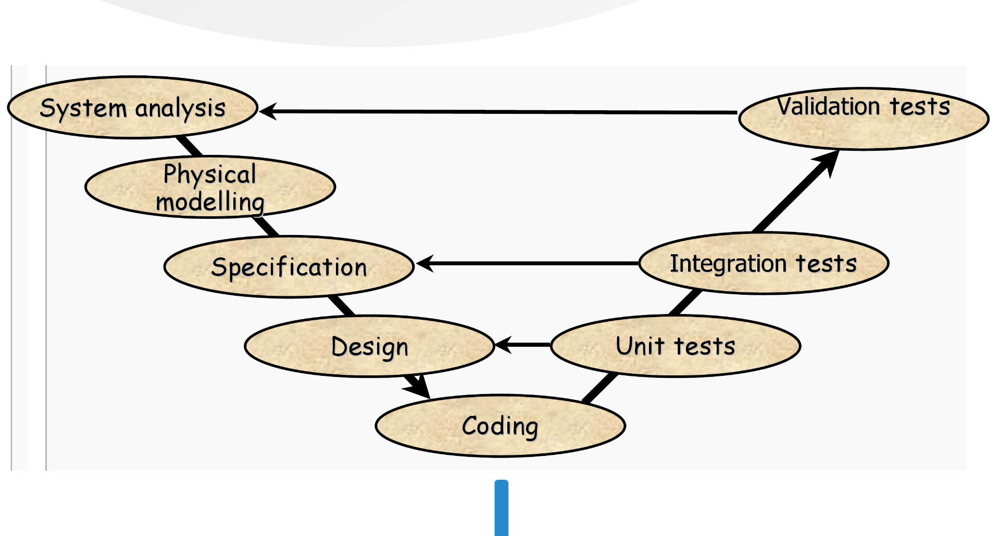

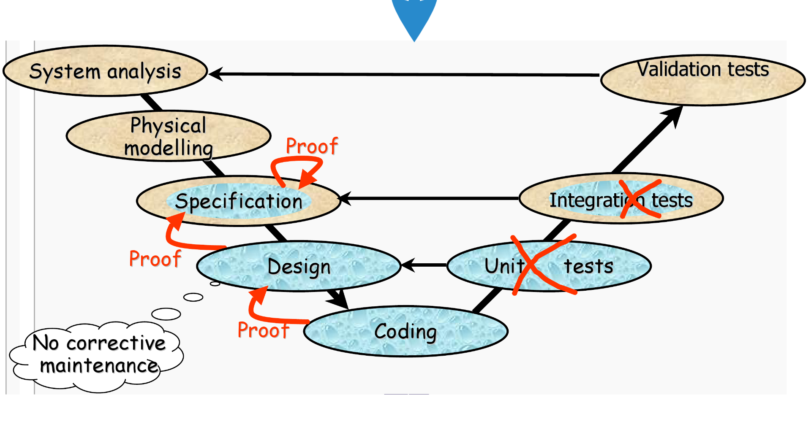

#### Helyettesítés

* $[x := E] F$ jelölés
  * Az $x$ összes szabad előfordulását $E$-re cseréljük $F$-ben.
  * $\forall n(n \in N \Rightarrow n > x)$: $x$ szabad, $n$ kötött változó
* _INITIALISATION_
  * Az inicializáció megőrzi az invariáns tulajdonságot.
  * $[G; H] P \Leftrightarrow [G][H]P$
  * $[PRE\quad P\quad THEN\quad G\quad END][Q] \Leftrightarrow P \land [G]Q$

### Felhasználási példák

* GEC Alstom, Matra Transport: vasúti és metrófejlesztések
* TA Group Ltd.: ejtőernyő-aktiválási rendszer
* Atomic Weapon Establishment: fegyverzetkezelő szoftver fejlesztése

## 1. A B helyettesítések szemantikája 

### Gép

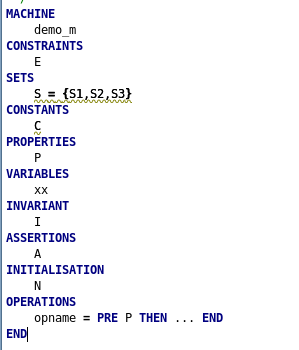

### Finomított gép  

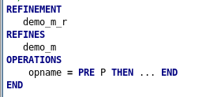

### Bizonyítások

* $\exists x \cdotp$
* $C \Rightarrow \exists(E, x \cdotp P)$
* $C \land P \Rightarrow \exists z \cdotp I$
* $C \land P \land I \Rightarrow J$
* $C \land P \Rightarrow [y]I$
* $C \land P \land J \land I \land L \Rightarrow [H]I$

Finomításnál:  
* $[G_R] \neg [G_A] \neg I_R$
* $I_A \land I_R \land L_A \Rightarrow L_R \land [H'\_R] \neg [H_A] \neg (I_R \land y' = y)$

### Helyettesítések

* $[skip]P \Leftrightarrow P$
* $[x := E]P \Leftrightarrow P^{x \leftarrow E}$
* $[x, y := E,F]P \Leftrightarrow [z := F][x := E].[y := z]P$
* $[PRE\quad P\quad THEN\quad S\quad END]R \Leftrightarrow P \land [S]R$
* $[IF\quad P\quad THEN\quad S\quad ELSE\quad T\quad END]R \Leftrightarrow (P \Rightarrow [S]R) \land (\neg P \Rightarrow [T]R)$
* $[SELECT\quad P_1\quad THEN\quad S_1\quad WHEN\quad P_2\quad THEN\quad S_2 ...  WHEN\quad P_n\quad THEN\quad S_n\quad ELSE\quad T\quad END]R \Leftrightarrow (P_1 \Rightarrow [S_1]R) \land ... \land (P_n \Rightarrow [S_n]R) \land ((\neg P_1 \land ... \land \neg P_n) \Rightarrow [T]R))$
* $[S; T]P \Leftrightarrow [S][T]P$

Példa:  
1) $[skip](a = 3) \Leftrightarrow (a = 3)$  
2) $[a := 3](a \in 1..10) \Leftrightarrow (a \in 1..10)^{a \leftarrow 3} \Leftrightarrow 3 \in 1..10$

### Műveletek szemantikája

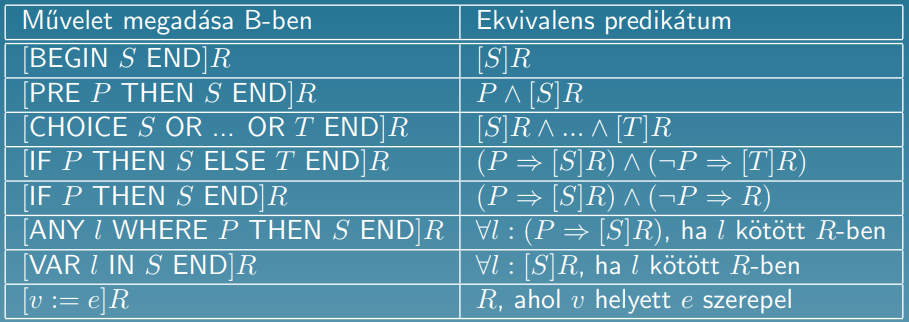

## 2. A B komponensek fajtái, tulajdonságai 

Megkülönböztetjük az _absztrakt gépet_, a _finomítást_ és az _implementációt_.  

### Absztrakt gép

* Architektúrák
  * _SEES_
  * _INCLUDE_
  * _EXTENDS_
  * _PROMOTES_
  * _USES_
* Komponensek
  * _CONSTRAINTS_
  * _SETS_
  * _CONCRETE_CONSTANTS_
  * _ABSTRACT_CONSTANTS_
  * _PROPERTIES_
  * _CONCRETE_VARIABLES_
  * _ABSTRACT_VARIABLES_
  * _INVARIANT_
  * _ASSERTIONS_
  * _INITIALISATION_
  * _OPERATIONS_

### Finomított gép

* Architektúrák
  * _SEES_
  * _INCLUDE_
  * _EXTENDS_
  * _PROMOTES_
* Komponensek
  * _SETS_
  * _CONCRETE_CONSTANTS_
  * _ABSTRACT_CONSTANTS_
  * _PROPERTIES_
  * _CONCRETE_VARIABLES_
  * _ABSTRACT_VARIABLES_
  * _INVARIANT_
  * _ASSERTIONS_
  * _INITIALISATION_
  * _OPERATIONS_

### Implementáció

* Architektúrák
  * _SEES_
  * _INCLUDE_
  * _EXTENDS_
  * _PROMOTES_
* Komponensek
  * _SETS_
  * _CONCRETE_CONSTANTS_
  * _PROPERTIES_
  * _VALUES_
  * _CONCRETE_VARIABLES_
  * _INVARIANT_
  * _ASSERTIONS_
  * _INITIALISATION_
  * _OPERATIONS_

### Komponensek

* _CONSTRAINTS_
  * A gép változóira lehet megszorítást tenni.

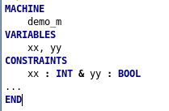

* _SETS_
  * Segítségével halmazokat lehet definiálni.

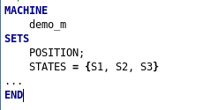
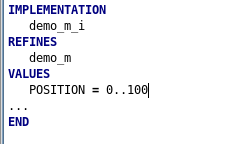

* _CONSTANTS_
  * Konstansokat lehet definiálni.
* _INITIALISATION_
  * A változók inicializálására használható.
* _OPERATIONS_
  * Műveletek megadására használható.
  * Absztrakt és finomított gépnél _előfeltétel + utófeltétel_
  * Implementációnál a konkrét végrehajtást adjuk meg.
* _PROPERTIES_
  * Absztrakt és konkrét konstansok típusainak megadására szolgál.

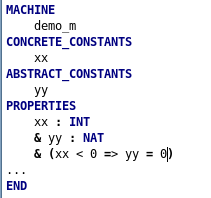

* _VALUES_
  * Halmazok és konstansok inicializálására használható.
* _VARIABLES_
  * "Globális" változók nevének felsorolására használható.
  * Lehet konkrét és absztrakt is.
  * A változók típusát az invariánsban lehet megadni.
  * Kezdőértéket az inicializációs blokkban kapnak.
* _INVARIANT_
  * A gép invariánsát lehet megadni.
  * Az inicializáció és bámrely metódus meghívása után igaznak kell lennie.

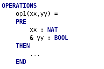

### Architektúrák

* _INCLUDE_
  * Beágyazás
  * "Átmásolja" a gép tartalmát.
  * Absztakt gépek közötti kapcsolat
  * Tartalmazza: _SETS_, _CONSTANTS_, _VARIABLES_, _PROPERTIES_, _INVARIANT_

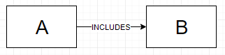

* _SEES_
  * Előfordulhat implementáció és absztrakt gép között.
  * Az A felhasználhatja a B műveleteit.
  * Testvérgépek között teremt kapcsolatot.
  * Használatához szökséges az _IMPORTS_ is.
  * Tartalmazza: _SETS_, _CONSTANTS_, _VARIABLES_ (csak olvasásra)

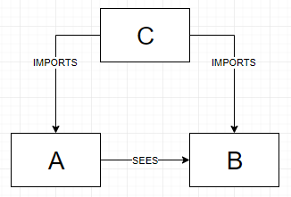

* _IMPORTS_
  * Implementáció és absztrakt gép között teremt kapcsolatot.
  * Az implementáció "példányosítja" az absztrakt gépet, hogy használhassa az adatait és műveleteit (saját adatként és műveletként kezeli őket).
  * Olyan, mint az _INCLUDE_, csak az implementációban.
  * Példányosít, így később lehet _SEES_ kapcsolatot megadni.
* _USES_
  * Absztrakt gépek között teremt kapcsolatot.
  * Adatok megosztására használható, csak olvasásra.

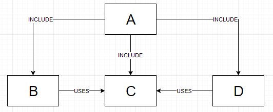

* _ASSERTIONS_
  * Olyan állításokat adhatunk meg, amelyeket fel szeretnénk használni a bizonyítás során.
  * Egyszer be kell bizonyítani, de ha több helyen szeretnénk használni, akkor egyszerűsödhetnek a bizonyítások.

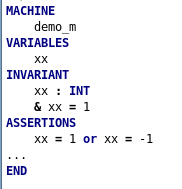

## 3. Interaktív bizonyítórendszer 

### Bevezetés

* Bizonyítani kell, hogy a specifikáció, a finomítás, valamint az implementáció helyes.
* Állításokat generál, amelyeket be kell látni.
* Pl.:
  * Szekvencia:
$$
  \frac{\{\{Q\}\} S_1 \{\{Q'\}\}\quad \{\{Q'\}\} S_2 \{\{R\}\}}{\{\{Q\}\} S_1; S_2 \{\{R\}\}}
$$

### Bizonyító parancsok

* **pr** (prove)
  * Automata bizonyító, megpróbálja különböző heurisztikák mentén belátni az állítást.
* **sh** (search hypothesis)
  * A hipotérzistérben lehet állításokat keresni/kilistázni.
* **ah** (add hypothesis)
  * Ha a hipotézistérben egy fontos állítás nem szerepel, de igaz, akkor _ah_ segítségével lehet hozzáadni.
  * Az állítást ezután be kell látni.
  * A későbbiekben fel tudjuk használni.
* **sr** (search rule)
  * Előre definiált szabályok keresésére alkalmas, amelyek mentén egy állítást be tudunk látni.
* **ar** (apply rule)
  * Megadjuk, hogy melyik szabályt alkalmazzuk.
* **ph** (particularize hypothesis)
  * A célban univerzális kvantoros kifejezést tartalmazó állítás bizonyítására alkalmas.
  * Kötött változókat manipulál.
* **se** (suggest for exist)
  * A célban egzisztenciális kvantoros kifejezést tartalmazó állítás bizonyítására alkalmas.
  * Kicseréli a célbeli változókat valamilyen hipotézistérbeli változóra.
* **fh** (false hypothesis)
  * Megpróbál belátni egy állítást úgy, hogy bebizonyítja, hogy egy hipotézis hamis.
  * Indirekt bizonyítás
* **dc** (do cases)
  * Esetszétválasztással próbál bebizonyítani egy állítást.
* **dd** (deduction)
  * Dedukciót végez: $\frac{A \Rightarrow B}{B}$
  * Az $A-t$ berakja a hipotézistérbe.
* **eh** (use equality in hypothesis)
  * Ha van egy $a = A$ állításunk, akkor a célban (_Goal_), egy hipotézisben (_Hyp_) vagy az összes hipotézisben (_AllHyp_) ki lehet cserélni.
* **ae** (abstract expression)
  * Egy bonyolult kifejezést ki lehet emelni egy változóba.
  * Pl.: ae(EX, ID) => ID = EX bekerül a hipotézistérbe => _eh_-t lehet alkalmazni.
* **pp0** (predicate prover 0)
  * A => B
  * Megpróbálja B-t belátni A-ból.
* **pp1** (predicate prover 1)
  * Hasonlóan, mint a pp0, de a teljes hipotézistérrel dolgozik.

## 4. Bizonyítandó állítások 

* A pszeudonyelvű állításokból elsőrendű logikai, illetve halmazelméleti állítások képezhetők.
* Ezeket a bizonyítandó állításokat a B eszközkészlet automatikusan generálja.

Mire vonatkoznak az állítások?  

* A specifikáció konzisztens
* A finomítás helyes
* Az implementáció megoldja a feladatot

## Források
- Istenes Zoltán előadásdiasora: https://prezi.com/dn7oy9jtawqr/a-b-formalis-modszer/?fbclid=IwAR27agGfk79UNA8JGX4NPgJYiGM6ufwM-ygnUgnErSINBoMVJAyATE9uDjs
- Atelier B Interactive Prover Manual
- BME-s diák valami PhD tárgyhoz: https://inf.mit.bme.hu/sites/default/files/materials/category/kateg%C3%B3ria/oktat%C3%A1s/doktorandusz-t%C3%A1rgyak/szoftver-verifik%C3%A1ci%C3%B3-%C3%A9s-valid%C3%A1ci%C3%B3/16/SZVV-2016_EA23b_Event-B_part3_modszer.pdf?fbclid=IwAR2QfHB63TG98XyzI-dMxDGq3H7wrutCwyG3rXrq_ea7MbhAEZh7faWB02k
